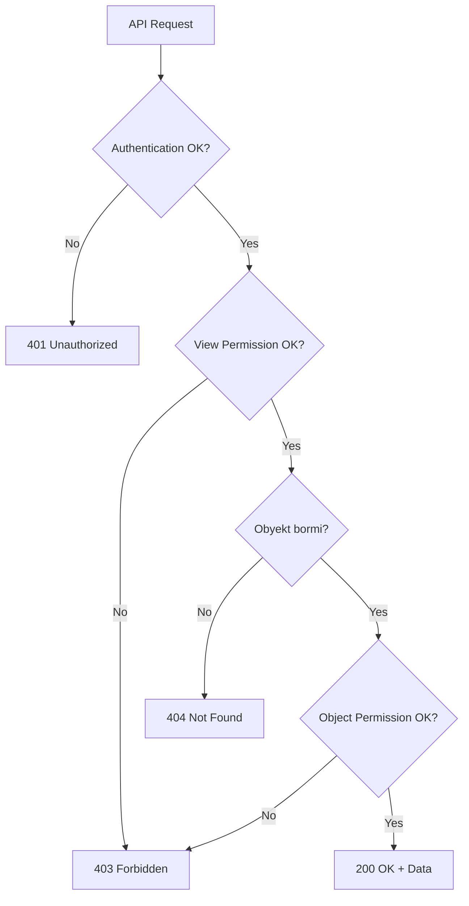

# 🔐 8-DARS: PERMISSIONS (RUXSATLAR) BILAN ISHLASH

## 🎯 Dars Maqsadi

Bu darsda Django REST Framework'da **Permissions (Ruxsatlar)** bilan ishlashni o'rganasiz. Permissions - bu kimlar API'ga murojaat qila olishi, qanday amallarni bajara olishini boshqarish mexanizmi.

**Dars oxirida siz:**
- ✅ Permissions tushunchasi va turlari
- ✅ Built-in permission classlar
- ✅ Custom permission yaratish
- ✅ Object-level permissions
- ✅ View-level va global permissions
- ✅ IsOwnerOrReadOnly pattern
- ✅ Permissions kombinatsiyasi

---

## 📚 Oldingi Darsdan Kerakli Bilimlar

Bu darsni boshlashdan oldin quyidagilar tayyor bo'lishi kerak:

- [x] Authentication (Token-based) tushunchasi
- [x] ViewSet va Router ishlashi
- [x] Serializer validate metodlari
- [x] Django User modeli

> **Eslatma:** Agar authentication (7-dars) o'rganilmagan bo'lsa, avval 7-darsni tugating!

---

## 🔍 1. PERMISSIONS NIMA?

### 1.1 Asosiy Tushuncha

**Permission** - bu API endpoint'ga kirishni nazorat qiluvchi qoida:

```
Authentication: "Siz kimsiz?" (Who are you?)
  ↓
Permission: "Sizga ruxsat bormi?" (Are you allowed?)
  ↓
API Response
```

### 1.2 Authentication vs Permission

| Xususiyat | Authentication | Permission |
|-----------|----------------|-------------|
| **Savol** | Kim siz? | Ruxsatingiz bormi? |
| **Natija** | User aniqlanadi | Access beriladi/rad etiladi |
| **Misol** | Token orqali login | Admin bo'lishi kerak |
| **Xato** | 401 Unauthorized | 403 Forbidden |

**Real hayot misoli:**
```
Authentication = ID karta (sizni taniydi)
Permission = Ish xonasiga kirish huquqi (ruxsat)
```

---

## 🛠️ 2. BUILT-IN PERMISSION CLASSLAR

### 2.1 AllowAny

**Hammaga ruxsat beradi** (authentication kerak emas):

```python
from rest_framework.permissions import AllowAny
from rest_framework import viewsets
from .models import Task
from .serializers import TaskSerializer

class PublicTaskViewSet(viewsets.ReadOnlyModelViewSet):
    """
    Hammaga ochiq API - authentication kerak emas
    """
    queryset = Task.objects.filter(is_public=True)
    serializer_class = TaskSerializer
    permission_classes = [AllowAny]  # Default setting
```

**Qachon ishlatiladi:**
- Public API endpoints
- Landing page ma'lumotlari
- Blog postlar (readonly)
- Umumiy statistika

### 2.2 IsAuthenticated

**Faqat login qilgan userlar uchun:**

```python
from rest_framework.permissions import IsAuthenticated

class TaskViewSet(viewsets.ModelViewSet):
    """
    Faqat login qilgan userlar uchun
    """
    queryset = Task.objects.all()
    serializer_class = TaskSerializer
    permission_classes = [IsAuthenticated]
```

**Xususiyatlari:**
- Login bo'lmagan user: `401 Unauthorized`
- Login bo'lgan har qanday user: ruxsat beriladi
- Token/Session kerak

### 2.3 IsAdminUser

**Faqat admin userlar uchun:**

```python
from rest_framework.permissions import IsAdminUser

class UserManagementViewSet(viewsets.ModelViewSet):
    """
    Faqat admin panel uchun
    """
    queryset = User.objects.all()
    serializer_class = UserSerializer
    permission_classes = [IsAdminUser]
```

**Tekshirish:**
- `user.is_staff == True` bo'lishi kerak
- Superuser ham kiritiladi

### 2.4 IsAuthenticatedOrReadOnly

**Read uchun hamma, Write uchun faqat login:**

```python
from rest_framework.permissions import IsAuthenticatedOrReadOnly

class BlogPostViewSet(viewsets.ModelViewSet):
    """
    GET - hamma ko'radi
    POST/PUT/DELETE - faqat login qilganlar
    """
    queryset = BlogPost.objects.all()
    serializer_class = BlogPostSerializer
    permission_classes = [IsAuthenticatedOrReadOnly]
```

**SAFE_METHODS:**
```python
# Ular hamma uchun ruxsat
SAFE_METHODS = ['GET', 'HEAD', 'OPTIONS']

# Bular faqat authenticated uchun
UNSAFE_METHODS = ['POST', 'PUT', 'PATCH', 'DELETE']
```

---

## 🎨 3. CUSTOM PERMISSION YARATISH

### 3.1 Asosiy Struktura

`tasks/permissions.py` yarating:

```python
from rest_framework import permissions

class BaseCustomPermission(permissions.BasePermission):
    """
    Custom permission asosiy strukturasi
    """
    # View-level permission (butun view uchun)
    def has_permission(self, request, view):
        """
        View ga kirish ruxsati
        Return:
            True - ruxsat beriladi
            False - 403 Forbidden
        """
        return True
    
    # Object-level permission (bitta obyekt uchun)
    def has_object_permission(self, request, view, obj):
        """
        Bitta obyektga amal bajarish ruxsati
        Return:
            True - ruxsat beriladi
            False - 403 Forbidden
        """
        return True
```

### 3.2 IsOwner - Faqat Egasi

```python
class IsOwner(permissions.BasePermission):
    """
    Faqat obyekt egasi amal bajara oladi
    """
    message = "Siz bu obyektning egasi emassiz!"
    
    def has_object_permission(self, request, view, obj):
        # obj.owner bilan request.user ni solishtirish
        return obj.owner == request.user
```

**Modelda owner field kerak:**

```python
class Task(models.Model):
    title = models.CharField(max_length=200)
    description = models.TextField(blank=True)
    owner = models.ForeignKey(
        User,
        on_delete=models.CASCADE,
        related_name='tasks'
    )
    completed = models.BooleanField(default=False)
    created_at = models.DateTimeField(auto_now_add=True)
```

### 3.3 IsOwnerOrReadOnly - READ hamma, WRITE egasi

```python
class IsOwnerOrReadOnly(permissions.BasePermission):
    """
    GET - hamma
    POST/PUT/DELETE - faqat owner
    """
    def has_object_permission(self, request, view, obj):
        # SAFE_METHODS (GET, HEAD, OPTIONS) - hamma uchun
        if request.method in permissions.SAFE_METHODS:
            return True
        
        # UNSAFE (POST/PUT/DELETE) - faqat owner
        return obj.owner == request.user
```

**Ishlatish:**

```python
class TaskViewSet(viewsets.ModelViewSet):
    queryset = Task.objects.all()
    serializer_class = TaskSerializer
    permission_classes = [IsAuthenticated, IsOwnerOrReadOnly]
    
    def perform_create(self, serializer):
        # Yangi task yaratilganda owner ni avtomatik qo'shish
        serializer.save(owner=self.request.user)
```

### 3.4 Advanced Custom Permission

```python
class IsOwnerOrAdmin(permissions.BasePermission):
    """
    Owner yoki Admin ruxsat oladi
    """
    def has_object_permission(self, request, view, obj):
        # Admin har doim ruxsat oladi
        if request.user.is_staff:
            return True
        
        # Owner ham ruxsat oladi
        return obj.owner == request.user


class CanEditAfterTimeLimit(permissions.BasePermission):
    """
    Yaratilganidan 1 soat ichida tahrirlash mumkin
    """
    message = "Bu obyektni tahrirlash muddati o'tgan!"
    
    def has_object_permission(self, request, view, obj):
        from datetime import timedelta
        from django.utils import timezone
        
        # GET so'rov - har doim ruxsat
        if request.method in permissions.SAFE_METHODS:
            return True
        
        # 1 soat ichidami?
        time_limit = timezone.now() - timedelta(hours=1)
        return obj.created_at > time_limit


class IsPremiumUser(permissions.BasePermission):
    """
    Faqat premium userlar uchun
    """
    message = "Bu funksiya faqat premium foydalanuvchilar uchun!"
    
    def has_permission(self, request, view):
        # User profile'da premium field borligini taxmin qilamiz
        return (
            request.user.is_authenticated and
            hasattr(request.user, 'profile') and
            request.user.profile.is_premium
        )
```

---

## 🔗 4. PERMISSION KOMBINATSIYASI

### 4.1 AND Logic (Hammasi bajarilishi kerak)

```python
class SecureTaskViewSet(viewsets.ModelViewSet):
    queryset = Task.objects.all()
    serializer_class = TaskSerializer
    # Har ikkisi ham True bo'lishi kerak
    permission_classes = [IsAuthenticated, IsOwnerOrReadOnly]
```

### 4.2 OR Logic (Birortasi bajarilsa kifoya)

```python
from rest_framework.permissions import BasePermission

class IsOwnerOrAdmin(BasePermission):
    """
    Owner YOKI Admin - ikkalasidan biri bo'lsa yetadi
    """
    def has_object_permission(self, request, view, obj):
        return (
            obj.owner == request.user or  # Owner
            request.user.is_staff  # Admin
        )
```

### 4.3 Complex Logic

```python
class ComplexPermission(BasePermission):
    """
    Murakkab sharoitlar
    """
    def has_object_permission(self, request, view, obj):
        user = request.user
        
        # Admin - har doim ruxsat
        if user.is_staff:
            return True
        
        # Owner - faqat o'qish va yangilash
        if obj.owner == user:
            return request.method in ['GET', 'PATCH']
        
        # Team member - faqat o'qish
        if hasattr(obj, 'team') and user in obj.team.members.all():
            return request.method == 'GET'
        
        # Boshqalar - ruxsat yo'q
        return False
```

---

## 🌍 5. GLOBAL PERMISSIONS

### 5.1 Project-wide Settings

`myproject/settings.py`:

```python
REST_FRAMEWORK = {
    # Global authentication
    'DEFAULT_AUTHENTICATION_CLASSES': [
        'rest_framework.authentication.TokenAuthentication',
        'rest_framework.authentication.SessionAuthentication',
    ],
    
    # Global permission - barcha view'lar uchun
    'DEFAULT_PERMISSION_CLASSES': [
        'rest_framework.permissions.IsAuthenticated',
    ],
}
```

**Agar global permission berilgan bo'lsa:**
```python
# Bu view uchun permission kerak emas
class PublicTaskViewSet(viewsets.ReadOnlyModelViewSet):
    queryset = Task.objects.all()
    serializer_class = TaskSerializer
    permission_classes = []  # Global setting'ni override qiladi
```

---

## 🎯 6. ADVANCED: METHOD-BASED PERMISSIONS

### 6.1 get_permissions Method

```python
class FlexibleTaskViewSet(viewsets.ModelViewSet):
    queryset = Task.objects.all()
    serializer_class = TaskSerializer
    
    def get_permissions(self):
        """
        Har xil action uchun turli permissions
        """
        if self.action == 'list':
            # List - hamma ko'radi
            permission_classes = [AllowAny]
        elif self.action == 'create':
            # Create - faqat authenticated
            permission_classes = [IsAuthenticated]
        elif self.action in ['update', 'partial_update', 'destroy']:
            # Update/Delete - faqat owner yoki admin
            permission_classes = [IsAuthenticated, IsOwnerOrAdmin]
        else:
            # Default
            permission_classes = [IsAuthenticated]
        
        return [permission() for permission in permission_classes]
```

### 6.2 Decorator-based Permissions

```python
from rest_framework.decorators import action, permission_classes
from rest_framework.permissions import IsAdminUser, IsAuthenticated

class TaskViewSet(viewsets.ModelViewSet):
    queryset = Task.objects.all()
    serializer_class = TaskSerializer
    permission_classes = [IsAuthenticated]
    
    @action(detail=False, methods=['get'])
    @permission_classes([AllowAny])  # Bu action uchun hamma ruxsat
    def public_stats(self, request):
        """
        Umumiy statistika - hamma ko'rishi mumkin
        """
        total = Task.objects.count()
        completed = Task.objects.filter(completed=True).count()
        return Response({
            'total': total,
            'completed': completed,
            'completion_rate': f"{(completed/total)*100:.1f}%"
        })
    
    @action(detail=False, methods=['get'])
    @permission_classes([IsAdminUser])  # Faqat admin
    def admin_report(self, request):
        """
        Admin hisoboti - faqat adminlar ko'radi
        """
        return Response({
            'total_users': User.objects.count(),
            'total_tasks': Task.objects.count(),
            # ... boshqa statistika
        })
```

---

## 💼 7. TO'LIQ REAL MISOL

### 7.1 Model

`tasks/models.py`:

```python
from django.db import models
from django.contrib.auth.models import User

class Task(models.Model):
    PRIORITY_CHOICES = [
        ('low', 'Past'),
        ('medium', 'O\'rta'),
        ('high', 'Yuqori'),
    ]
    
    title = models.CharField(max_length=200)
    description = models.TextField(blank=True)
    owner = models.ForeignKey(
        User,
        on_delete=models.CASCADE,
        related_name='owned_tasks'
    )
    assigned_to = models.ForeignKey(
        User,
        on_delete=models.SET_NULL,
        null=True,
        blank=True,
        related_name='assigned_tasks'
    )
    priority = models.CharField(
        max_length=10,
        choices=PRIORITY_CHOICES,
        default='medium'
    )
    completed = models.BooleanField(default=False)
    is_public = models.BooleanField(default=False)
    created_at = models.DateTimeField(auto_now_add=True)
    updated_at = models.DateTimeField(auto_now=True)
    
    def __str__(self):
        return f"{self.title} - {self.owner.username}"
```

### 7.2 Custom Permissions

`tasks/permissions.py`:

```python
from rest_framework import permissions

class IsOwnerOrReadOnly(permissions.BasePermission):
    """
    Owner - full access
    Others - read only
    """
    def has_object_permission(self, request, view, obj):
        if request.method in permissions.SAFE_METHODS:
            return True
        return obj.owner == request.user


class IsOwnerOrAssigned(permissions.BasePermission):
    """
    Owner yoki assigned user
    """
    def has_object_permission(self, request, view, obj):
        return (
            obj.owner == request.user or
            obj.assigned_to == request.user
        )


class CanCompleteTask(permissions.BasePermission):
    """
    Owner yoki assigned user task ni complete qila oladi
    """
    message = "Faqat owner yoki assigned user task ni complete qila oladi!"
    
    def has_object_permission(self, request, view, obj):
        # Faqat complete action uchun
        if view.action != 'mark_complete':
            return True
        
        return (
            obj.owner == request.user or
            obj.assigned_to == request.user
        )
```

### 7.3 Serializer

`tasks/serializers.py`:

```python
from rest_framework import serializers
from .models import Task
from django.contrib.auth.models import User

class TaskSerializer(serializers.ModelSerializer):
    owner = serializers.ReadOnlyField(source='owner.username')
    assigned_to_username = serializers.ReadOnlyField(
        source='assigned_to.username'
    )
    is_assigned_to_me = serializers.SerializerMethodField()
    can_complete = serializers.SerializerMethodField()
    
    class Meta:
        model = Task
        fields = [
            'id',
            'title',
            'description',
            'owner',
            'assigned_to',
            'assigned_to_username',
            'priority',
            'completed',
            'is_public',
            'created_at',
            'updated_at',
            'is_assigned_to_me',
            'can_complete',
        ]
        read_only_fields = ['owner', 'created_at', 'updated_at']
    
    def get_is_assigned_to_me(self, obj):
        """Men ga assign qilinganmi?"""
        request = self.context.get('request')
        if request and request.user.is_authenticated:
            return obj.assigned_to == request.user
        return False
    
    def get_can_complete(self, obj):
        """Men complete qila olamanmi?"""
        request = self.context.get('request')
        if request and request.user.is_authenticated:
            return (
                obj.owner == request.user or
                obj.assigned_to == request.user
            )
        return False
```

### 7.4 ViewSet

`tasks/views.py`:

```python
from rest_framework import viewsets, status
from rest_framework.decorators import action
from rest_framework.response import Response
from rest_framework.permissions import IsAuthenticated, AllowAny
from .models import Task
from .serializers import TaskSerializer
from .permissions import IsOwnerOrReadOnly, CanCompleteTask

class TaskViewSet(viewsets.ModelViewSet):
    queryset = Task.objects.all()
    serializer_class = TaskSerializer
    
    def get_permissions(self):
        """Action ga qarab permissions"""
        if self.action == 'list':
            return [AllowAny()]
        elif self.action == 'create':
            return [IsAuthenticated()]
        elif self.action == 'mark_complete':
            return [IsAuthenticated(), CanCompleteTask()]
        else:
            return [IsAuthenticated(), IsOwnerOrReadOnly()]
    
    def get_queryset(self):
        """Userga oid tasklar yoki public tasklar"""
        user = self.request.user
        if user.is_authenticated:
            # Login bo'lgan user:
            # - O'zining tasklari
            # - Unga assign qilingan tasklar
            # - Public tasklar
            return Task.objects.filter(
                models.Q(owner=user) |
                models.Q(assigned_to=user) |
                models.Q(is_public=True)
            ).distinct()
        else:
            # Anonymous user - faqat public
            return Task.objects.filter(is_public=True)
    
    def perform_create(self, serializer):
        """Yaratilayotganda owner qo'shish"""
        serializer.save(owner=self.request.user)
    
    @action(detail=True, methods=['post'])
    def mark_complete(self, request, pk=None):
        """Task ni complete qilish"""
        task = self.get_object()
        task.completed = True
        task.save()
        serializer = self.get_serializer(task)
        return Response(serializer.data)
    
    @action(detail=True, methods=['post'])
    def assign(self, request, pk=None):
        """Task ni boshqa userga assign qilish"""
        task = self.get_object()
        
        # Faqat owner assign qila oladi
        if task.owner != request.user:
            return Response(
                {'error': 'Faqat owner assign qila oladi!'},
                status=status.HTTP_403_FORBIDDEN
            )
        
        user_id = request.data.get('user_id')
        try:
            user = User.objects.get(id=user_id)
            task.assigned_to = user
            task.save()
            serializer = self.get_serializer(task)
            return Response(serializer.data)
        except User.DoesNotExist:
            return Response(
                {'error': 'User topilmadi!'},
                status=status.HTTP_404_NOT_FOUND
            )
    
    @action(detail=False, methods=['get'])
    def my_tasks(self, request):
        """Mening barcha tasklarim"""
        tasks = Task.objects.filter(
            models.Q(owner=request.user) |
            models.Q(assigned_to=request.user)
        )
        serializer = self.get_serializer(tasks, many=True)
        return Response(serializer.data)
```

---

## ✅ 8. API NI TEST QILISH

### 8.1 User va Token Yaratish

```bash
# Ikkita user yaratish
python manage.py shell
```

```python
from django.contrib.auth.models import User
from rest_framework.authtoken.models import Token

# User 1
user1 = User.objects.create_user(username='john', password='pass123')
token1 = Token.objects.create(user=user1)
print(f"User1 Token: {token1.key}")

# User 2
user2 = User.objects.create_user(username='jane', password='pass456')
token2 = Token.objects.create(user=user2)
print(f"User2 Token: {token2.key}")
```

### 8.2 Test Scenarios

**1. Public List (AllowAny):**
```bash
# Token siz - ishlaydi
curl http://127.0.0.1:8000/api/tasks/
```

**2. Create (IsAuthenticated):**
```bash
# John taskni yaratadi
curl -X POST http://127.0.0.1:8000/api/tasks/ \
  -H "Authorization: Token <john_token>" \
  -H "Content-Type: application/json" \
  -d '{
    "title": "John ning vazifasi",
    "description": "Test",
    "priority": "high"
  }'
```

**3. Update (IsOwnerOrReadOnly):**
```bash
# John o'z taskini yangilaydi - ishlaydi
curl -X PATCH http://127.0.0.1:8000/api/tasks/1/ \
  -H "Authorization: Token <john_token>" \
  -H "Content-Type: application/json" \
  -d '{"completed": true}'

# Jane John ning taskini yangilaydi - 403 Forbidden
curl -X PATCH http://127.0.0.1:8000/api/tasks/1/ \
  -H "Authorization: Token <jane_token>" \
  -H "Content-Type: application/json" \
  -d '{"completed": true}'
```

**4. Custom Action - Mark Complete:**
```bash
# Owner complete qiladi - ishlaydi
curl -X POST http://127.0.0.1:8000/api/tasks/1/mark_complete/ \
  -H "Authorization: Token <john_token>"
```

**5. Assign Task:**
```bash
# John task ni Jane ga assign qiladi
curl -X POST http://127.0.0.1:8000/api/tasks/1/assign/ \
  -H "Authorization: Token <john_token>" \
  -H "Content-Type: application/json" \
  -d '{"user_id": 2}'

# Endi Jane ham complete qila oladi
curl -X POST http://127.0.0.1:8000/api/tasks/1/mark_complete/ \
  -H "Authorization: Token <jane_token>"
```

---

## 🎯 AMALIYOT TOPSHIRIQLARI

### 📝 Topshiriq 1: Comment System (Oson)

**Model:**
```python
class Comment(models.Model):
    post = models.ForeignKey(BlogPost, on_delete=models.CASCADE)
    author = models.ForeignKey(User, on_delete=models.CASCADE)
    text = models.TextField()
    created_at = models.DateTimeField(auto_now_add=True)
```

**Talablar:**
- ✅ `IsOwnerOrReadOnly` permission
- ✅ Faqat comment egasi o'chirishi mumkin
- ✅ Hamma o'qiy oladi

### 📝 Topshiriq 2: Article Publishing (O'rta)

**Model:**
```python
class Article(models.Model):
    STATUS_CHOICES = [
        ('draft', 'Qoralama'),
        ('published', 'Nashr qilingan'),
    ]
    
    author = models.ForeignKey(User, on_delete=models.CASCADE)
    title = models.CharField(max_length=200)
    content = models.TextField()
    status = models.CharField(max_length=10, choices=STATUS_CHOICES)
```

**Talablar:**
- ✅ Draft - faqat author ko'radi
- ✅ Published - hamma ko'radi
- ✅ Faqat author tahrirlaydi
- ✅ Custom permission: `CanPublishArticle` (faqat staff)

### 📝 Topshiriq 3: Team Project (Qiyin)

**Models:**
```python
class Team(models.Model):
    name = models.CharField(max_length=100)
    owner = models.ForeignKey(User, on_delete=models.CASCADE)
    members = models.ManyToManyField(User, related_name='teams')

class Project(models.Model):
    team = models.ForeignKey(Team, on_delete=models.CASCADE)
    name = models.CharField(max_length=200)
    description = models.TextField()
```

**Talablar:**
- ✅ Team owner - full access
- ✅ Team member - read va update
- ✅ Others - no access
- ✅ Custom action: `add_member` (faqat owner)
- ✅ Custom permission: `IsTeamMemberOrOwner`

---

## 📊 REQUEST-RESPONSE FLOW



---

## 🔗 KEYINGI DARSLAR

✅ **Dars 08 tugadi! Permission sistemasini to'liq o'rgandingiz!**

**Keyingi darsda:**
- Throttling (Rate Limiting)
- Request cheklash
- Abuse prevention

---

## 📚 QISQA XULOSALAR

### Permission Flow

```python
1. has_permission() - View level
   ↓ (True)
2. View code executes
   ↓
3. get_object() - Obyekt olish
   ↓
4. has_object_permission() - Object level
   ↓ (True)
5. Response qaytadi
```

### Best Practices

| ✅ To'g'ri | ❌ Noto'g'ri |
|----------|------------|
| `IsOwnerOrReadOnly` pattern ishlatish | Har doim `AllowAny` ishlatish |
| Object-level permissions | View-level permissions bilan chalkashib yuborish |
| Custom message qo'shish | Generic xato xabari |
| Method-based permissions | Barcha action uchun bir xil permission |

### Permission Hierarchy

```
AllowAny (eng keng)
  ↓
IsAuthenticatedOrReadOnly
  ↓
IsAuthenticated
  ↓
IsOwnerOrReadOnly
  ↓
IsOwner
  ↓
Custom Complex Permissions (eng tor)
```

**Esda tuting:**
- Authentication ≠ Permission
- 401 = Kim siz? (Authentication)
- 403 = Ruxsatingiz yo'q! (Permission)
- `has_permission` → View uchun
- `has_object_permission` → Obyekt uchun
