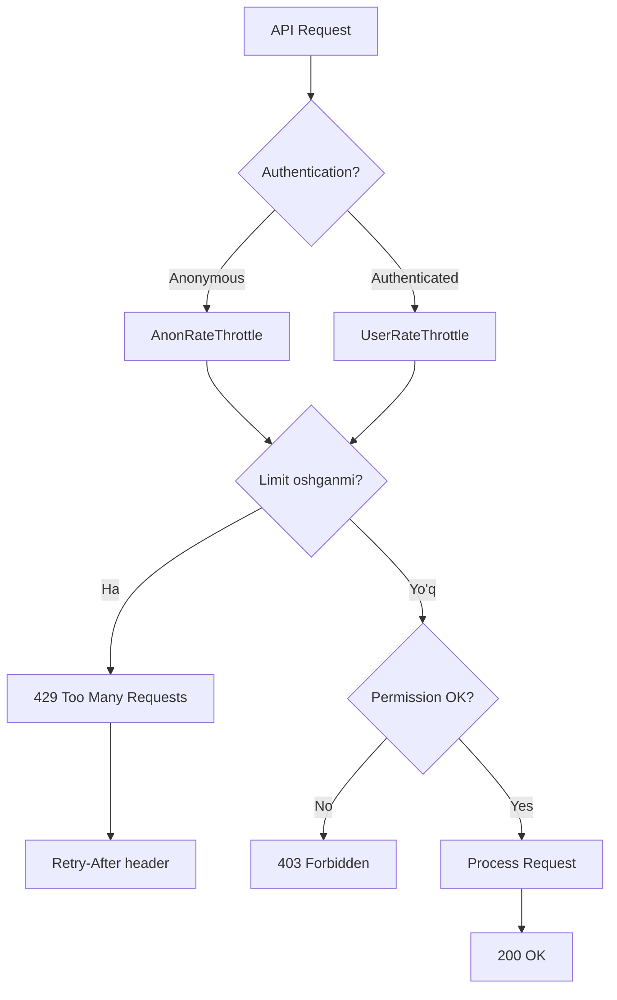

# ⏱️ 9-DARS: THROTTLING VA RATE LIMITING

## 🎯 Dars Maqsadi

Bu darsda Django REST Framework'da **Throttling (So'rovlarni Cheklash)** va **Rate Limiting (Tezlik Cheklash)** bilan ishlashni o'rganasiz. Bu mexanizmlar API'ni abuse (suiiste'mol) dan himoya qiladi va server resurslarini to'g'ri taqsimlaydi.

**Dars oxirida siz:**
- ✅ Throttling nima va nega kerak
- ✅ Built-in throttle classlar
- ✅ Custom throttle yaratish
- ✅ Turli user typelari uchun turli limitlar
- ✅ Endpoint-specific throttling
- ✅ Throttle cache backend'i
- ✅ Burst va sustained throttling
- ✅ Best practices

---

## 📚 Oldingi Darsdan Kerakli Bilimlar

Bu darsni boshlashdan oldin quyidagilar tayyor bo'lishi kerak:

- [x] Authentication (Token-based) ishlashi
- [x] Permissions tizimi
- [x] ViewSet va Router
- [x] API testing (cURL/Postman)

> **Eslatma:** Throttling - bu authentication va permissions'dan keyingi himoya qatlami!

---

## 🔍 1. THROTTLING NIMA?

### 1.1 Asosiy Tushuncha

**Throttling** - ma'lum vaqt ichida API'ga nechta so'rov yuborish mumkinligini cheklash:

```
Rate Limiting = Request cheklash
Throttling = Vaqtga qarab cheklash

Misol: "1 daqiqada 10 ta so'rov"
```

### 1.2 Nega Kerak?

| Sabab | Tushuntirish | Misol |
|-------|-------------|-------|
| **DOS hujumlaridan himoya** | Server yuklanishini cheklash | Spam botlar |
| **Fair usage** | Barcha userlar uchun teng imkoniyat | Bir user barcha resursni egallasa |
| **Resource boshqaruv** | Database, CPU saqlash | Heavy querylar |
| **Monetization** | Free vs Premium farqi | Free: 100/day, Premium: 10000/day |

### 1.3 Real Hayot Misollari

```python
# GitHub API
# Authenticated: 5000 requests/hour
# Unauthenticated: 60 requests/hour

# Twitter API
# Standard: 900 requests/15 min
# Premium: 3000 requests/15 min

# OpenAI API
# Free tier: 3 requests/min
# Paid: 60 requests/min
```

---

## 🛠️ 2. BUILT-IN THROTTLE CLASSLAR

### 2.1 AnonRateThrottle

**Anonymous (login qilmagan) userlar uchun:**

```python
from rest_framework.throttling import AnonRateThrottle
from rest_framework import viewsets
from .models import Task
from .serializers import TaskSerializer

class PublicTaskViewSet(viewsets.ReadOnlyModelViewSet):
    """
    Anonymous userlar uchun cheklangan API
    """
    queryset = Task.objects.filter(is_public=True)
    serializer_class = TaskSerializer
    throttle_classes = [AnonRateThrottle]  # Anonim userlar uchun
```

**Settings:**
```python
# myproject/settings.py
REST_FRAMEWORK = {
    'DEFAULT_THROTTLE_RATES': {
        'anon': '100/day',  # Kuniga 100 ta so'rov
    }
}
```

**Qanday ishlaydi:**
```
1. Request keladi
2. User authenticated emas
3. IP address bilan identifikatsiya qilinadi
4. Shu IP dan 24 soat ichida 100 ta so'rov tekshiriladi
5. Agar oshsa → 429 Too Many Requests
```

### 2.2 UserRateThrottle

**Authenticated (login qilgan) userlar uchun:**

```python
from rest_framework.throttling import UserRateThrottle

class TaskViewSet(viewsets.ModelViewSet):
    """
    Login qilgan userlar uchun API
    """
    queryset = Task.objects.all()
    serializer_class = TaskSerializer
    throttle_classes = [UserRateThrottle]  # Authenticated userlar uchun
```

**Settings:**
```python
REST_FRAMEWORK = {
    'DEFAULT_THROTTLE_RATES': {
        'user': '1000/day',  # Kuniga 1000 ta so'rov (anon dan ko'p)
    }
}
```

**User ID bilan track qilinadi:**
```python
# User 1: 1000/day
# User 2: 1000/day
# Har bir user alohida hisoblanadi
```

### 2.3 ScopedRateThrottle

**Endpoint-specific throttling:**

```python
from rest_framework.throttling import ScopedRateThrottle

class TaskViewSet(viewsets.ModelViewSet):
    """
    Har xil action uchun turli limit
    """
    queryset = Task.objects.all()
    serializer_class = TaskSerializer
    throttle_classes = [ScopedRateThrottle]
    
    # Har bir action uchun scope belgilash
    throttle_scope = 'tasks'  # Default scope
    
    def get_throttles(self):
        """
        Action ga qarab throttle scope o'zgartirish
        """
        if self.action == 'create':
            # Create uchun alohida scope
            self.throttle_scope = 'task-create'
        elif self.action == 'list':
            # List uchun alohida scope
            self.throttle_scope = 'task-list'
        return super().get_throttles()
```

**Settings:**
```python
REST_FRAMEWORK = {
    'DEFAULT_THROTTLE_RATES': {
        'task-create': '10/hour',   # Yaratish - soatiga 10 ta
        'task-list': '100/hour',     # Ko'rish - soatiga 100 ta
        'tasks': '50/hour',          # Boshqalar - soatiga 50 ta
    }
}
```

---

## 🎨 3. CUSTOM THROTTLE YARATISH

### 3.1 Asosiy Struktura

`tasks/throttles.py` yarating:

```python
from rest_framework.throttling import BaseThrottle, UserRateThrottle
import time

class CustomBaseThrottle(BaseThrottle):
    """
    Custom throttle asosiy strukturasi
    """
    # Cache key yaratish
    def get_cache_key(self, request, view):
        """
        Cache da saqlanadigan unique key
        
        Return:
            str: Unique identifier
            None: Throttle qo'llanmasin
        """
        if request.user.is_authenticated:
            # User ID bilan
            ident = request.user.pk
        else:
            # IP address bilan
            ident = self.get_ident(request)
        
        # Format: throttle_<view_name>_<user_or_ip>
        return f'throttle_{view.__class__.__name__}_{ident}'
    
    # Throttle tekshirish
    def allow_request(self, request, view):
        """
        So'rovga ruxsat berilsinmi?
        
        Return:
            True: Ruxsat beriladi
            False: 429 Too Many Requests
        """
        # Har doim ruxsat berish (demo)
        return True
    
    # Kutish vaqti
    def wait(self):
        """
        Keyingi so'rov uchun necha soniya kutish kerak?
        
        Return:
            int: Soniyalar soni
            None: Limit yo'q
        """
        return None
```

### 3.2 Time-based Throttle

```python
from rest_framework.throttling import SimpleRateThrottle
from django.core.cache import cache

class BurstRateThrottle(SimpleRateThrottle):
    """
    Qisqa vaqt ichida juda ko'p so'rov oldini olish
    
    Misol: 1 daqiqada 5 tadan ortiq POST so'rov bo'lmasin
    """
    scope = 'burst'  # Settings da 'burst' key ishlatiladi
    
    def get_cache_key(self, request, view):
        """
        Faqat POST so'rovlar uchun throttle
        """
        # Faqat POST uchun
        if request.method != 'POST':
            return None  # Throttle qo'llanmasin
        
        # User yoki IP
        if request.user.is_authenticated:
            ident = request.user.pk
        else:
            ident = self.get_ident(request)
        
        # Unique key
        return self.cache_format % {
            'scope': self.scope,
            'ident': ident
        }


class SustainedRateThrottle(SimpleRateThrottle):
    """
    Uzoq vaqt davomida barqaror limit
    
    Misol: 1 soatda 100 tadan ortiq so'rov bo'lmasin
    """
    scope = 'sustained'
    
    def get_cache_key(self, request, view):
        """
        Barcha so'rovlar uchun
        """
        if request.user.is_authenticated:
            ident = request.user.pk
        else:
            ident = self.get_ident(request)
        
        return self.cache_format % {
            'scope': self.scope,
            'ident': ident
        }
```

**Settings:**
```python
REST_FRAMEWORK = {
    'DEFAULT_THROTTLE_RATES': {
        'burst': '5/min',       # 1 daqiqada 5 ta (tez cheklov)
        'sustained': '100/hour', # 1 soatda 100 ta (uzoq muddatli)
    }
}
```

**Ikkisini birgalikda ishlatish:**
```python
class TaskViewSet(viewsets.ModelViewSet):
    queryset = Task.objects.all()
    serializer_class = TaskSerializer
    throttle_classes = [BurstRateThrottle, SustainedRateThrottle]
    
    # Ikkala throttle ham True qaytarishi kerak
    # Agar birontasi False qaytarsa → 429 Error
```

### 3.3 Conditional Throttle

```python
class PremiumUserThrottle(UserRateThrottle):
    """
    Premium userlar uchun yuqori limit
    """
    def allow_request(self, request, view):
        """
        Premium user bo'lsa throttle qo'llanmasin
        """
        # Premium user tekshirish
        if request.user.is_authenticated and hasattr(request.user, 'profile'):
            if request.user.profile.is_premium:
                # Premium userga limit yo'q
                return True
        
        # Oddiy user uchun standart throttle
        return super().allow_request(request, view)
    
    # Rate ni dinamik o'zgartirish
    def get_rate(self):
        """
        User type ga qarab rate
        """
        # Default rate
        return '1000/day'


class AdminNoThrottle(BaseThrottle):
    """
    Adminlarga limit qo'ymaslik
    """
    def allow_request(self, request, view):
        """
        Admin bo'lsa har doim ruxsat
        """
        # Admin bo'lsa throttle yo'q
        if request.user and request.user.is_staff:
            return True
        
        # Admin emas - rad qilish (boshqa throttle ishlatiladi)
        return True
```

### 3.4 IP-based Throttle

```python
class IPAddressThrottle(SimpleRateThrottle):
    """
    IP address bo'yicha cheklash (VPN dan himoya)
    """
    scope = 'ip'
    
    def get_cache_key(self, request, view):
        """
        Faqat IP address ishlatish
        """
        # Har doim IP address ishlatish (authenticated bo'lsa ham)
        return self.cache_format % {
            'scope': self.scope,
            'ident': self.get_ident(request)  # IP address
        }


class EndpointThrottle(SimpleRateThrottle):
    """
    Har bir endpoint uchun alohida limit
    """
    def get_cache_key(self, request, view):
        """
        Endpoint + User kombinatsiyasi
        """
        if request.user.is_authenticated:
            ident = request.user.pk
        else:
            ident = self.get_ident(request)
        
        # Endpoint path qo'shish
        endpoint = request.path
        
        return f'throttle_{endpoint}_{ident}'
    
    def get_rate(self):
        """
        Endpoint ga qarab rate
        """
        # Heavy endpoint uchun kam limit
        if 'heavy' in self.scope:
            return '10/hour'
        # Light endpoint uchun ko'p limit
        return '1000/hour'
```

---

## 🌍 4. GLOBAL VA VIEW-LEVEL THROTTLING

### 4.1 Global Settings

`myproject/settings.py`:

```python
REST_FRAMEWORK = {
    # Global throttle classes - barcha view'lar uchun
    'DEFAULT_THROTTLE_CLASSES': [
        'rest_framework.throttling.AnonRateThrottle',   # Anonymous
        'rest_framework.throttling.UserRateThrottle',   # Authenticated
    ],
    
    # Har bir throttle class uchun rate
    'DEFAULT_THROTTLE_RATES': {
        'anon': '100/day',      # Anonymous: kuniga 100
        'user': '1000/day',     # Authenticated: kuniga 1000
    }
}
```

**Agar global throttle berilgan bo'lsa:**
```python
# Global throttle'ni disable qilish
class UnlimitedViewSet(viewsets.ModelViewSet):
    queryset = Task.objects.all()
    serializer_class = TaskSerializer
    throttle_classes = []  # Throttle yo'q
```

### 4.2 View-Level Throttling

```python
from rest_framework.throttling import UserRateThrottle, AnonRateThrottle

class TaskViewSet(viewsets.ModelViewSet):
    """
    View uchun maxsus throttle
    """
    queryset = Task.objects.all()
    serializer_class = TaskSerializer
    
    # Faqat shu view uchun
    throttle_classes = [UserRateThrottle, AnonRateThrottle]


class HeavyReportViewSet(viewsets.ReadOnlyModelViewSet):
    """
    Heavy operatsiyalar uchun past limit
    """
    queryset = Report.objects.all()
    serializer_class = ReportSerializer
    
    # Custom throttle
    throttle_classes = [BurstRateThrottle]  # Faqat 5/min
```

### 4.3 Method-based Throttling

```python
from rest_framework.decorators import action, throttle_classes
from rest_framework.throttling import UserRateThrottle

class TaskViewSet(viewsets.ModelViewSet):
    queryset = Task.objects.all()
    serializer_class = TaskSerializer
    
    # Default throttle barcha action uchun
    throttle_classes = [UserRateThrottle]
    
    @action(detail=False, methods=['post'])
    @throttle_classes([BurstRateThrottle])  # Faqat shu action uchun
    def bulk_create(self, request):
        """
        Ko'p task yaratish - qattiq cheklangan
        
        URL: /tasks/bulk_create/
        Throttle: 5/min (BurstRateThrottle)
        """
        tasks_data = request.data.get('tasks', [])
        
        # Validation
        if len(tasks_data) > 10:
            return Response(
                {'error': 'Bir safarda max 10 ta task yaratish mumkin!'},
                status=status.HTTP_400_BAD_REQUEST
            )
        
        # Bulk create
        serializer = self.get_serializer(data=tasks_data, many=True)
        serializer.is_valid(raise_exception=True)
        serializer.save(owner=request.user)
        
        return Response(serializer.data, status=status.HTTP_201_CREATED)
    
    @action(detail=False, methods=['get'])
    @throttle_classes([])  # Throttle yo'q
    def public_stats(self, request):
        """
        Umumiy statistika - limit yo'q
        
        URL: /tasks/public_stats/
        Throttle: None (cheksiz)
        """
        total = Task.objects.count()
        completed = Task.objects.filter(completed=True).count()
        
        return Response({
            'total': total,
            'completed': completed,
            'completion_rate': f"{(completed/total)*100:.1f}%" if total > 0 else "0%"
        })
```

---

## 💼 5. TO'LIQ REAL MISOL

### 5.1 Custom Throttles

`tasks/throttles.py`:

```python
from rest_framework.throttling import SimpleRateThrottle, UserRateThrottle

class BurstRateThrottle(SimpleRateThrottle):
    """
    Burst limit - qisqa vaqt ichida juda ko'p so'rov oldini olish
    1 daqiqada 10 ta so'rov
    """
    scope = 'burst'


class SustainedRateThrottle(SimpleRateThrottle):
    """
    Sustained limit - uzoq vaqt uchun limit
    1 soatda 100 ta so'rov
    """
    scope = 'sustained'


class PremiumUserThrottle(UserRateThrottle):
    """
    Premium userlar uchun yuqori limit
    """
    scope = 'premium'
    
    def allow_request(self, request, view):
        """
        Premium user uchun throttle qo'llanmasin
        """
        # Premium tekshirish
        if (request.user.is_authenticated and 
            hasattr(request.user, 'profile') and 
            request.user.profile.is_premium):
            return True  # Premium - cheksiz
        
        # Free user - standart throttle
        return super().allow_request(request, view)


class CreateTaskThrottle(SimpleRateThrottle):
    """
    Faqat task yaratish uchun throttle
    1 soatda 20 ta task yaratish mumkin
    """
    scope = 'task-create'
    
    def get_cache_key(self, request, view):
        """
        Faqat POST so'rovlar uchun
        """
        # Faqat POST method uchun throttle
        if request.method != 'POST':
            return None  # Throttle qo'llanmasin
        
        # User ID yoki IP
        if request.user.is_authenticated:
            ident = request.user.pk
        else:
            ident = self.get_ident(request)
        
        return self.cache_format % {
            'scope': self.scope,
            'ident': ident
        }
```

### 5.2 Settings

`myproject/settings.py`:

```python
# Django settings
INSTALLED_APPS = [
    'django.contrib.admin',
    'django.contrib.auth',
    'django.contrib.contenttypes',
    'django.contrib.sessions',
    'django.contrib.messages',
    'django.contrib.staticfiles',
    
    # Third-party
    'rest_framework',
    'rest_framework.authtoken',
    
    # Local apps
    'tasks',
]

# DRF settings
REST_FRAMEWORK = {
    # Authentication
    'DEFAULT_AUTHENTICATION_CLASSES': [
        'rest_framework.authentication.TokenAuthentication',
        'rest_framework.authentication.SessionAuthentication',
    ],
    
    # Permissions
    'DEFAULT_PERMISSION_CLASSES': [
        'rest_framework.permissions.IsAuthenticated',
    ],
    
    # Throttling
    'DEFAULT_THROTTLE_CLASSES': [
        'rest_framework.throttling.AnonRateThrottle',   # Anonymous users
        'rest_framework.throttling.UserRateThrottle',   # Authenticated users
    ],
    
    # Throttle rates
    'DEFAULT_THROTTLE_RATES': {
        # Built-in throttles
        'anon': '100/day',          # Anonymous: 100 requests/day
        'user': '1000/day',         # Authenticated: 1000 requests/day
        
        # Custom throttles
        'burst': '10/min',          # Burst: 10 requests/minute
        'sustained': '100/hour',    # Sustained: 100 requests/hour
        'premium': '10000/day',     # Premium: 10000 requests/day
        'task-create': '20/hour',   # Task creation: 20/hour
    },
}

# Cache configuration (throttling uchun kerak)
CACHES = {
    'default': {
        'BACKEND': 'django.core.cache.backends.locmem.LocMemCache',  # Development uchun
        'LOCATION': 'unique-snowflake',
    }
}

# Production uchun Redis ishlatish tavsiya etiladi:
# CACHES = {
#     'default': {
#         'BACKEND': 'django_redis.cache.RedisCache',
#         'LOCATION': 'redis://127.0.0.1:6379/1',
#         'OPTIONS': {
#             'CLIENT_CLASS': 'django_redis.client.DefaultClient',
#         }
#     }
# }
```

### 5.3 ViewSet

`tasks/views.py`:

```python
from rest_framework import viewsets, status
from rest_framework.decorators import action, throttle_classes
from rest_framework.response import Response
from rest_framework.permissions import IsAuthenticated, AllowAny
from rest_framework.throttling import AnonRateThrottle, UserRateThrottle
from django.db import models
from django.contrib.auth.models import User

from .models import Task
from .serializers import TaskSerializer
from .permissions import IsOwnerOrReadOnly
from .throttles import (
    BurstRateThrottle,
    SustainedRateThrottle,
    CreateTaskThrottle,
    PremiumUserThrottle
)


class TaskViewSet(viewsets.ModelViewSet):
    """
    Task CRUD API with throttling
    
    Throttling strategy:
    - Burst: 10 requests/minute (qisqa muddat)
    - Sustained: 100 requests/hour (uzoq muddat)
    - Create: 20 tasks/hour (yaratish uchun maxsus)
    """
    queryset = Task.objects.all()
    serializer_class = TaskSerializer
    permission_classes = [IsAuthenticated, IsOwnerOrReadOnly]
    
    # Default throttles - barcha action uchun
    throttle_classes = [
        BurstRateThrottle,      # 10/min
        SustainedRateThrottle,  # 100/hour
    ]
    
    def get_queryset(self):
        """
        User o'z tasklarini yoki public tasklarni ko'radi
        """
        user = self.request.user
        if user.is_authenticated:
            # O'z tasklari yoki public tasklar
            return Task.objects.filter(
                models.Q(owner=user) | models.Q(is_public=True)
            ).distinct()
        else:
            # Faqat public tasklar
            return Task.objects.filter(is_public=True)
    
    def get_throttles(self):
        """
        Action ga qarab throttle o'zgartirish
        """
        # Create action uchun maxsus throttle
        if self.action == 'create':
            # Create uchun qo'shimcha throttle
            return [
                BurstRateThrottle(),
                SustainedRateThrottle(),
                CreateTaskThrottle(),  # 20/hour
            ]
        
        # Boshqa actionlar uchun default
        return super().get_throttles()
    
    def perform_create(self, serializer):
        """
        Task yaratilganda owner qo'shish
        """
        serializer.save(owner=self.request.user)
    
    @action(detail=False, methods=['post'])
    @throttle_classes([BurstRateThrottle])  # Juda qattiq limit: 10/min
    def bulk_create(self, request):
        """
        Ko'p task bir vaqtda yaratish
        
        URL: POST /tasks/bulk_create/
        Body: {"tasks": [{task1}, {task2}, ...]}
        Throttle: 10/min (BurstRateThrottle)
        """
        tasks_data = request.data.get('tasks', [])
        
        # Max 10 ta
        if len(tasks_data) > 10:
            return Response(
                {
                    'error': 'Bir safarda maksimum 10 ta task yaratish mumkin!',
                    'received': len(tasks_data),
                    'maximum': 10
                },
                status=status.HTTP_400_BAD_REQUEST
            )
        
        # Bulk create
        serializer = self.get_serializer(data=tasks_data, many=True)
        serializer.is_valid(raise_exception=True)
        
        # Owner qo'shish
        serializer.save(owner=request.user)
        
        return Response(
            {
                'message': f'{len(tasks_data)} ta task yaratildi!',
                'tasks': serializer.data
            },
            status=status.HTTP_201_CREATED
        )
    
    @action(detail=False, methods=['get'])
    @throttle_classes([])  # Throttle yo'q
    @permission_classes([AllowAny])  # Permission ham yo'q
    def public_stats(self, request):
        """
        Umumiy statistika - throttle va permission yo'q
        
        URL: GET /tasks/public_stats/
        Throttle: None (cheksiz)
        Permission: AllowAny
        """
        # Umumiy statistika
        total = Task.objects.count()
        completed = Task.objects.filter(completed=True).count()
        public = Task.objects.filter(is_public=True).count()
        
        # Foizlar
        completion_rate = (completed / total * 100) if total > 0 else 0
        public_rate = (public / total * 100) if total > 0 else 0
        
        return Response({
            'total_tasks': total,
            'completed_tasks': completed,
            'public_tasks': public,
            'completion_rate': f"{completion_rate:.1f}%",
            'public_rate': f"{public_rate:.1f}%",
        })
    
    @action(detail=False, methods=['get'])
    @throttle_classes([SustainedRateThrottle])  # 100/hour
    def my_stats(self, request):
        """
        Foydalanuvchi statistikasi
        
        URL: GET /tasks/my_stats/
        Throttle: 100/hour (SustainedRateThrottle)
        """
        user = request.user
        
        # User tasklari
        my_tasks = Task.objects.filter(owner=user)
        total = my_tasks.count()
        completed = my_tasks.filter(completed=True).count()
        pending = total - completed
        
        # Priority bo'yicha
        high_priority = my_tasks.filter(priority='high').count()
        medium_priority = my_tasks.filter(priority='medium').count()
        low_priority = my_tasks.filter(priority='low').count()
        
        return Response({
            'username': user.username,
            'total_tasks': total,
            'completed': completed,
            'pending': pending,
            'completion_rate': f"{(completed/total*100):.1f}%" if total > 0 else "0%",
            'by_priority': {
                'high': high_priority,
                'medium': medium_priority,
                'low': low_priority,
            }
        })
    
    @action(detail=True, methods=['post'])
    @throttle_classes([BurstRateThrottle])  # 10/min
    def mark_complete(self, request, pk=None):
        """
        Task ni complete qilish
        
        URL: POST /tasks/{id}/mark_complete/
        Throttle: 10/min
        """
        task = self.get_object()  # Permission check avtomatik
        
        # Allaqachon complete bo'lsa
        if task.completed:
            return Response(
                {'message': 'Task allaqachon bajarilgan!'},
                status=status.HTTP_200_OK
            )
        
        # Complete qilish
        task.completed = True
        task.save()
        
        serializer = self.get_serializer(task)
        return Response({
            'message': 'Task bajarilgan deb belgilandi!',
            'task': serializer.data
        })
```

### 5.4 Serializer (o'zgarishsiz)

`tasks/serializers.py`:

```python
from rest_framework import serializers
from .models import Task

class TaskSerializer(serializers.ModelSerializer):
    """
    Task serializer with custom fields
    """
    # Owner username (read-only)
    owner = serializers.ReadOnlyField(source='owner.username')
    
    # Status field (computed)
    status = serializers.SerializerMethodField()
    
    # Days since created (computed)
    days_old = serializers.SerializerMethodField()
    
    class Meta:
        model = Task
        fields = [
            'id',
            'title',
            'description',
            'priority',
            'completed',
            'is_public',
            'owner',
            'created_at',
            'updated_at',
            'status',           # Computed field
            'days_old',         # Computed field
        ]
        read_only_fields = ['id', 'owner', 'created_at', 'updated_at']
    
    def get_status(self, obj):
        """
        Task holati
        """
        return "Bajarilgan ✅" if obj.completed else "Bajarilmagan ⏳"
    
    def get_days_old(self, obj):
        """
        Necha kun oldin yaratilgan
        """
        from datetime import datetime
        delta = datetime.now().date() - obj.created_at.date()
        return delta.days
    
    def validate_title(self, value):
        """
        Title validation
        """
        if len(value.strip()) < 3:
            raise serializers.ValidationError(
                "Sarlavha kamida 3 ta belgidan iborat bo'lishi kerak!"
            )
        return value.strip()
```

---

## ✅ 6. THROTTLE RESPONSE

### 6.1 429 Too Many Requests

**Default response:**
```json
{
    "detail": "Request was throttled. Expected available in 3600 seconds."
}
```

**Custom xabar:**
```python
class CustomThrottle(UserRateThrottle):
    """
    Custom error message bilan throttle
    """
    def wait(self):
        """
        Kutish vaqti
        """
        wait_seconds = super().wait()
        
        if wait_seconds:
            # Daqiqalarga aylantirish
            wait_minutes = int(wait_seconds / 60) + 1
            return wait_minutes * 60  # Rounded to minutes
        
        return None
```

### 6.2 Response Headers

**Throttle headers DRF qo'shmaydi, lekin qo'shish mumkin:**

```python
from rest_framework.views import exception_handler

def custom_exception_handler(exc, context):
    """
    Custom exception handler - throttle headers qo'shish
    """
    # Default handler
    response = exception_handler(exc, context)
    
    # Throttle exception bo'lsa
    if response is not None and response.status_code == 429:
        # Request object
        request = context.get('request')
        view = context.get('view')
        
        # Throttle instance
        for throttle in view.get_throttles():
            if not throttle.allow_request(request, view):
                # Wait time
                wait = throttle.wait()
                if wait:
                    # Headers qo'shish
                    response['Retry-After'] = int(wait)
                    response['X-RateLimit-Limit'] = throttle.num_requests
                    response['X-RateLimit-Remaining'] = 0
                break
    
    return response
```

**Settings ga qo'shish:**
```python
REST_FRAMEWORK = {
    'EXCEPTION_HANDLER': 'myapp.utils.custom_exception_handler',
}
```

---

## 🎯 AMALIYOT TOPSHIRIQLARI

### 📝 Topshiriq 1: Comment Throttling (Oson)

**Vazifa:**
Comment API yarating va throttling qo'shing.

**Model:**
```python
class Comment(models.Model):
    post = models.ForeignKey(BlogPost, on_delete=models.CASCADE)
    author = models.ForeignKey(User, on_delete=models.CASCADE)
    text = models.TextField()
    created_at = models.DateTimeField(auto_now_add=True)
```

**Talablar:**
- ✅ Comment yaratish: 30/hour
- ✅ Comment o'qish: 500/hour
- ✅ Spam oldini olish: 5/min burst limit

### 📝 Topshiriq 2: File Upload Throttling (O'rta)

**Vazifa:**
File upload API yaratib, throttling qo'shing.

**Talablar:**
- ✅ File upload: 10/day (katta fayllar uchun)
- ✅ Small files (<1MB): 50/day
- ✅ Large files (>1MB): 10/day
- ✅ Premium user: 100/day

**Maslahat:**
```python
class FileUploadThrottle(SimpleRateThrottle):
    def get_rate(self):
        # File size ga qarab
        file_size = request.data.get('file').size
        if file_size > 1024 * 1024:  # 1MB
            return '10/day'
        return '50/day'
```

### 📝 Topshiriq 3: Multi-tier Throttling (Qiyin)

**Vazifa:**
3 darajali throttling tizimi yarating.

**User tiers:**
```python
class UserProfile(models.Model):
    TIER_CHOICES = [
        ('free', 'Free'),
        ('basic', 'Basic'),
        ('premium', 'Premium'),
    ]
    user = models.OneToOneField(User, on_delete=models.CASCADE)
    tier = models.CharField(max_length=10, choices=TIER_CHOICES)
```

**Throttle limits:**
| Tier | Requests/hour | Requests/day | Burst |
|------|---------------|--------------|-------|
| Free | 100 | 1000 | 5/min |
| Basic | 500 | 5000 | 20/min |
| Premium | 2000 | 20000 | 50/min |

**Talablar:**
- ✅ Tier ga qarab throttle
- ✅ Tier upgrade qilish funksiyasi
- ✅ Usage statistics API
- ✅ Throttle reset API (admin uchun)

---

## 📊 THROTTLE FLOW



---

## 🔗 KEYINGI DARSLAR

✅ **Dars 09 tugadi! Throttling tizimini to'liq o'rgandingiz!**

**Keyingi darsda:**
- Filtering (Ma'lumotlarni filtrlash)
- Searching (Qidiruv)
- Ordering (Tartiblash)

---

## 📚 QISQA XULOSALAR

### Rate Format

```python
# Format: 'number/period'
'5/second'   # 1 soniyada 5 ta
'10/minute'  # 1 daqiqada 10 ta
'100/hour'   # 1 soatda 100 ta
'1000/day'   # 1 kunda 1000 ta
```

### Throttle Hierarchy

```
Request keladi
  ↓
1. AnonRateThrottle / UserRateThrottle (Global)
  ↓
2. View-level Throttle
  ↓
3. Method-level Throttle (@action)
  ↓
Hammasi OK bo'lsa → Request execute bo'ladi
Birontasi FAIL bo'lsa → 429 Error
```

### Best Practices

| ✅ To'g'ri | ❌ Noto'g'ri |
|----------|------------|
| Burst + Sustained kombinatsiyasi | Faqat bitta throttle |
| Premium user uchun yuqori limit | Barcha uchun bir xil |
| Heavy operation uchun past limit | Barcha endpoint bir xil |
| Redis cache (production) | LocMem cache (production) |
| Custom error message | Generic message |

### Common Rates

```python
# API type uchun tavsiyalar
PUBLIC_API = '100/hour'      # Ochiq API
FREE_TIER = '1000/day'       # Free user
PAID_TIER = '10000/day'      # Premium user
ADMIN_API = None             # Cheksiz

# Operation type uchun
READ_HEAVY = '1000/hour'     # Ko'p o'qiladi
WRITE_LIMITED = '50/hour'    # Kam yoziladi
SEARCH = '100/hour'          # Qidiruv (heavy)
LOGIN = '5/minute'           # Brute-force protection
```

**Esda tuting:**
- Throttling ≠ Authentication ≠ Permission
- Cache backend tanlash muhim (Redis tavsiya)
- Burst + Sustained = Muvozanatli himoya
- Premium tier = User retention
- Monitor va optimize qiling!
