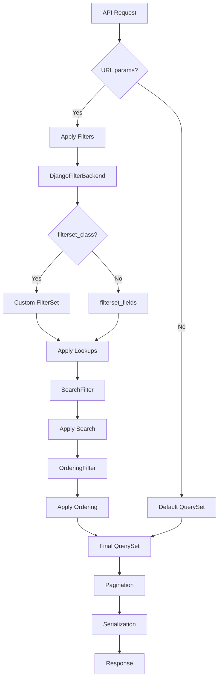

# 🔍 10-DARS: FILTERING, SEARCHING VA ORDERING

## 🎯 Dars Maqsadi

Bu darsda Django REST Framework'da **Filtering (Filtrlash)**, **Searching (Qidirish)** va **Ordering (Tartiblash)** funksiyalarini o'rganasiz. Bu funksiyalar API'dan olingan ma'lumotlarni foydalanuvchi ehtiyojiga moslashtirishni ta'minlaydi.

**Dars oxirida siz:**
- ✅ Filtering, Searching, Ordering farqi
- ✅ DjangoFilterBackend ishlatish
- ✅ SearchFilter va OrderingFilter
- ✅ Custom FilterSet yaratish
- ✅ Advanced filtering patterns
- ✅ Lookup operators (__gt, __lt, __contains)
- ✅ Multiple filters kombinatsiyasi
- ✅ Performance optimization

---

## 📚 Oldingi Darsdan Kerakli Bilimlar

Bu darsni boshlashdan oldin quyidagilar tayyor bo'lishi kerak:

- [x] ViewSet va QuerySet tushunchasi
- [x] Serializer ishlashi
- [x] URL parameters (query params)
- [x] Basic Django ORM

> **Eslatma:** Bu funksiyalar foydalanuvchi tajribasini sezilarli yaxshilaydi!

---

## 🔍 1. ASOSIY TUSHUNCHALAR

### 1.1 Filtering vs Searching vs Ordering

| Feature | Maqsad | Misol | Query Param |
|---------|--------|-------|-------------|
| **Filtering** | Aniq qiymatlar bo'yicha filtrlash | Faqat completed=True | `?completed=true` |
| **Searching** | Matnli qidiruv | Title da "Django" so'zi | `?search=Django` |
| **Ordering** | Natijalarni tartiblash | Eng yangilari birinchi | `?ordering=-created_at` |

### 1.2 Real Hayot Misollari

```python
# E-commerce
/products/?category=electronics&price__lt=1000&ordering=-rating
# Kategoriya: electronics, Narx: <1000, Tartiblash: reyting bo'yicha

# Blog
/posts/?search=django&status=published&ordering=-created_at
# Qidiruv: "django", Status: published, Eng yangilari birinchi

# Social Media
/posts/?author=john&created_at__gte=2024-01-01&ordering=-likes
# Muallif: john, Sana: 2024-yildan keyin, Eng ko'p like
```

### 1.3 Query Parameters Format

```python
# Single filter
/tasks/?completed=true

# Multiple filters
/tasks/?completed=true&priority=high

# Search
/tasks/?search=meeting

# Ordering
/tasks/?ordering=-created_at

# Kombinatsiya
/tasks/?completed=false&search=urgent&ordering=-priority
```

---

## 🛠️ 2. DJANGO-FILTER O'RNATISH

### 2.1 Installation

```bash
# django-filter paketini o'rnatish
pip install django-filter
```

### 2.2 Settings Configuration

`myproject/settings.py`:

```python
INSTALLED_APPS = [
    'django.contrib.admin',
    'django.contrib.auth',
    'django.contrib.contenttypes',
    'django.contrib.sessions',
    'django.contrib.messages',
    'django.contrib.staticfiles',
    
    # Third-party apps
    'rest_framework',
    'rest_framework.authtoken',
    'django_filters',  # ← Django-filter qo'shildi
    
    # Local apps
    'tasks',
]

# DRF Settings
REST_FRAMEWORK = {
    # Global filter backends
    'DEFAULT_FILTER_BACKENDS': [
        'django_filters.rest_framework.DjangoFilterBackend',  # Filtering
        'rest_framework.filters.SearchFilter',                # Searching
        'rest_framework.filters.OrderingFilter',              # Ordering
    ],
}
```

---

## 🎨 3. BASIC FILTERING

### 3.1 Simple Filtering

`tasks/views.py`:

```python
from rest_framework import viewsets
from django_filters.rest_framework import DjangoFilterBackend
from rest_framework.filters import SearchFilter, OrderingFilter
from .models import Task
from .serializers import TaskSerializer

class TaskViewSet(viewsets.ModelViewSet):
    """
    Task API with filtering, searching, and ordering
    """
    queryset = Task.objects.all()
    serializer_class = TaskSerializer
    
    # Filter backends - qaysi filter turlari ishlatiladi
    filter_backends = [
        DjangoFilterBackend,  # Filtering uchun
        SearchFilter,         # Searching uchun
        OrderingFilter,       # Ordering uchun
    ]
    
    # Simple filtering - aniq qiymat bo'yicha
    filterset_fields = ['completed', 'priority', 'owner']
    # Misol: /tasks/?completed=true
    # Misol: /tasks/?priority=high
    # Misol: /tasks/?owner=1
    
    # Searching - matnli qidiruv
    search_fields = ['title', 'description']
    # Misol: /tasks/?search=meeting
    # title yoki description da "meeting" so'zini qidiradi
    
    # Ordering - tartiblash
    ordering_fields = ['created_at', 'priority', 'completed']
    ordering = ['-created_at']  # Default ordering (eng yangilari)
    # Misol: /tasks/?ordering=-created_at (teskari)
    # Misol: /tasks/?ordering=priority (to'g'ri)
```

**Ishlatish:**

```bash
# Faqat bajarilgan tasklar
curl "http://127.0.0.1:8000/api/tasks/?completed=true"

# High priority tasklar
curl "http://127.0.0.1:8000/api/tasks/?priority=high"

# User 1 ning tasklari
curl "http://127.0.0.1:8000/api/tasks/?owner=1"

# Kombinatsiya: high priority, bajarilmagan
curl "http://127.0.0.1:8000/api/tasks/?priority=high&completed=false"
```

### 3.2 Advanced Model

Kengaytirilgan Task modeli:

`tasks/models.py`:

```python
from django.db import models
from django.contrib.auth.models import User

class Task(models.Model):
    """
    Task model with filtering, searching, ordering fields
    """
    # Priority choices
    PRIORITY_CHOICES = [
        ('low', 'Past'),
        ('medium', 'O\'rta'),
        ('high', 'Yuqori'),
        ('urgent', 'Срочный'),
    ]
    
    # Status choices
    STATUS_CHOICES = [
        ('todo', 'Qilish kerak'),
        ('in_progress', 'Jarayonda'),
        ('review', 'Ko\'rib chiqilmoqda'),
        ('done', 'Tayyor'),
    ]
    
    # Basic fields
    title = models.CharField(
        max_length=200,
        verbose_name="Sarlavha",
        help_text="Task nomi"
    )
    description = models.TextField(
        blank=True,
        verbose_name="Tavsif",
        help_text="Batafsil tavsif"
    )
    
    # Status fields
    completed = models.BooleanField(
        default=False,
        verbose_name="Bajarilganmi?",
        db_index=True  # Filtering uchun index
    )
    status = models.CharField(
        max_length=20,
        choices=STATUS_CHOICES,
        default='todo',
        verbose_name="Holat",
        db_index=True  # Filtering uchun index
    )
    priority = models.CharField(
        max_length=10,
        choices=PRIORITY_CHOICES,
        default='medium',
        verbose_name="Muhimlik",
        db_index=True  # Filtering uchun index
    )
    
    # Relationships
    owner = models.ForeignKey(
        User,
        on_delete=models.CASCADE,
        related_name='owned_tasks',
        verbose_name="Egasi"
    )
    assigned_to = models.ForeignKey(
        User,
        on_delete=models.SET_NULL,
        null=True,
        blank=True,
        related_name='assigned_tasks',
        verbose_name="Biriktirilgan"
    )
    
    # Dates
    due_date = models.DateField(
        null=True,
        blank=True,
        verbose_name="Tugash sanasi",
        db_index=True  # Filtering uchun index
    )
    created_at = models.DateTimeField(
        auto_now_add=True,
        verbose_name="Yaratilgan",
        db_index=True  # Ordering uchun index
    )
    updated_at = models.DateTimeField(
        auto_now=True,
        verbose_name="Yangilangan"
    )
    
    # Additional fields
    is_public = models.BooleanField(
        default=False,
        verbose_name="Ochiq",
        help_text="Barchaga ko'rinadi"
    )
    tags = models.CharField(
        max_length=200,
        blank=True,
        verbose_name="Teglar",
        help_text="Vergul bilan ajratilgan"
    )
    
    class Meta:
        verbose_name = "Vazifa"
        verbose_name_plural = "Vazifalar"
        ordering = ['-created_at']  # Default ordering
        indexes = [
            # Compound indexes (ko'p ishlatiladigan kombinatsiyalar)
            models.Index(fields=['owner', 'completed']),
            models.Index(fields=['priority', 'status']),
            models.Index(fields=['created_at', 'priority']),
        ]
    
    def __str__(self):
        return f"{self.title} [{self.get_priority_display()}]"
```

---

## 🔧 4. CUSTOM FILTERSET

### 4.1 FilterSet Class

`tasks/filters.py` yarating:

```python
from django_filters import rest_framework as filters
from .models import Task

class TaskFilter(filters.FilterSet):
    """
    Custom FilterSet for Task model
    
    Bu yerda lookups va custom filtering logic qo'shamiz
    """
    
    # Exact match (default)
    title = filters.CharFilter(
        field_name='title',
        lookup_expr='icontains'  # Case-insensitive contains
    )
    # Misol: /tasks/?title=meeting
    # "meeting", "Meeting", "MEETING" - hammasi topiladi
    
    # Date range filtering
    created_after = filters.DateFilter(
        field_name='created_at',
        lookup_expr='gte'  # Greater than or equal
    )
    created_before = filters.DateFilter(
        field_name='created_at',
        lookup_expr='lte'  # Less than or equal
    )
    # Misol: /tasks/?created_after=2024-01-01&created_before=2024-12-31
    # 2024 yildagi barcha tasklar
    
    # Due date range
    due_date_from = filters.DateFilter(
        field_name='due_date',
        lookup_expr='gte'
    )
    due_date_to = filters.DateFilter(
        field_name='due_date',
        lookup_expr='lte'
    )
    
    # Multiple choice filtering
    priority = filters.MultipleChoiceFilter(
        field_name='priority',
        choices=Task.PRIORITY_CHOICES
    )
    # Misol: /tasks/?priority=high&priority=urgent
    # High yoki urgent priority (OR logic)
    
    # Boolean filters
    completed = filters.BooleanFilter(field_name='completed')
    is_public = filters.BooleanFilter(field_name='is_public')
    
    # Related field filtering
    owner = filters.NumberFilter(field_name='owner__id')
    owner_username = filters.CharFilter(
        field_name='owner__username',
        lookup_expr='icontains'
    )
    # Misol: /tasks/?owner_username=john
    
    # Custom method filter
    is_overdue = filters.BooleanFilter(method='filter_overdue')
    
    def filter_overdue(self, queryset, name, value):
        """
        Muddati o'tgan tasklarni filtrlash
        """
        from datetime import date
        
        if value:
            # Overdue: due_date < today AND not completed
            return queryset.filter(
                due_date__lt=date.today(),
                completed=False
            )
        else:
            # Not overdue
            return queryset.exclude(
                due_date__lt=date.today(),
                completed=False
            )
    # Misol: /tasks/?is_overdue=true
    
    # Tags filtering
    has_tag = filters.CharFilter(method='filter_has_tag')
    
    def filter_has_tag(self, queryset, name, value):
        """
        Tag bo'yicha filtrlash (comma-separated)
        """
        # tags field: "urgent,work,personal"
        return queryset.filter(tags__icontains=value)
    # Misol: /tasks/?has_tag=work
    
    class Meta:
        model = Task
        fields = {
            # Simple fields
            'completed': ['exact'],
            'status': ['exact'],
            'priority': ['exact'],
            'is_public': ['exact'],
            
            # Date fields with lookups
            'created_at': ['exact', 'gte', 'lte', 'year', 'month'],
            'due_date': ['exact', 'gte', 'lte', 'isnull'],
            
            # Char fields with lookups
            'title': ['exact', 'icontains', 'istartswith'],
            'description': ['icontains'],
            
            # Related fields
            'owner': ['exact'],
            'assigned_to': ['exact', 'isnull'],
        }
        # Misol: /tasks/?created_at__year=2024
        # Misol: /tasks/?title__istartswith=meeting
        # Misol: /tasks/?assigned_to__isnull=true (biriktirilmagan)


class AdvancedTaskFilter(filters.FilterSet):
    """
    Advanced filtering with complex logic
    """
    
    # Min/Max priority
    min_priority = filters.ChoiceFilter(
        field_name='priority',
        lookup_expr='gte',
        choices=Task.PRIORITY_CHOICES
    )
    
    # Date ranges
    created_at = filters.DateFromToRangeFilter()
    # Misol: /tasks/?created_at_after=2024-01-01&created_at_before=2024-12-31
    
    # Number ranges
    days_until_due = filters.NumberFilter(method='filter_days_until_due')
    
    def filter_days_until_due(self, queryset, name, value):
        """
        Due date ga necha kun qolgan
        """
        from datetime import date, timedelta
        
        target_date = date.today() + timedelta(days=value)
        return queryset.filter(
            due_date__lte=target_date,
            due_date__gte=date.today()
        )
    # Misol: /tasks/?days_until_due=7 (1 haftadan kam)
    
    # My tasks filter
    my_tasks = filters.BooleanFilter(method='filter_my_tasks')
    
    def filter_my_tasks(self, queryset, name, value):
        """
        Foydalanuvchining barcha tasklari (owner yoki assigned)
        """
        if not value or not self.request:
            return queryset
        
        user = self.request.user
        return queryset.filter(
            models.Q(owner=user) | models.Q(assigned_to=user)
        )
    # Misol: /tasks/?my_tasks=true
    
    class Meta:
        model = Task
        fields = []  # Meta.fields da belgilangan fieldlar avtomatik
```

### 4.2 ViewSet da FilterSet ishlatish

`tasks/views.py`:

```python
from django_filters.rest_framework import DjangoFilterBackend
from rest_framework.filters import SearchFilter, OrderingFilter
from rest_framework import viewsets
from .models import Task
from .serializers import TaskSerializer
from .filters import TaskFilter  # Custom FilterSet

class TaskViewSet(viewsets.ModelViewSet):
    """
    Task API with custom filtering
    """
    queryset = Task.objects.all()
    serializer_class = TaskSerializer
    
    # Filter backends
    filter_backends = [DjangoFilterBackend, SearchFilter, OrderingFilter]
    
    # Custom FilterSet class
    filterset_class = TaskFilter  # ← Custom FilterSet ishlatiladi
    
    # Search fields
    search_fields = [
        'title',           # Exact field
        'description',     # Exact field
        '=owner__username',  # = prefix: exact match
        '^tags',           # ^ prefix: starts with
    ]
    # Misol: /tasks/?search=meeting
    # title, description da "meeting" qidiradi
    
    # Ordering fields
    ordering_fields = [
        'created_at',
        'updated_at',
        'due_date',
        'priority',
        'title',
    ]
    ordering = ['-created_at']  # Default
    
    def get_queryset(self):
        """
        Queryset ni optimize qilish
        """
        queryset = super().get_queryset()
        
        # Select related (foreign key optimization)
        queryset = queryset.select_related('owner', 'assigned_to')
        
        # Prefetch related (many-to-many optimization)
        # queryset = queryset.prefetch_related('comments', 'attachments')
        
        return queryset
```

---

## 🔍 5. SEARCH FILTER

### 5.1 Basic Search

```python
class TaskViewSet(viewsets.ModelViewSet):
    queryset = Task.objects.all()
    serializer_class = TaskSerializer
    filter_backends = [SearchFilter]
    
    # Simple search
    search_fields = ['title', 'description']
    # /tasks/?search=meeting
    # title yoki description da "meeting" (case-insensitive)
```

### 5.2 Advanced Search Patterns

```python
class TaskViewSet(viewsets.ModelViewSet):
    queryset = Task.objects.all()
    serializer_class = TaskSerializer
    filter_backends = [SearchFilter]
    
    search_fields = [
        # Default: icontains (case-insensitive contains)
        'title',              # title__icontains
        'description',        # description__icontains
        
        # Exact match
        '=owner__username',   # owner__username__exact
        
        # Starts with
        '^title',             # title__istartswith
        
        # Full-text search (PostgreSQL only)
        '@title',             # Full-text search
        '@description',
        
        # Related fields
        'owner__username',            # Owner nomi
        'owner__email',               # Owner email
        'assigned_to__username',      # Assigned user nomi
        
        # Multiple related
        'owner__profile__company',    # Owner kompaniyasi
    ]
    
    # Misol: /tasks/?search=john
    # - title da "john" bor tasklar
    # - description da "john" bor tasklar
    # - owner.username = "john" tasklar
    # - owner.email da "john" bor tasklar
```

### 5.3 Custom Search Backend

`tasks/filters.py`:

```python
from rest_framework import filters

class CustomSearchFilter(filters.SearchFilter):
    """
    Custom search filter with additional logic
    """
    
    def filter_queryset(self, request, queryset, view):
        """
        Custom search logic
        """
        search_term = request.query_params.get('search', '')
        
        if not search_term:
            return queryset
        
        # Split search term into words
        words = search_term.split()
        
        # Search each word (AND logic)
        for word in words:
            queryset = queryset.filter(
                models.Q(title__icontains=word) |
                models.Q(description__icontains=word) |
                models.Q(tags__icontains=word)
            )
        
        return queryset
    
    # Misol: /tasks/?search=urgent meeting
    # title yoki description da "urgent" VA "meeting" bor tasklar
```

---

## 📊 6. ORDERING FILTER

### 6.1 Basic Ordering

```python
class TaskViewSet(viewsets.ModelViewSet):
    queryset = Task.objects.all()
    serializer_class = TaskSerializer
    filter_backends = [OrderingFilter]
    
    # Ordering fields
    ordering_fields = ['created_at', 'priority', 'title']
    
    # Default ordering
    ordering = ['-created_at']  # Minus (-) = descending
    
    # Misol: /tasks/?ordering=created_at (ascending)
    # Misol: /tasks/?ordering=-created_at (descending)
    # Misol: /tasks/?ordering=priority,-created_at (multi-field)
```

### 6.2 Custom Ordering

```python
from rest_framework import filters

class CustomOrderingFilter(filters.OrderingFilter):
    """
    Custom ordering with additional fields
    """
    
    def get_ordering(self, request, queryset, view):
        """
        Custom ordering logic
        """
        ordering = super().get_ordering(request, queryset, view)
        
        if not ordering:
            # Default ordering
            return ['-created_at']
        
        return ordering
    
    def filter_queryset(self, request, queryset, view):
        """
        Apply ordering with custom logic
        """
        ordering = self.get_ordering(request, queryset, view)
        
        if ordering:
            # Custom field mappings
            ordering_map = {
                'priority': 'priority_order',  # Custom priority ordering
                'status': 'status_order',
            }
            
            # Replace custom fields
            mapped_ordering = []
            for field in ordering:
                # Remove - if present
                desc = field.startswith('-')
                field_name = field[1:] if desc else field
                
                # Map to custom field
                if field_name in ordering_map:
                    field_name = ordering_map[field_name]
                
                # Add - back if needed
                mapped_ordering.append(f"-{field_name}" if desc else field_name)
            
            queryset = queryset.order_by(*mapped_ordering)
        
        return queryset
```

### 6.3 Priority-based Ordering

```python
from django.db.models import Case, When, IntegerField

class TaskViewSet(viewsets.ModelViewSet):
    queryset = Task.objects.all()
    serializer_class = TaskSerializer
    
    def get_queryset(self):
        """
        Add custom ordering fields
        """
        queryset = super().get_queryset()
        
        # Priority ordering: urgent > high > medium > low
        queryset = queryset.annotate(
            priority_order=Case(
                When(priority='urgent', then=0),
                When(priority='high', then=1),
                When(priority='medium', then=2),
                When(priority='low', then=3),
                output_field=IntegerField(),
            )
        )
        
        # Status ordering: todo > in_progress > review > done
        queryset = queryset.annotate(
            status_order=Case(
                When(status='todo', then=0),
                When(status='in_progress', then=1),
                When(status='review', then=2),
                When(status='done', then=3),
                output_field=IntegerField(),
            )
        )
        
        return queryset
    
    # Misol: /tasks/?ordering=priority_order
    # urgent tasklar birinchi
```

---

## 💼 7. TO'LIQ REAL MISOL

### 7.1 Complete ViewSet

`tasks/views.py`:

```python
from rest_framework import viewsets, status
from rest_framework.decorators import action
from rest_framework.response import Response
from django_filters.rest_framework import DjangoFilterBackend
from rest_framework.filters import SearchFilter, OrderingFilter
from django.db.models import Q, Count, Case, When, IntegerField
from datetime import date, timedelta

from .models import Task
from .serializers import TaskSerializer, TaskListSerializer
from .filters import TaskFilter
from .permissions import IsOwnerOrReadOnly

class TaskViewSet(viewsets.ModelViewSet):
    """
    Complete Task API with filtering, searching, and ordering
    
    Endpoints:
    - GET /tasks/ - List with filters
    - POST /tasks/ - Create
    - GET /tasks/{id}/ - Retrieve
    - PUT /tasks/{id}/ - Update
    - PATCH /tasks/{id}/ - Partial update
    - DELETE /tasks/{id}/ - Delete
    
    Custom actions:
    - GET /tasks/my_tasks/ - User's own tasks
    - GET /tasks/overdue/ - Overdue tasks
    - GET /tasks/upcoming/ - Upcoming deadlines
    """
    
    queryset = Task.objects.all()
    serializer_class = TaskSerializer
    permission_classes = [IsOwnerOrReadOnly]
    
    # Filter backends
    filter_backends = [
        DjangoFilterBackend,  # Filtering
        SearchFilter,         # Searching
        OrderingFilter,       # Ordering
    ]
    
    # Filtering
    filterset_class = TaskFilter  # Custom FilterSet
    
    # Searching
    search_fields = [
        'title',              # title__icontains
        'description',        # description__icontains
        '^tags',             # tags__istartswith
        '=owner__username',   # owner__username__exact
    ]
    
    # Ordering
    ordering_fields = [
        'created_at',
        'updated_at',
        'due_date',
        'priority_order',  # Custom annotated field
        'status_order',    # Custom annotated field
        'title',
    ]
    ordering = ['-created_at']  # Default
    
    def get_queryset(self):
        """
        Optimize queryset and add custom annotations
        """
        queryset = super().get_queryset()
        
        # Select related (ForeignKey optimization)
        queryset = queryset.select_related('owner', 'assigned_to')
        
        # Add custom ordering fields
        queryset = queryset.annotate(
            # Priority ordering
            priority_order=Case(
                When(priority='urgent', then=0),
                When(priority='high', then=1),
                When(priority='medium', then=2),
                When(priority='low', then=3),
                default=4,
                output_field=IntegerField(),
            ),
            # Status ordering
            status_order=Case(
                When(status='todo', then=0),
                When(status='in_progress', then=1),
                When(status='review', then=2),
                When(status='done', then=3),
                default=4,
                output_field=IntegerField(),
            )
        )
        
        return queryset
    
    def get_serializer_class(self):
        """
        List uchun boshqa serializer ishlatish
        """
        if self.action == 'list':
            return TaskListSerializer  # Kam fieldlar
        return TaskSerializer  # To'liq ma'lumot
    
    @action(detail=False, methods=['get'])
    def my_tasks(self, request):
        """
        User ning barcha tasklari
        
        URL: GET /tasks/my_tasks/
        Filters: Barcha standart filterlar ishlaydi
        """
        # User ning tasklari (owner yoki assigned)
        queryset = self.filter_queryset(
            self.get_queryset().filter(
                Q(owner=request.user) | Q(assigned_to=request.user)
            )
        )
        
        # Pagination
        page = self.paginate_queryset(queryset)
        if page is not None:
            serializer = self.get_serializer(page, many=True)
            return self.get_paginated_response(serializer.data)
        
        serializer = self.get_serializer(queryset, many=True)
        return Response(serializer.data)
    
    @action(detail=False, methods=['get'])
    def overdue(self, request):
        """
        Muddati o'tgan tasklar
        
        URL: GET /tasks/overdue/
        """
        # Overdue: due_date < today AND not completed
        queryset = self.filter_queryset(
            self.get_queryset().filter(
                due_date__lt=date.today(),
                completed=False
            )
        )
        
        # Ordering by due_date (most overdue first)
        queryset = queryset.order_by('due_date')
        
        page = self.paginate_queryset(queryset)
        if page is not None:
            serializer = self.get_serializer(page, many=True)
            return self.get_paginated_response(serializer.data)
        
        serializer = self.get_serializer(queryset, many=True)
        return Response(serializer.data)
    
    @action(detail=False, methods=['get'])
    def upcoming(self, request):
        """
        Yaqin kunda tugaydigan tasklar (7 kun ichida)
        
        URL: GET /tasks/upcoming/
        Query params: ?days=7 (default)
        """
        # Days parameter
        days = int(request.query_params.get('days', 7))
        
        # Upcoming deadline
        end_date = date.today() + timedelta(days=days)
        
        queryset = self.filter_queryset(
            self.get_queryset().filter(
                due_date__gte=date.today(),
                due_date__lte=end_date,
                completed=False
            )
        )
        
        # Order by due_date
        queryset = queryset.order_by('due_date')
        
        page = self.paginate_queryset(queryset)
        if page is not None:
            serializer = self.get_serializer(page, many=True)
            return self.get_paginated_response(serializer.data)
        
        serializer = self.get_serializer(queryset, many=True)
        return Response(serializer.data)
    
    @action(detail=False, methods=['get'])
    def stats(self, request):
        """
        Filter bo'yicha statistika
        
        URL: GET /tasks/stats/
        Filters: Barcha filterlar qo'llaniladi, so'ng statistika hisoblanadi
        """
        # Filter qo'llangan queryset
        queryset = self.filter_queryset(self.get_queryset())
        
        # Statistics
        total = queryset.count()
        completed = queryset.filter(completed=True).count()
        
        # By priority
        by_priority = {}
        for choice in Task.PRIORITY_CHOICES:
            key = choice[0]
            count = queryset.filter(priority=key).count()
            by_priority[key] = count
        
        # By status
        by_status = {}
        for choice in Task.STATUS_CHOICES:
            key = choice[0]
            count = queryset.filter(status=key).count()
            by_status[key] = count
        
        return Response({
            'total': total,
            'completed': completed,
            'pending': total - completed,
            'completion_rate': f"{(completed/total*100):.1f}%" if total > 0 else "0%",
            'by_priority': by_priority,
            'by_status': by_status,
        })
```

### 7.2 List Serializer

`tasks/serializers.py`:

```python
from rest_framework import serializers
from .models import Task

class TaskListSerializer(serializers.ModelSerializer):
    """
    Simplified serializer for list view
    Kam fieldlar = tezroq response
    """
    owner = serializers.ReadOnlyField(source='owner.username')
    status_display = serializers.CharField(source='get_status_display')
    priority_display = serializers.CharField(source='get_priority_display')
    
    class Meta:
        model = Task
        fields = [
            'id',
            'title',
            'status',
            'status_display',
            'priority',
            'priority_display',
            'completed',
            'due_date',
            'owner',
            'created_at',
        ]


class TaskSerializer(serializers.ModelSerializer):
    """
    Full serializer for detail view
    """
    owner = serializers.ReadOnlyField(source='owner.username')
    assigned_to_username = serializers.ReadOnlyField(source='assigned_to.username')
    
    # Display values
    status_display = serializers.CharField(source='get_status_display', read_only=True)
    priority_display = serializers.CharField(source='get_priority_display', read_only=True)
    
    # Computed fields
    is_overdue = serializers.SerializerMethodField()
    days_until_due = serializers.SerializerMethodField()
    
    class Meta:
        model = Task
        fields = [
            'id',
            'title',
            'description',
            'status',
            'status_display',
            'priority',
            'priority_display',
            'completed',
            'due_date',
            'owner',
            'assigned_to',
            'assigned_to_username',
            'is_public',
            'tags',
            'created_at',
            'updated_at',
            'is_overdue',
            'days_until_due',
        ]
        read_only_fields = ['owner', 'created_at', 'updated_at']
    
    def get_is_overdue(self, obj):
        """
        Muddati o'tganmi?
        """
        from datetime import date
        if obj.due_date and not obj.completed:
            return obj.due_date < date.today()
        return False
    
    def get_days_until_due(self, obj):
        """
        Due date ga necha kun qolgan
        """
        from datetime import date
        if obj.due_date:
            delta = (obj.due_date - date.today()).days
            return delta
        return None
```

---

## ✅ 8. TESTING EXAMPLES

### 8.1 Filtering Examples

```bash
# Basic filtering
curl "http://127.0.0.1:8000/api/tasks/?completed=true"
curl "http://127.0.0.1:8000/api/tasks/?priority=high"
curl "http://127.0.0.1:8000/api/tasks/?status=in_progress"

# Date filtering
curl "http://127.0.0.1:8000/api/tasks/?created_at__gte=2024-01-01"
curl "http://127.0.0.1:8000/api/tasks/?due_date__lte=2024-12-31"

# Lookup expressions
curl "http://127.0.0.1:8000/api/tasks/?title__icontains=meeting"
curl "http://127.0.0.1:8000/api/tasks/?created_at__year=2024"
curl "http://127.0.0.1:8000/api/tasks/?assigned_to__isnull=true"

# Custom filters
curl "http://127.0.0.1:8000/api/tasks/?is_overdue=true"
curl "http://127.0.0.1:8000/api/tasks/?has_tag=work"
curl "http://127.0.0.1:8000/api/tasks/?my_tasks=true"

# Multiple filters (AND logic)
curl "http://127.0.0.1:8000/api/tasks/?priority=high&completed=false&status=in_progress"
```

### 8.2 Searching Examples

```bash
# Basic search
curl "http://127.0.0.1:8000/api/tasks/?search=meeting"

# Multiple words (OR logic in search_fields)
curl "http://127.0.0.1:8000/api/tasks/?search=urgent+meeting"

# Search + Filter
curl "http://127.0.0.1:8000/api/tasks/?search=meeting&priority=high"
```

### 8.3 Ordering Examples

```bash
# Single field ordering
curl "http://127.0.0.1:8000/api/tasks/?ordering=created_at"     # Ascending
curl "http://127.0.0.1:8000/api/tasks/?ordering=-created_at"    # Descending

# Multiple fields
curl "http://127.0.0.1:8000/api/tasks/?ordering=priority_order,-created_at"

# Custom ordering
curl "http://127.0.0.1:8000/api/tasks/?ordering=-priority_order"  # Urgent first
```

### 8.4 Combined Examples

```bash
# Filter + Search + Order
curl "http://127.0.0.1:8000/api/tasks/?completed=false&search=meeting&ordering=-priority_order"

# Complex query
curl "http://127.0.0.1:8000/api/tasks/?status=in_progress&priority=high&created_at__gte=2024-01-01&ordering=-created_at"

# Custom actions with filters
curl "http://127.0.0.1:8000/api/tasks/my_tasks/?priority=high&ordering=-due_date"
curl "http://127.0.0.1:8000/api/tasks/upcoming/?days=3&priority=urgent"
```

---

## 🎯 AMALIYOT TOPSHIRIQLARI

### 📝 Topshiriq 1: Product Filtering (Oson)

**Model:**
```python
class Product(models.Model):
    name = models.CharField(max_length=200)
    price = models.DecimalField(max_digits=10, decimal_places=2)
    category = models.CharField(max_length=50)
    in_stock = models.BooleanField(default=True)
    created_at = models.DateTimeField(auto_now_add=True)
```

**Talablar:**
- ✅ Filter by category, in_stock
- ✅ Price range filter (min_price, max_price)
- ✅ Search by name
- ✅ Order by price, created_at

### 📝 Topshiriq 2: Blog Post Advanced Filtering (O'rta)

**Models:**
```python
class Category(models.Model):
    name = models.CharField(max_length=100)

class BlogPost(models.Model):
    title = models.CharField(max_length=200)
    content = models.TextField()
    author = models.ForeignKey(User, on_delete=models.CASCADE)
    category = models.ForeignKey(Category, on_delete=models.SET_NULL, null=True)
    published = models.BooleanField(default=False)
    published_at = models.DateTimeField(null=True)
    views = models.IntegerField(default=0)
    tags = models.CharField(max_length=200)
```

**Talablar:**
- ✅ FilterSet with date ranges
- ✅ Category filtering (by name or ID)
- ✅ Author filtering (by username)
- ✅ Published vs draft filtering
- ✅ Tag-based filtering
- ✅ Views range (min_views, max_views)
- ✅ Full-text search (title, content)
- ✅ Custom filter: popular (views > 1000)

### 📝 Topshiriq 3: E-commerce Advanced Search (Qiyin)

**Complex filtering system:**

**Talablar:**
- ✅ Multi-level category filtering (parent → child)
- ✅ Price ranges with currency conversion
- ✅ Rating filter (stars)
- ✅ Availability filter (in_stock, pre_order, out_of_stock)
- ✅ Brand filtering
- ✅ Multiple tag filtering (AND logic)
- ✅ Custom filters:
  - `on_sale` - discount mavjud
  - `new_arrivals` - 30 kun ichida qo'shilgan
  - `trending` - ko'p sotilgan
- ✅ Faceted search (filtering + counts)
- ✅ Autocomplete search

---

## 📊 FILTERING FLOW



---

## 🔗 KEYINGI DARSLAR

✅ **Dars 10 tugadi! Filtering, Searching, Ordering to'liq o'rgandingiz!**

**Keyingi darsda:**
- Pagination (Sahifalash)
- LimitOffsetPagination
- PageNumberPagination
- CursorPagination

---

## 📚 QISQA XULOSALAR

### Lookup Expressions

```python
# Exact
field__exact='value'         # Aynan teng
field='value'                # Qisqartma

# Contains
field__contains='value'      # O'z ichiga oladi (case-sensitive)
field__icontains='value'     # O'z ichiga oladi (case-insensitive)

# Starts/Ends with
field__startswith='value'    # Boshlanadi
field__istartswith='value'   # Boshlanadi (case-insensitive)
field__endswith='value'      # Tugaydi
field__iendswith='value'     # Tugaydi (case-insensitive)

# Comparisons
field__gt=10                 # Greater than
field__gte=10                # Greater than or equal
field__lt=10                 # Less than
field__lte=10                # Less than or equal

# Null checks
field__isnull=True           # NULL
field__isnull=False          # NOT NULL

# Date/Time
field__year=2024             # Year
field__month=1               # Month
field__day=15                # Day
field__date='2024-01-15'     # Date part

# Range
field__range=(1, 10)         # Between 1 and 10

# In list
field__in=[1,2,3]            # IN (1, 2, 3)
```

### Search Modifiers

```python
# Default (icontains)
'title'                      # title__icontains

# Exact (=)
'=username'                  # username__exact

# Starts with (^)
'^email'                     # email__istartswith

# Full-text (@) - PostgreSQL only
'@description'               # Full-text search

# Related (.)
'owner__username'            # Related field
```

### Best Practices

| ✅ To'g'ri | ❌ Noto'g'ri |
|----------|------------|
| db_index qo'shish (ko'p filtrlangan fieldlarga) | Index'siz qoldirish |
| Custom FilterSet ishlatish | Faqat filterset_fields |
| select_related / prefetch_related | N+1 query muammosi |
| List uchun simplified serializer | Har doim to'liq serializer |
| Pagination qo'shish | Cheksiz natijalar |

### Performance Tips

```python
# ✅ Good
queryset.select_related('owner')  # ForeignKey
queryset.prefetch_related('tags')  # ManyToMany

# ✅ Good - Indexing
class Meta:
    indexes = [
        models.Index(fields=['created_at', 'priority']),
    ]

# ✅ Good - Compound filters
filterset_fields = {
    'created_at': ['gte', 'lte'],  # Range
}

# ❌ Bad
for task in tasks:
    owner = task.owner  # N+1 query

# ❌ Bad
Task.objects.all()  # No filtering, thousands of records
```

**Esda tuting:**
- Filtering = Backend da filtrlash
- Searching = Matnli qidiruv
- Ordering = Tartiblash
- Index qo'ying = Performance ↑
- Pagination kerak = Sanoqsiz ma'lumotlar uchun
