# 📄 11-DARS: PAGINATION (SAHIFALASH)

## 🎯 Dars Maqsadi

Bu darsda Django REST Framework'da **Pagination (Sahifalash)** bilan ishlashni o'rganasiz. Pagination - katta hajmdagi ma'lumotlarni kichik qismlarga bo'lib, API performansini va foydalanuvchi tajribasini yaxshilash uchun kerak bo'lgan muhim texnologiya.

**Dars oxirida siz:**
- ✅ Pagination nima va nega kerak
- ✅ PageNumberPagination
- ✅ LimitOffsetPagination
- ✅ CursorPagination
- ✅ Custom pagination class
- ✅ Pagination + Filtering + Searching
- ✅ Performance considerations
- ✅ Frontend integration patterns

---

## 📚 Oldingi Darsdan Kerakli Bilimlar

Bu darsni boshlashdan oldin quyidagilar tayyor bo'lishi kerak:

- [x] ViewSet va QuerySet
- [x] Serializer
- [x] Filtering va Searching
- [x] Response format

> **Eslatma:** Pagination - har qanday production API'da bo'lishi shart!

---

## 🔍 1. PAGINATION NIMA?

### 1.1 Asosiy Tushuncha

**Pagination** - ma'lumotlarni kichik "sahifalarga" bo'lish:

```
Database: 10,000 ta record
  ↓
Pagination: Har safar 20 ta
  ↓
User: 500 marta kam ma'lumot yuklaydi
```

### 1.2 Nega Kerak?

| Muammo | Pagination'siz | Pagination bilan |
|--------|----------------|------------------|
| **Database load** | 10,000 ta record SELECT | 20 ta record SELECT |
| **Network transfer** | 5 MB JSON | 10 KB JSON |
| **Client memory** | 5 MB parse | 10 KB parse |
| **User experience** | 10 soniya kutish | 0.1 soniya ⚡ |
| **Server cost** | 💰💰💰 | 💰 |

### 1.3 Real Hayot Misollari

```python
# Google Search
# 10 natija per page, billions of results

# Instagram Feed
# 20 post per scroll, infinite scrolling

# GitHub API
# 30 items per page, max 100

# Twitter API
# 200 tweets per request (max)
```

---

## 🛠️ 2. PAGE NUMBER PAGINATION

### 2.1 Basic Setup

`myproject/settings.py`:

```python
REST_FRAMEWORK = {
    # Global pagination
    'DEFAULT_PAGINATION_CLASS': 'rest_framework.pagination.PageNumberPagination',
    'PAGE_SIZE': 10,  # Har bir sahifada 10 ta item
}
```

**Ishlatish:**
```bash
# Birinchi sahifa (default)
GET /api/tasks/

# Ikkinchi sahifa
GET /api/tasks/?page=2

# Uchinchi sahifa
GET /api/tasks/?page=3
```

**Response format:**
```json
{
    "count": 100,        // Jami itemlar soni
    "next": "http://api.example.com/tasks/?page=3",      // Keyingi sahifa
    "previous": "http://api.example.com/tasks/?page=1",  // Oldingi sahifa
    "results": [         // Hozirgi sahifa ma'lumotlari
        {"id": 1, "title": "Task 1"},
        {"id": 2, "title": "Task 2"},
        // ... 10 ta item
    ]
}
```

### 2.2 Custom PageNumberPagination

`tasks/pagination.py` yarating:

```python
from rest_framework.pagination import PageNumberPagination
from rest_framework.response import Response

class StandardResultsPagination(PageNumberPagination):
    """
    Standard pagination - ko'pchilik endpoint'lar uchun
    
    Features:
    - Page size: 10 (default)
    - User can override: ?page_size=50
    - Max page size: 100
    """
    # Default page size
    page_size = 10
    
    # User page size override parameter
    # Misol: ?page_size=25
    page_size_query_param = 'page_size'
    
    # Max page size (user 1000 deb yozmasa ham)
    max_page_size = 100
    
    # Custom response format
    def get_paginated_response(self, data):
        """
        Custom response with additional metadata
        """
        return Response({
            'count': self.page.paginator.count,           # Jami items
            'total_pages': self.page.paginator.num_pages, # Jami sahifalar
            'current_page': self.page.number,             # Hozirgi sahifa
            'page_size': self.page_size,                  # Sahifa hajmi
            'next': self.get_next_link(),                 # Keyingi sahifa URL
            'previous': self.get_previous_link(),         # Oldingi sahifa URL
            'results': data                               # Ma'lumotlar
        })


class SmallResultsPagination(PageNumberPagination):
    """
    Kichik pagination - mobile uchun
    """
    page_size = 5
    page_size_query_param = 'page_size'
    max_page_size = 20


class LargeResultsPagination(PageNumberPagination):
    """
    Katta pagination - admin panel uchun
    """
    page_size = 50
    page_size_query_param = 'page_size'
    max_page_size = 500


class CustomPageNumberPagination(PageNumberPagination):
    """
    Advanced custom pagination with extra features
    """
    page_size = 20
    page_size_query_param = 'page_size'
    max_page_size = 100
    
    # Custom page query parameter
    # Misol: ?p=2 instead of ?page=2
    page_query_param = 'page'
    
    # Last page string
    # Misol: ?page=last
    last_page_strings = ('last',)
    
    def get_paginated_response(self, data):
        """
        Enhanced response with links object
        """
        return Response({
            'pagination': {
                'count': self.page.paginator.count,
                'total_pages': self.page.paginator.num_pages,
                'current_page': self.page.number,
                'per_page': self.get_page_size(self.request),
                'has_next': self.page.has_next(),
                'has_previous': self.page.has_previous(),
            },
            'links': {
                'next': self.get_next_link(),
                'previous': self.get_previous_link(),
                # Custom links
                'first': self.get_first_link(),
                'last': self.get_last_link(),
            },
            'results': data
        })
    
    def get_first_link(self):
        """
        First page link
        """
        if not self.page.has_previous():
            return None
        
        url = self.request.build_absolute_uri()
        return self.replace_query_param(url, self.page_query_param, 1)
    
    def get_last_link(self):
        """
        Last page link
        """
        if not self.page.has_next():
            return None
        
        url = self.request.build_absolute_uri()
        return self.replace_query_param(
            url,
            self.page_query_param,
            self.page.paginator.num_pages
        )
    
    def replace_query_param(self, url, key, val):
        """
        Helper method to replace query parameter
        """
        from django.utils.http import urlencode
        from urllib.parse import urlparse, parse_qs, urlunparse
        
        parsed = urlparse(url)
        params = parse_qs(parsed.query)
        params[key] = [str(val)]
        
        new_query = urlencode(params, doseq=True)
        return urlunparse((
            parsed.scheme,
            parsed.netloc,
            parsed.path,
            parsed.params,
            new_query,
            parsed.fragment
        ))
```

### 2.3 ViewSet da Ishlatish

`tasks/views.py`:

```python
from rest_framework import viewsets
from .models import Task
from .serializers import TaskSerializer
from .pagination import StandardResultsPagination

class TaskViewSet(viewsets.ModelViewSet):
    """
    Task API with pagination
    """
    queryset = Task.objects.all()
    serializer_class = TaskSerializer
    
    # Custom pagination class
    pagination_class = StandardResultsPagination
    
    # QuerySet optimization
    def get_queryset(self):
        """
        Optimize queryset for pagination
        """
        queryset = super().get_queryset()
        
        # Select related
        queryset = queryset.select_related('owner', 'assigned_to')
        
        # Order by (pagination uchun kerak!)
        queryset = queryset.order_by('-created_at')
        
        return queryset
```

---

## 📊 3. LIMIT OFFSET PAGINATION

### 3.1 Basic Concept

**LimitOffsetPagination** - SQL LIMIT/OFFSET ga o'xshash:

```sql
-- Page 1: Items 0-9
SELECT * FROM tasks LIMIT 10 OFFSET 0;

-- Page 2: Items 10-19
SELECT * FROM tasks LIMIT 10 OFFSET 10;

-- Page 3: Items 20-29
SELECT * FROM tasks LIMIT 10 OFFSET 20;
```

### 3.2 Implementation

`tasks/pagination.py`:

```python
from rest_framework.pagination import LimitOffsetPagination

class StandardLimitOffsetPagination(LimitOffsetPagination):
    """
    Limit/Offset pagination
    
    Usage:
    - ?limit=10&offset=0  (first 10 items)
    - ?limit=10&offset=10 (next 10 items)
    - ?limit=5&offset=15  (items 15-19)
    """
    
    # Default limit
    default_limit = 10
    
    # User can override limit
    # Misol: ?limit=50
    limit_query_param = 'limit'
    
    # User can override offset
    # Misol: ?offset=100
    offset_query_param = 'offset'
    
    # Max limit
    max_limit = 100
    
    def get_paginated_response(self, data):
        """
        Custom response format
        """
        return Response({
            'count': self.count,
            'limit': self.limit,
            'offset': self.offset,
            'next': self.get_next_link(),
            'previous': self.get_previous_link(),
            'results': data
        })


class FlexibleLimitOffsetPagination(LimitOffsetPagination):
    """
    Flexible pagination for data exports
    """
    default_limit = 20
    limit_query_param = 'limit'
    offset_query_param = 'offset'
    max_limit = 1000  # Export uchun kattaroq limit
    
    def get_paginated_response(self, data):
        """
        Enhanced response with range info
        """
        # Calculate range
        start = self.offset + 1
        end = min(self.offset + self.limit, self.count)
        
        return Response({
            'pagination': {
                'total': self.count,
                'limit': self.limit,
                'offset': self.offset,
                'range': f"{start}-{end}",  # "1-20 of 100"
            },
            'links': {
                'next': self.get_next_link(),
                'previous': self.get_previous_link(),
            },
            'results': data
        })
```

**Ishlatish:**

```bash
# First 10 items
GET /api/tasks/?limit=10&offset=0

# Next 10 items
GET /api/tasks/?limit=10&offset=10

# Items 50-74 (25 items)
GET /api/tasks/?limit=25&offset=50

# All items (bad practice!)
GET /api/tasks/?limit=1000000
```

### 3.3 Page vs LimitOffset

| Feature | PageNumberPagination | LimitOffsetPagination |
|---------|---------------------|----------------------|
| **URL** | `?page=2` | `?limit=10&offset=10` |
| **User-friendly** | ✅ Juda oson | ❌ Biroz murakkab |
| **Flexibility** | ❌ Faqat page size | ✅ Har qanday range |
| **Bookmarkable** | ✅ Page URL saqlanadi | ✅ Range URL saqlanadi |
| **Use case** | Web UI | Data export, API client |

---

## ⚡ 4. CURSOR PAGINATION

### 4.1 Concept

**CursorPagination** - katta dataset uchun eng tez va samarali:

```
Traditional: "Give me page 1000" = OFFSET 10000 (slow!)
Cursor: "Give me items after this cursor" = WHERE id > X (fast!)
```

### 4.2 Implementation

`tasks/pagination.py`:

```python
from rest_framework.pagination import CursorPagination

class TaskCursorPagination(CursorPagination):
    """
    Cursor-based pagination for large datasets
    
    Advantages:
    - Very fast (no OFFSET)
    - Consistent results (no missing/duplicate items)
    - Good for real-time data
    
    Disadvantages:
    - Can't jump to specific page
    - Forward/backward only
    - Ordering required
    """
    
    # Page size
    page_size = 20
    
    # User can override
    page_size_query_param = 'page_size'
    max_page_size = 100
    
    # Ordering field (MUST be unique or have created_at)
    ordering = '-created_at'  # Eng yangilari birinchi
    
    # Cursor query parameter
    cursor_query_param = 'cursor'
    
    def get_paginated_response(self, data):
        """
        Cursor pagination response
        """
        return Response({
            'next': self.get_next_link(),      # Next cursor
            'previous': self.get_previous_link(),  # Previous cursor
            'results': data
        })


class MultipleOrderingCursorPagination(CursorPagination):
    """
    Cursor pagination with multiple ordering fields
    """
    page_size = 20
    page_size_query_param = 'page_size'
    max_page_size = 100
    
    # Multiple ordering fields
    # Birinchi field unique bo'lishi yoki created_at bo'lishi kerak
    ordering = ('-created_at', 'id')
    
    # Custom cursor parameter
    cursor_query_param = 'cursor'


class DateBasedCursorPagination(CursorPagination):
    """
    Date-based cursor pagination (timeline)
    """
    page_size = 50
    ordering = '-created_at'  # Timeline order
    
    def get_paginated_response(self, data):
        """
        Enhanced response with date range info
        """
        # Get date range from results
        if data:
            first_date = data[0].get('created_at')
            last_date = data[-1].get('created_at')
        else:
            first_date = last_date = None
        
        return Response({
            'pagination': {
                'page_size': self.page_size,
                'date_range': {
                    'start': last_date,  # Oldest in this page
                    'end': first_date,   # Newest in this page
                }
            },
            'links': {
                'next': self.get_next_link(),
                'previous': self.get_previous_link(),
            },
            'results': data
        })
```

**Ishlatish:**

```bash
# First page
GET /api/tasks/

# Response:
{
    "next": "http://api.com/tasks/?cursor=cD0yMDI0LTAx...",
    "previous": null,
    "results": [...]
}

# Next page (cursor dan foydalanish)
GET /api/tasks/?cursor=cD0yMDI0LTAx...

# Specific page number yo'q!
# Faqat next/previous
```

### 4.3 Qachon Ishlatish?

```python
# ✅ Cursor Pagination - Recommended
- Real-time feeds (Twitter, Instagram)
- Infinite scrolling
- Very large datasets (millions of items)
- Fast performance kerak

# ✅ Page Number Pagination - Recommended
- Traditional web UI
- User needs to jump to specific page
- Smaller datasets (<100k items)

# ✅ Limit/Offset Pagination - Recommended
- Data exports
- API clients needing exact ranges
- Flexible range requirements
```

---

## 💼 5. TO'LIQ REAL MISOL

### 5.1 Multiple Pagination Classes

`tasks/views.py`:

```python
from rest_framework import viewsets
from rest_framework.decorators import action
from rest_framework.response import Response
from django.db.models import Q
from datetime import date, timedelta

from .models import Task
from .serializers import TaskSerializer, TaskListSerializer
from .pagination import (
    StandardResultsPagination,
    SmallResultsPagination,
    TaskCursorPagination,
    FlexibleLimitOffsetPagination
)

class TaskViewSet(viewsets.ModelViewSet):
    """
    Task API with multiple pagination strategies
    """
    queryset = Task.objects.all()
    serializer_class = TaskSerializer
    
    # Default pagination
    pagination_class = StandardResultsPagination
    
    def get_queryset(self):
        """
        Optimized queryset
        """
        queryset = super().get_queryset()
        
        # Performance optimization
        queryset = queryset.select_related('owner', 'assigned_to')
        
        # Ordering (pagination uchun kerak!)
        queryset = queryset.order_by('-created_at', 'id')
        
        return queryset
    
    def get_pagination_class(self):
        """
        Action ga qarab pagination class
        """
        # Custom actions uchun turli pagination
        if self.action == 'feed':
            return TaskCursorPagination  # Real-time feed
        elif self.action == 'export':
            return FlexibleLimitOffsetPagination  # Export
        elif self.action == 'mobile':
            return SmallResultsPagination  # Mobile
        
        # Default
        return self.pagination_class
    
    @property
    def paginator(self):
        """
        Get paginator instance with dynamic class
        """
        if not hasattr(self, '_paginator'):
            if self.pagination_class is None:
                self._paginator = None
            else:
                # Use dynamic pagination class
                pagination_class = self.get_pagination_class()
                self._paginator = pagination_class()
        return self._paginator
    
    @action(detail=False, methods=['get'])
    def feed(self, request):
        """
        Real-time feed - Cursor pagination
        
        URL: GET /tasks/feed/
        Pagination: Cursor (fast, real-time)
        """
        # Latest tasks
        queryset = self.filter_queryset(
            self.get_queryset().order_by('-created_at', 'id')
        )
        
        # Cursor pagination
        page = self.paginate_queryset(queryset)
        if page is not None:
            serializer = TaskListSerializer(page, many=True)
            return self.get_paginated_response(serializer.data)
        
        serializer = TaskListSerializer(queryset, many=True)
        return Response(serializer.data)
    
    @action(detail=False, methods=['get'])
    def export(self, request):
        """
        Data export - Limit/Offset pagination
        
        URL: GET /tasks/export/?limit=1000&offset=0
        Pagination: LimitOffset (flexible ranges)
        """
        # All tasks for export
        queryset = self.filter_queryset(self.get_queryset())
        
        # LimitOffset pagination
        page = self.paginate_queryset(queryset)
        if page is not None:
            serializer = self.get_serializer(page, many=True)
            return self.get_paginated_response(serializer.data)
        
        serializer = self.get_serializer(queryset, many=True)
        return Response(serializer.data)
    
    @action(detail=False, methods=['get'])
    def mobile(self, request):
        """
        Mobile API - Small pagination
        
        URL: GET /tasks/mobile/
        Pagination: Small pages (5 items)
        """
        # Mobile-optimized queryset
        queryset = self.filter_queryset(
            self.get_queryset().only(
                'id', 'title', 'completed', 'priority', 'due_date'
            )
        )
        
        # Small pagination
        page = self.paginate_queryset(queryset)
        if page is not None:
            serializer = TaskListSerializer(page, many=True)
            return self.get_paginated_response(serializer.data)
        
        serializer = TaskListSerializer(queryset, many=True)
        return Response(serializer.data)
    
    @action(detail=False, methods=['get'])
    def stats_paginated(self, request):
        """
        Paginated statistics by category
        
        URL: GET /tasks/stats_paginated/
        """
        # Group by priority
        from django.db.models import Count
        
        queryset = Task.objects.values('priority').annotate(
            count=Count('id'),
            completed_count=Count('id', filter=Q(completed=True))
        ).order_by('-count')
        
        # Paginate stats
        page = self.paginate_queryset(queryset)
        if page is not None:
            return self.get_paginated_response(page)
        
        return Response(queryset)


class UnpaginatedTaskViewSet(viewsets.ReadOnlyModelViewSet):
    """
    Unpaginated API - for specific use cases
    
    WARNING: Use carefully! Only for small datasets
    """
    queryset = Task.objects.all()
    serializer_class = TaskSerializer
    pagination_class = None  # Pagination o'chirilgan
    
    def get_queryset(self):
        """
        Limit queryset to prevent abuse
        """
        queryset = super().get_queryset()
        
        # Max 100 items
        return queryset[:100]
```

### 5.2 Serializers

`tasks/serializers.py`:

```python
from rest_framework import serializers
from .models import Task

class TaskListSerializer(serializers.ModelSerializer):
    """
    Lightweight serializer for lists (pagination)
    """
    owner_username = serializers.ReadOnlyField(source='owner.username')
    status_display = serializers.CharField(source='get_status_display')
    priority_display = serializers.CharField(source='get_priority_display')
    
    class Meta:
        model = Task
        fields = [
            'id',
            'title',
            'status',
            'status_display',
            'priority',
            'priority_display',
            'completed',
            'due_date',
            'owner_username',
        ]


class TaskSerializer(serializers.ModelSerializer):
    """
    Full serializer for detail view
    """
    owner = serializers.ReadOnlyField(source='owner.username')
    assigned_to_username = serializers.ReadOnlyField(
        source='assigned_to.username'
    )
    
    class Meta:
        model = Task
        fields = '__all__'
        read_only_fields = ['owner', 'created_at', 'updated_at']
```

---

## 🔧 6. PAGINATION + FILTERING + SEARCHING

### 6.1 Combined Usage

```bash
# Filtering + Pagination
GET /api/tasks/?completed=true&page=2

# Searching + Pagination
GET /api/tasks/?search=meeting&page=1

# Ordering + Pagination
GET /api/tasks/?ordering=-priority&page=3

# All combined
GET /api/tasks/?completed=false&search=urgent&ordering=-created_at&page=1&page_size=25
```

### 6.2 Response Example

```json
{
    "pagination": {
        "count": 150,           // Filtered count
        "total_pages": 6,       // 150 / 25 = 6
        "current_page": 1,
        "per_page": 25
    },
    "links": {
        "next": "http://api.com/tasks/?completed=false&search=urgent&ordering=-created_at&page=2&page_size=25",
        "previous": null
    },
    "filters_applied": {        // Custom metadata
        "completed": false,
        "search": "urgent",
        "ordering": "-created_at"
    },
    "results": [...]
}
```

---

## ⚡ 7. PERFORMANCE OPTIMIZATION

### 7.1 Database Optimization

```python
class TaskViewSet(viewsets.ModelViewSet):
    queryset = Task.objects.all()
    serializer_class = TaskSerializer
    pagination_class = StandardResultsPagination
    
    def get_queryset(self):
        """
        Optimized queryset for pagination
        """
        queryset = super().get_queryset()
        
        # 1. Select related (ForeignKey)
        queryset = queryset.select_related('owner', 'assigned_to')
        
        # 2. Prefetch related (ManyToMany) - if needed
        # queryset = queryset.prefetch_related('tags', 'comments')
        
        # 3. Only needed fields (for list view)
        if self.action == 'list':
            queryset = queryset.only(
                'id', 'title', 'status', 'priority',
                'completed', 'due_date', 'owner', 'created_at'
            )
        
        # 4. Defer heavy fields
        # queryset = queryset.defer('description', 'notes')
        
        # 5. Always order (pagination needs it!)
        queryset = queryset.order_by('-created_at', 'id')
        
        return queryset
```

### 7.2 Caching Strategy

```python
from django.core.cache import cache
from django.utils.decorators import method_decorator
from django.views.decorators.cache import cache_page

class TaskViewSet(viewsets.ModelViewSet):
    queryset = Task.objects.all()
    serializer_class = TaskSerializer
    pagination_class = StandardResultsPagination
    
    @method_decorator(cache_page(60 * 5))  # 5 minutes cache
    def list(self, request, *args, **kwargs):
        """
        Cached list view
        """
        # Generate cache key with pagination params
        page = request.query_params.get('page', 1)
        page_size = request.query_params.get('page_size', 10)
        cache_key = f'tasks_list_page{page}_size{page_size}'
        
        # Try cache first
        cached_response = cache.get(cache_key)
        if cached_response:
            return Response(cached_response)
        
        # Normal response
        response = super().list(request, *args, **kwargs)
        
        # Cache for 5 minutes
        cache.set(cache_key, response.data, 60 * 5)
        
        return response
```

### 7.3 Count Optimization

```python
from rest_framework.pagination import PageNumberPagination

class OptimizedPagination(PageNumberPagination):
    """
    Optimized pagination - skip count for large datasets
    """
    page_size = 20
    
    def get_count(self, queryset):
        """
        Override count for optimization
        """
        # For very large tables, COUNT(*) is slow
        # Use approximate count or skip count
        
        # Option 1: Approximate count (PostgreSQL)
        if queryset.model._meta.db_table == 'large_table':
            from django.db import connection
            with connection.cursor() as cursor:
                cursor.execute(
                    f"SELECT reltuples::bigint FROM pg_class WHERE relname = '{queryset.model._meta.db_table}'"
                )
                row = cursor.fetchone()
                return row[0] if row else 0
        
        # Option 2: Normal count
        return queryset.count()
    
    def get_paginated_response(self, data):
        """
        Response without count (faster)
        """
        return Response({
            'next': self.get_next_link(),
            'previous': self.get_previous_link(),
            'results': data
            # count removed for performance
        })
```

---

## ✅ 8. FRONTEND INTEGRATION

### 8.1 JavaScript/React Example

```javascript
// Pagination component
class TaskPagination extends React.Component {
  state = {
    tasks: [],
    page: 1,
    totalPages: 1,
    loading: false
  };
  
  async fetchTasks(page = 1) {
    this.setState({ loading: true });
    
    try {
      const response = await fetch(
        `http://api.com/tasks/?page=${page}&page_size=20`,
        {
          headers: {
            'Authorization': `Token ${this.props.token}`
          }
        }
      );
      
      const data = await response.json();
      
      this.setState({
        tasks: data.results,
        page: data.current_page,
        totalPages: data.total_pages,
        loading: false
      });
    } catch (error) {
      console.error('Error fetching tasks:', error);
      this.setState({ loading: false });
    }
  }
  
  componentDidMount() {
    this.fetchTasks(1);
  }
  
  handlePageChange(newPage) {
    this.fetchTasks(newPage);
  }
  
  render() {
    const { tasks, page, totalPages, loading } = this.state;
    
    return (
      <div>
        {loading ? (
          <div>Loading...</div>
        ) : (
          <div>
            <TaskList tasks={tasks} />
            
            <div className="pagination">
              <button
                disabled={page === 1}
                onClick={() => this.handlePageChange(page - 1)}
              >
                Previous
              </button>
              
              <span>Page {page} of {totalPages}</span>
              
              <button
                disabled={page === totalPages}
                onClick={() => this.handlePageChange(page + 1)}
              >
                Next
              </button>
            </div>
          </div>
        )}
      </div>
    );
  }
}
```

### 8.2 Infinite Scroll (Cursor Pagination)

```javascript
// Infinite scroll with Cursor Pagination
class InfiniteTaskList extends React.Component {
  state = {
    tasks: [],
    nextCursor: null,
    loading: false,
    hasMore: true
  };
  
  async loadMore() {
    if (!this.state.hasMore || this.state.loading) return;
    
    this.setState({ loading: true });
    
    // Build URL
    let url = 'http://api.com/tasks/feed/';
    if (this.state.nextCursor) {
      url += `?cursor=${this.state.nextCursor}`;
    }
    
    try {
      const response = await fetch(url, {
        headers: { 'Authorization': `Token ${this.props.token}` }
      });
      
      const data = await response.json();
      
      this.setState({
        tasks: [...this.state.tasks, ...data.results],
        nextCursor: data.next ? this.extractCursor(data.next) : null,
        hasMore: !!data.next,
        loading: false
      });
    } catch (error) {
      console.error('Error loading tasks:', error);
      this.setState({ loading: false });
    }
  }
  
  extractCursor(url) {
    const params = new URLSearchParams(url.split('?')[1]);
    return params.get('cursor');
  }
  
  componentDidMount() {
    this.loadMore();
    
    // Scroll event listener
    window.addEventListener('scroll', this.handleScroll);
  }
  
  componentWillUnmount() {
    window.removeEventListener('scroll', this.handleScroll);
  }
  
  handleScroll = () => {
    // Near bottom?
    if (
      window.innerHeight + window.scrollY >=
      document.body.offsetHeight - 500
    ) {
      this.loadMore();
    }
  };
  
  render() {
    const { tasks, loading, hasMore } = this.state;
    
    return (
      <div>
        <TaskList tasks={tasks} />
        
        {loading && <div>Loading more...</div>}
        {!hasMore && <div>No more tasks</div>}
      </div>
    );
  }
}
```

---

## 🎯 AMALIYOT TOPSHIRIQLARI

### 📝 Topshiriq 1: Blog Pagination (Oson)

**Model:**
```python
class BlogPost(models.Model):
    title = models.CharField(max_length=200)
    content = models.TextField()
    author = models.ForeignKey(User, on_delete=models.CASCADE)
    published_at = models.DateTimeField(auto_now_add=True)
```

**Talablar:**
- ✅ PageNumberPagination (10 items/page)
- ✅ Custom response format
- ✅ Total pages metadata
- ✅ First/Last page links

### 📝 Topshiriq 2: E-commerce Product Pagination (O'rta)

**Talablar:**
- ✅ Three pagination types:
  - List view: PageNumber (20 items)
  - Mobile API: Small pages (5 items)
  - Export: LimitOffset (max 1000)
- ✅ Filtering + pagination
- ✅ Performance optimization (select_related)
- ✅ Cache first page (5 minutes)

### 📝 Topshiriq 3: Social Media Feed (Qiyin)

**Talablar:**
- ✅ Cursor pagination for feed
- ✅ Infinite scroll support
- ✅ Real-time updates (new items indicator)
- ✅ Multiple ordering strategies
- ✅ Load newer/older posts
- ✅ Performance: <100ms per page
- ✅ Frontend implementation (React/Vue)

---

## 📊 PAGINATION COMPARISON

```mermaid
graph TD
    A[Choose Pagination] --> B{Use Case?}
    
    B -->|Web UI, Small DB| C[PageNumber]
    B -->|Real-time Feed| D[Cursor]
    B -->|Data Export| E[LimitOffset]
    
    C --> F[Easy to use ✅]
    C --> G[Slow for large DB ❌]
    
    D --> H[Very fast ✅]
    D --> I[No page jump ❌]
    
    E --> J[Flexible ranges ✅]
    E --> K[Complex URL ❌]
```



---

## 🔗 KEYINGI DARSLAR

✅ **Dars 11 tugadi! Pagination to'liq o'rgandingiz!**

**Keyingi darsda:**
- JWT Authentication
- Token refresh
- Access + Refresh tokens

---

## 📚 QISQA XULOSALAR

### Pagination Types

| Type | Best For | Pros | Cons |
|------|----------|------|------|
| **PageNumber** | Web UI | Simple, bookmarkable | Slow for large DB |
| **LimitOffset** | Data export | Flexible ranges | Complex URLs |
| **Cursor** | Real-time feed | Very fast | No page jumping |

### Performance Tips

```python
# ✅ Good
queryset.select_related('owner')  # ForeignKey
queryset.order_by('-created_at')  # Always order!
pagination_class = CursorPagination  # Large DB

# ✅ Good - Caching
@cache_page(60 * 5)  # 5 minutes
def list(self, request):
    pass

# ❌ Bad
queryset.all()[:1000000]  # No pagination!
queryset.count()  # Slow for large tables
```

### Best Practices

| ✅ To'g'ri | ❌ Noto'g'ri |
|----------|------------|
| Always paginate | Unlimited results |
| Use Cursor for large DB | PageNumber everywhere |
| select_related() | N+1 queries |
| Cache popular pages | No caching |
| Limit max page_size | User can set 999999 |

### Response Format Standard

```json
{
  "pagination": {
    "count": 100,
    "total_pages": 5,
    "current_page": 2,
    "per_page": 20
  },
  "links": {
    "next": "...",
    "previous": "...",
    "first": "...",
    "last": "..."
  },
  "results": [...]
}
```

**Esda tuting:**
- Pagination = Majburiy (har qanday list API)
- Cursor = Tez (million records)
- PageNumber = Oson (traditional UI)
- LimitOffset = Flexible (export)!
- Always optimize queryset!
