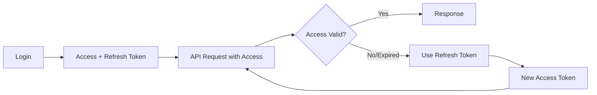
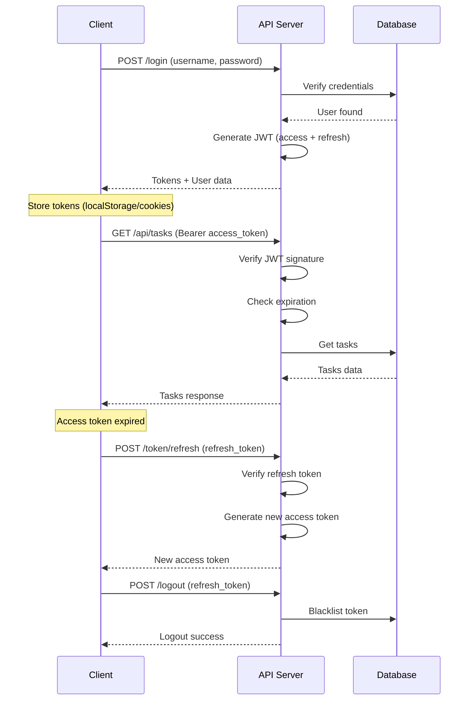

# 🔐 12-DARS: JWT AUTHENTICATION

## 🎯 Dars Maqsadi

Bu darsda Django REST Framework'da **JWT (JSON Web Token) Authentication** bilan ishlashni o'rganasiz. JWT - zamonaviy, stateless, va xavfsiz authentication mexanizmi bo'lib, hozirgi kunda eng ko'p ishlatiladigan usullardan biri.

**Dars oxirida siz:**
- ✅ JWT nima va qanday ishlaydi
- ✅ Token vs JWT farqi
- ✅ Access va Refresh tokens
- ✅ JWT configuration va customization
- ✅ Custom claims va permissions
- ✅ Token lifecycle management
- ✅ Security best practices
- ✅ Frontend integration

---

## 📚 Oldingi Darsdan Kerakli Bilimlar

Bu darsni boshlashdan oldin quyidagilar tayyor bo'lishi kerak:

- [x] Basic Token Authentication tushunchasi
- [x] User model va authentication
- [x] Permissions
- [x] ViewSet va APIView

> **Eslatma:** JWT - production API'larda standart authentication mexanizmi!

---

## 🔍 1. JWT NIMA?

### 1.1 Asosiy Tushuncha

**JWT (JSON Web Token)** - uchta qismdan iborat, nuqta bilan ajratilgan string:

```
eyJhbGc.eyJ1c2VyX2lk.SflKxwRJ
↓       ↓          ↓
Header  Payload    Signature
```

**Strukturasi:**

```json
// Header - Algorithm va token turi
{
  "alg": "HS256",
  "typ": "JWT"
}

// Payload - User ma'lumotlari (claims)
{
  "user_id": 123,
  "username": "john",
  "exp": 1672531200,    // Expiration time
  "iat": 1672527600     // Issued at time
}

// Signature - Header + Payload + Secret Key
HMACSHA256(
  base64UrlEncode(header) + "." +
  base64UrlEncode(payload),
  secret_key
)
```

### 1.2 Token Authentication vs JWT

| Feature | Token Authentication | JWT Authentication |
|---------|---------------------|-------------------|
| **Storage** | Database da saqlanadi | Database'da saqlanmaydi |
| **Stateless** | ❌ Stateful | ✅ Stateless |
| **Payload** | Random string | User ma'lumotlari |
| **Verification** | Database query | Signature tekshirish |
| **Performance** | Sekinroq (DB query) | Tezroq (no DB) |
| **Scalability** | ❌ Qiyin | ✅ Oson |
| **Revocation** | ✅ Oson (DB'dan o'chirish) | ❌ Qiyin (blacklist kerak) |

### 1.3 Access vs Refresh Tokens

```
Access Token:
- Short-lived (5-15 minutes)
- API so'rovlarda ishlatiladi
- User ma'lumotlarini o'z ichiga oladi

Refresh Token:
- Long-lived (7-30 days)
- Yangi access token olish uchun
- Xavfsizroq (kam ishlatiladi)
```

**Workflow:**



---

## 🛠️ 2. JWT O'RNATISH

### 2.1 Installation

```bash
# djangorestframework-simplejwt package
pip install djangorestframework-simplejwt
```

### 2.2 Basic Settings

`myproject/settings.py`:

```python
from datetime import timedelta

INSTALLED_APPS = [
    'django.contrib.admin',
    'django.contrib.auth',
    'django.contrib.contenttypes',
    'django.contrib.sessions',
    'django.contrib.messages',
    'django.contrib.staticfiles',
    
    # Third-party apps
    'rest_framework',
    'rest_framework_simplejwt',  # JWT package
    
    # Local apps
    'tasks',
]

# DRF Settings
REST_FRAMEWORK = {
    # Authentication classes
    'DEFAULT_AUTHENTICATION_CLASSES': [
        'rest_framework_simplejwt.authentication.JWTAuthentication',  # JWT
        # 'rest_framework.authentication.SessionAuthentication',  # Optional: for browsable API
    ],
    
    # Permission classes
    'DEFAULT_PERMISSION_CLASSES': [
        'rest_framework.permissions.IsAuthenticated',
    ],
}

# JWT Settings
SIMPLE_JWT = {
    # Access token lifetime
    'ACCESS_TOKEN_LIFETIME': timedelta(minutes=15),  # 15 daqiqa
    
    # Refresh token lifetime
    'REFRESH_TOKEN_LIFETIME': timedelta(days=7),  # 7 kun
    
    # Token yangilanishi mumkinmi?
    'ROTATE_REFRESH_TOKENS': True,  # Har safar yangi refresh token
    
    # Eski refresh token blacklist ga tushadi
    'BLACKLIST_AFTER_ROTATION': True,
    
    # Update last login time
    'UPDATE_LAST_LOGIN': True,
    
    # Signing algorithm
    'ALGORITHM': 'HS256',  # HMAC SHA-256
    
    # Signing key (SECRET_KEY ishlatiladi)
    'SIGNING_KEY': settings.SECRET_KEY,
    
    # Verification key (public key for RSA)
    'VERIFYING_KEY': None,
    
    # Audience claim
    'AUDIENCE': None,
    
    # Issuer claim
    'ISSUER': None,
    
    # JWK URL
    'JWK_URL': None,
    
    # Leeway for expiration (seconds)
    'LEEWAY': 0,
    
    # Auth header types
    'AUTH_HEADER_TYPES': ('Bearer',),  # Authorization: Bearer <token>
    
    # Auth header name
    'AUTH_HEADER_NAME': 'HTTP_AUTHORIZATION',
    
    # User ID field
    'USER_ID_FIELD': 'id',
    'USER_ID_CLAIM': 'user_id',
    
    # User authentication rule
    'USER_AUTHENTICATION_RULE': 'rest_framework_simplejwt.authentication.default_user_authentication_rule',
    
    # Token types
    'AUTH_TOKEN_CLASSES': ('rest_framework_simplejwt.tokens.AccessToken',),
    'TOKEN_TYPE_CLAIM': 'token_type',
    
    # JTI claim (unique ID for token)
    'JTI_CLAIM': 'jti',
    
    # Sliding token (alternative to access/refresh)
    'SLIDING_TOKEN_REFRESH_EXP_CLAIM': 'refresh_exp',
    'SLIDING_TOKEN_LIFETIME': timedelta(minutes=5),
    'SLIDING_TOKEN_REFRESH_LIFETIME': timedelta(days=1),
}
```

### 2.3 URL Configuration

`myproject/urls.py`:

```python
from django.contrib import admin
from django.urls import path, include
from rest_framework.routers import DefaultRouter

# Simple JWT views
from rest_framework_simplejwt.views import (
    TokenObtainPairView,      # Login - Access + Refresh token olish
    TokenRefreshView,         # Refresh token bilan yangi Access token
    TokenVerifyView,          # Token verify qilish
)

# App views
from tasks.views import TaskViewSet

# Router
router = DefaultRouter()
router.register(r'tasks', TaskViewSet, basename='task')

urlpatterns = [
    # Admin
    path('admin/', admin.site.urls),
    
    # API endpoints
    path('api/', include(router.urls)),
    
    # JWT endpoints
    path('api/token/', TokenObtainPairView.as_view(), name='token_obtain_pair'),
    path('api/token/refresh/', TokenRefreshView.as_view(), name='token_refresh'),
    path('api/token/verify/', TokenVerifyView.as_view(), name='token_verify'),
]
```

---

## 🎨 3. CUSTOM JWT CLAIMS

### 3.1 Custom TokenObtainPairSerializer

`tasks/serializers.py`:

```python
from rest_framework_simplejwt.serializers import TokenObtainPairSerializer
from rest_framework_simplejwt.views import TokenObtainPairView

class CustomTokenObtainPairSerializer(TokenObtainPairSerializer):
    """
    Custom JWT serializer - token'ga qo'shimcha ma'lumot qo'shish
    """
    
    @classmethod
    def get_token(cls, user):
        """
        Token yaratish va custom claims qo'shish
        """
        # Parent class'dan token olish
        token = super().get_token(user)
        
        # Custom claims qo'shish
        token['username'] = user.username
        token['email'] = user.email
        token['is_staff'] = user.is_staff
        token['is_superuser'] = user.is_superuser
        
        # User profile ma'lumotlari (agar profile model bo'lsa)
        if hasattr(user, 'profile'):
            token['full_name'] = user.profile.full_name
            token['avatar'] = user.profile.avatar.url if user.profile.avatar else None
            token['is_premium'] = user.profile.is_premium
        
        # Custom data
        token['login_count'] = user.login_count if hasattr(user, 'login_count') else 0
        
        return token
    
    def validate(self, attrs):
        """
        Validation va response customization
        """
        # Default validation
        data = super().validate(attrs)
        
        # Qo'shimcha user ma'lumotlari response'ga
        data['user'] = {
            'id': self.user.id,
            'username': self.user.username,
            'email': self.user.email,
            'is_staff': self.user.is_staff,
            'first_name': self.user.first_name,
            'last_name': self.user.last_name,
        }
        
        # Profile ma'lumotlari
        if hasattr(self.user, 'profile'):
            data['user']['profile'] = {
                'avatar': self.user.profile.avatar.url if self.user.profile.avatar else None,
                'bio': self.user.profile.bio,
                'is_premium': self.user.profile.is_premium,
            }
        
        return data


class CustomTokenObtainPairView(TokenObtainPairView):
    """
    Custom view for token generation
    """
    serializer_class = CustomTokenObtainPairSerializer
```

**URL'ga qo'shish:**

```python
# myproject/urls.py
from tasks.serializers import CustomTokenObtainPairView

urlpatterns = [
    # ...
    path('api/token/', CustomTokenObtainPairView.as_view(), name='token_obtain_pair'),
]
```

### 3.2 Token'dan Claims O'qish

`tasks/utils.py`:

```python
from rest_framework_simplejwt.tokens import AccessToken

def decode_jwt_token(token_string):
    """
    JWT token'ni decode qilish va claims olish
    """
    try:
        # Token object yaratish
        token = AccessToken(token_string)
        
        # Claims olish
        user_id = token['user_id']
        username = token.get('username')
        email = token.get('email')
        is_staff = token.get('is_staff', False)
        
        return {
            'user_id': user_id,
            'username': username,
            'email': email,
            'is_staff': is_staff,
            'exp': token['exp'],  # Expiration time
            'iat': token['iat'],  # Issued at time
        }
    except Exception as e:
        return None


# View da ishlatish
from rest_framework.decorators import api_view, permission_classes
from rest_framework.permissions import IsAuthenticated
from rest_framework.response import Response

@api_view(['GET'])
@permission_classes([IsAuthenticated])
def get_token_info(request):
    """
    Token ma'lumotlarini qaytarish
    """
    # Header'dan token olish
    auth_header = request.META.get('HTTP_AUTHORIZATION', '')
    if auth_header.startswith('Bearer '):
        token_string = auth_header[7:]  # "Bearer " ni olib tashlash
        
        # Decode
        token_data = decode_jwt_token(token_string)
        
        return Response({
            'token_info': token_data,
            'user': {
                'id': request.user.id,
                'username': request.user.username,
            }
        })
    
    return Response({'error': 'No token provided'}, status=400)
```

---

## 🔒 4. TOKEN BLACKLIST

### 4.1 Blacklist Setup

Token'larni bekor qilish (logout) uchun blacklist kerak:

```python
# settings.py
INSTALLED_APPS = [
    # ...
    'rest_framework_simplejwt.token_blacklist',  # Blacklist app
]

# Migrate
# python manage.py migrate
```

### 4.2 Custom Logout View

`tasks/views.py`:

```python
from rest_framework.views import APIView
from rest_framework.response import Response
from rest_framework import status
from rest_framework.permissions import IsAuthenticated
from rest_framework_simplejwt.tokens import RefreshToken

class LogoutView(APIView):
    """
    Logout - refresh token'ni blacklist ga qo'shish
    """
    permission_classes = [IsAuthenticated]
    
    def post(self, request):
        """
        Logout endpoint
        
        Request body:
        {
            "refresh": "<refresh_token>"
        }
        """
        try:
            # Refresh token olish
            refresh_token = request.data.get('refresh')
            
            if not refresh_token:
                return Response(
                    {'error': 'Refresh token required'},
                    status=status.HTTP_400_BAD_REQUEST
                )
            
            # Token object yaratish
            token = RefreshToken(refresh_token)
            
            # Blacklist ga qo'shish
            token.blacklist()
            
            return Response(
                {'message': 'Logout successful'},
                status=status.HTTP_200_OK
            )
        
        except Exception as e:
            return Response(
                {'error': str(e)},
                status=status.HTTP_400_BAD_REQUEST
            )


class LogoutAllView(APIView):
    """
    Logout all devices - barcha tokenlarni bekor qilish
    """
    permission_classes = [IsAuthenticated]
    
    def post(self, request):
        """
        Barcha user tokenlarini blacklist ga qo'shish
        """
        from rest_framework_simplejwt.token_blacklist.models import OutstandingToken
        
        try:
            # User ning barcha tokenlari
            tokens = OutstandingToken.objects.filter(user=request.user)
            
            # Barcha tokenlarni blacklist ga qo'shish
            for token in tokens:
                try:
                    RefreshToken(token.token).blacklist()
                except:
                    pass  # Token already blacklisted or invalid
            
            return Response(
                {'message': f'Logged out from all devices'},
                status=status.HTTP_200_OK
            )
        
        except Exception as e:
            return Response(
                {'error': str(e)},
                status=status.HTTP_400_BAD_REQUEST
            )
```

**URL'ga qo'shish:**

```python
# myproject/urls.py
from tasks.views import LogoutView, LogoutAllView

urlpatterns = [
    # ...
    path('api/logout/', LogoutView.as_view(), name='logout'),
    path('api/logout-all/', LogoutAllView.as_view(), name='logout_all'),
]
```

---

## 💼 5. TO'LIQ REAL MISOL

### 5.1 User Registration

`tasks/serializers.py`:

```python
from django.contrib.auth.models import User
from rest_framework import serializers
from rest_framework.validators import UniqueValidator
from django.contrib.auth.password_validation import validate_password

class RegisterSerializer(serializers.ModelSerializer):
    """
    User registration serializer
    """
    # Email unique bo'lishi kerak
    email = serializers.EmailField(
        required=True,
        validators=[UniqueValidator(queryset=User.objects.all())]
    )
    
    # Password fields
    password = serializers.CharField(
        write_only=True,
        required=True,
        validators=[validate_password]  # Django password validation
    )
    password2 = serializers.CharField(
        write_only=True,
        required=True
    )
    
    class Meta:
        model = User
        fields = [
            'username',
            'email',
            'password',
            'password2',
            'first_name',
            'last_name'
        ]
        extra_kwargs = {
            'first_name': {'required': True},
            'last_name': {'required': True}
        }
    
    def validate(self, attrs):
        """
        Password match validation
        """
        if attrs['password'] != attrs['password2']:
            raise serializers.ValidationError({
                'password': 'Password fields didn\'t match.'
            })
        
        return attrs
    
    def create(self, validated_data):
        """
        User yaratish
        """
        # password2 ni olib tashlash
        validated_data.pop('password2')
        
        # User yaratish
        user = User.objects.create_user(
            username=validated_data['username'],
            email=validated_data['email'],
            password=validated_data['password'],
            first_name=validated_data.get('first_name', ''),
            last_name=validated_data.get('last_name', '')
        )
        
        return user


class UserSerializer(serializers.ModelSerializer):
    """
    User detail serializer
    """
    class Meta:
        model = User
        fields = [
            'id',
            'username',
            'email',
            'first_name',
            'last_name',
            'is_staff',
            'date_joined',
        ]
        read_only_fields = ['id', 'date_joined']
```

### 5.2 Authentication Views

`tasks/views.py`:

```python
from rest_framework import generics, status
from rest_framework.views import APIView
from rest_framework.response import Response
from rest_framework.permissions import AllowAny, IsAuthenticated
from django.contrib.auth.models import User

from .serializers import RegisterSerializer, UserSerializer

class RegisterView(generics.CreateAPIView):
    """
    User registration endpoint
    
    POST /api/register/
    {
        "username": "john",
        "email": "john@example.com",
        "password": "SecurePass123!",
        "password2": "SecurePass123!",
        "first_name": "John",
        "last_name": "Doe"
    }
    """
    queryset = User.objects.all()
    permission_classes = [AllowAny]  # Registration har kim uchun
    serializer_class = RegisterSerializer
    
    def create(self, request, *args, **kwargs):
        """
        Custom create response
        """
        serializer = self.get_serializer(data=request.data)
        serializer.is_valid(raise_exception=True)
        user = serializer.save()
        
        # JWT token yaratish (auto login)
        from rest_framework_simplejwt.tokens import RefreshToken
        refresh = RefreshToken.for_user(user)
        
        return Response({
            'user': UserSerializer(user).data,
            'tokens': {
                'refresh': str(refresh),
                'access': str(refresh.access_token),
            },
            'message': 'User registered successfully'
        }, status=status.HTTP_201_CREATED)


class UserProfileView(APIView):
    """
    Current user profile
    
    GET /api/profile/
    """
    permission_classes = [IsAuthenticated]
    
    def get(self, request):
        """
        Get current user profile
        """
        serializer = UserSerializer(request.user)
        return Response(serializer.data)
    
    def patch(self, request):
        """
        Update current user profile
        """
        serializer = UserSerializer(
            request.user,
            data=request.data,
            partial=True
        )
        serializer.is_valid(raise_exception=True)
        serializer.save()
        
        return Response({
            'user': serializer.data,
            'message': 'Profile updated successfully'
        })


class ChangePasswordView(APIView):
    """
    Change password endpoint
    
    POST /api/change-password/
    {
        "old_password": "OldPass123",
        "new_password": "NewPass456"
    }
    """
    permission_classes = [IsAuthenticated]
    
    def post(self, request):
        """
        Change password
        """
        user = request.user
        old_password = request.data.get('old_password')
        new_password = request.data.get('new_password')
        
        # Validation
        if not old_password or not new_password:
            return Response(
                {'error': 'Both old and new password required'},
                status=status.HTTP_400_BAD_REQUEST
            )
        
        # Old password check
        if not user.check_password(old_password):
            return Response(
                {'error': 'Old password is incorrect'},
                status=status.HTTP_400_BAD_REQUEST
            )
        
        # Validate new password
        from django.contrib.auth.password_validation import validate_password
        try:
            validate_password(new_password, user)
        except Exception as e:
            return Response(
                {'error': str(e)},
                status=status.HTTP_400_BAD_REQUEST
            )
        
        # Set new password
        user.set_password(new_password)
        user.save()
        
        # Logout all devices (optional)
        # LogoutAllView logic here...
        
        return Response({
            'message': 'Password changed successfully'
        })
```

### 5.3 Complete URL Configuration

`myproject/urls.py`:

```python
from django.contrib import admin
from django.urls import path, include
from rest_framework.routers import DefaultRouter

# JWT views
from rest_framework_simplejwt.views import (
    TokenRefreshView,
    TokenVerifyView,
)

# Custom views
from tasks.views import (
    TaskViewSet,
    RegisterView,
    UserProfileView,
    ChangePasswordView,
    LogoutView,
    LogoutAllView,
)
from tasks.serializers import CustomTokenObtainPairView

# Router
router = DefaultRouter()
router.register(r'tasks', TaskViewSet, basename='task')

urlpatterns = [
    # Admin
    path('admin/', admin.site.urls),
    
    # API
    path('api/', include(router.urls)),
    
    # Authentication
    path('api/register/', RegisterView.as_view(), name='register'),
    path('api/login/', CustomTokenObtainPairView.as_view(), name='login'),
    path('api/token/refresh/', TokenRefreshView.as_view(), name='token_refresh'),
    path('api/token/verify/', TokenVerifyView.as_view(), name='token_verify'),
    path('api/logout/', LogoutView.as_view(), name='logout'),
    path('api/logout-all/', LogoutAllView.as_view(), name='logout_all'),
    
    # User
    path('api/profile/', UserProfileView.as_view(), name='profile'),
    path('api/change-password/', ChangePasswordView.as_view(), name='change_password'),
]
```

---

## ✅ 6. TESTING EXAMPLES

### 6.1 Registration

```bash
# Register new user
curl -X POST http://127.0.0.1:8000/api/register/ \
  -H "Content-Type: application/json" \
  -d '{
    "username": "john",
    "email": "john@example.com",
    "password": "SecurePass123!",
    "password2": "SecurePass123!",
    "first_name": "John",
    "last_name": "Doe"
  }'

# Response:
{
  "user": {
    "id": 1,
    "username": "john",
    "email": "john@example.com",
    "first_name": "John",
    "last_name": "Doe"
  },
  "tokens": {
    "refresh": "<refresh_token>",
    "access": "<access_token>"
  },
  "message": "User registered successfully"
}
```

### 6.2 Login

```bash
# Login
curl -X POST http://127.0.0.1:8000/api/login/ \
  -H "Content-Type: application/json" \
  -d '{
    "username": "john",
    "password": "SecurePass123!"
  }'

# Response:
{
  "refresh": "<refresh_token>",
  "access": "<access_token>",
  "user": {
    "id": 1,
    "username": "john",
    "email": "john@example.com",
    ...
  }
}
```

### 6.3 API Request with JWT

```bash
# GET request with JWT
curl http://127.0.0.1:8000/api/tasks/ \
  -H "Authorization: Bearer <access_token>"

# POST request
curl -X POST http://127.0.0.1:8000/api/tasks/ \
  -H "Authorization: Bearer <access_token>" \
  -H "Content-Type: application/json" \
  -d '{
    "title": "New Task",
    "description": "Task description"
  }'
```

### 6.4 Refresh Token

```bash
# Access token expired bo'lganda
curl -X POST http://127.0.0.1:8000/api/token/refresh/ \
  -H "Content-Type: application/json" \
  -d '{
    "refresh": "<refresh_token>"
  }'

# Response:
{
  "access": "<new_access_token>",
  "refresh": "<new_refresh_token>"  # ROTATE_REFRESH_TOKENS=True bo'lsa
}
```

### 6.5 Logout

```bash
# Logout (blacklist refresh token)
curl -X POST http://127.0.0.1:8000/api/logout/ \
  -H "Authorization: Bearer <access_token>" \
  -H "Content-Type: application/json" \
  -d '{
    "refresh": "<refresh_token>"
  }'

# Logout from all devices
curl -X POST http://127.0.0.1:8000/api/logout-all/ \
  -H "Authorization: Bearer <access_token>"
```

---

## 🔒 7. SECURITY BEST PRACTICES

### 7.1 Environment Variables

`.env`:

```bash
SECRET_KEY=your-secret-key-here-min-50-characters-long-random-string
DEBUG=False
ALLOWED_HOSTS=api.example.com,localhost

# JWT Settings
JWT_ACCESS_TOKEN_LIFETIME=15  # minutes
JWT_REFRESH_TOKEN_LIFETIME=7   # days
```

`settings.py`:

```python
import os
from datetime import timedelta
from dotenv import load_dotenv

load_dotenv()

SECRET_KEY = os.getenv('SECRET_KEY')
DEBUG = os.getenv('DEBUG', 'False') == 'True'
ALLOWED_HOSTS = os.getenv('ALLOWED_HOSTS', '').split(',')

SIMPLE_JWT = {
    'ACCESS_TOKEN_LIFETIME': timedelta(
        minutes=int(os.getenv('JWT_ACCESS_TOKEN_LIFETIME', 15))
    ),
    'REFRESH_TOKEN_LIFETIME': timedelta(
        days=int(os.getenv('JWT_REFRESH_TOKEN_LIFETIME', 7))
    ),
}
```

### 7.2 HTTPS Only

```python
# settings.py (Production)
SECURE_SSL_REDIRECT = True
SESSION_COOKIE_SECURE = True
CSRF_COOKIE_SECURE = True
SECURE_HSTS_SECONDS = 31536000  # 1 year
SECURE_HSTS_INCLUDE_SUBDOMAINS = True
SECURE_HSTS_PRELOAD = True
```

### 7.3 CORS Configuration

```bash
pip install django-cors-headers
```

```python
# settings.py
INSTALLED_APPS = [
    'corsheaders',
    # ...
]

MIDDLEWARE = [
    'corsheaders.middleware.CorsMiddleware',
    # ...
]

# Development
CORS_ALLOW_ALL_ORIGINS = True

# Production
CORS_ALLOWED_ORIGINS = [
    'https://example.com',
    'https://app.example.com',
]

CORS_ALLOW_CREDENTIALS = True
```

---

## 🌐 8. FRONTEND INTEGRATION

### 8.1 JavaScript/React Example

```javascript
// auth.js - Authentication service
class AuthService {
  constructor() {
    this.baseURL = 'http://localhost:8000/api';
    this.accessToken = localStorage.getItem('access_token');
    this.refreshToken = localStorage.getItem('refresh_token');
  }
  
  // Login
  async login(username, password) {
    const response = await fetch(`${this.baseURL}/login/`, {
      method: 'POST',
      headers: { 'Content-Type': 'application/json' },
      body: JSON.stringify({ username, password })
    });
    
    const data = await response.json();
    
    if (response.ok) {
      // Save tokens
      this.accessToken = data.access;
      this.refreshToken = data.refresh;
      localStorage.setItem('access_token', data.access);
      localStorage.setItem('refresh_token', data.refresh);
      
      return data.user;
    }
    
    throw new Error(data.error || 'Login failed');
  }
  
  // Logout
  async logout() {
    await fetch(`${this.baseURL}/logout/`, {
      method: 'POST',
      headers: {
        'Authorization': `Bearer ${this.accessToken}`,
        'Content-Type': 'application/json'
      },
      body: JSON.stringify({ refresh: this.refreshToken })
    });
    
    // Clear tokens
    this.accessToken = null;
    this.refreshToken = null;
    localStorage.removeItem('access_token');
    localStorage.removeItem('refresh_token');
  }
  
  // Refresh access token
  async refreshAccessToken() {
    const response = await fetch(`${this.baseURL}/token/refresh/`, {
      method: 'POST',
      headers: { 'Content-Type': 'application/json' },
      body: JSON.stringify({ refresh: this.refreshToken })
    });
    
    const data = await response.json();
    
    if (response.ok) {
      this.accessToken = data.access;
      localStorage.setItem('access_token', data.access);
      
      if (data.refresh) {
        this.refreshToken = data.refresh;
        localStorage.setItem('refresh_token', data.refresh);
      }
      
      return data.access;
    }
    
    // Refresh failed - logout
    await this.logout();
    throw new Error('Session expired');
  }
  
  // API request with auto-refresh
  async apiRequest(url, options = {}) {
    // Add Authorization header
    options.headers = {
      ...options.headers,
      'Authorization': `Bearer ${this.accessToken}`
    };
    
    let response = await fetch(`${this.baseURL}${url}`, options);
    
    // If 401, try to refresh token
    if (response.status === 401) {
      try {
        await this.refreshAccessToken();
        
        // Retry request with new token
        options.headers['Authorization'] = `Bearer ${this.accessToken}`;
        response = await fetch(`${this.baseURL}${url}`, options);
      } catch (error) {
        throw new Error('Authentication failed');
      }
    }
    
    return response.json();
  }
}

// Usage
const auth = new AuthService();

// Login
auth.login('john', 'SecurePass123!')
  .then(user => console.log('Logged in:', user))
  .catch(error => console.error('Login error:', error));

// API request
auth.apiRequest('/tasks/')
  .then(data => console.log('Tasks:', data))
  .catch(error => console.error('API error:', error));
```

---

## 🎯 AMALIYOT TOPSHIRIQLARI

### 📝 Topshiriq 1: Basic JWT Setup (Oson)

**Talablar:**
- ✅ djangorestframework-simplejwt o'rnatish
- ✅ Login endpoint (access + refresh token)
- ✅ Refresh endpoint
- ✅ Protected API endpoint
- ✅ Postman/cURL testing

### 📝 Topshiriq 2: Complete Auth System (O'rta)

**Talablar:**
- ✅ Registration endpoint
- ✅ Custom JWT claims (username, email)
- ✅ Token blacklist (logout)
- ✅ Change password endpoint
- ✅ User profile endpoint
- ✅ Email verification (bonus)

### 📝 Topshiriq 3: Advanced JWT System (Qiyin)

**Talablar:**
- ✅ Multi-tier permissions in JWT
- ✅ Device management (logout specific device)
- ✅ Token refresh strategy (sliding window)
- ✅ Rate limiting on auth endpoints
- ✅ 2FA integration
- ✅ Frontend integration (React/Vue)
- ✅ Secure cookie storage (httpOnly)

---

## 📊 JWT WORKFLOW



---

## 🔗 KEYINGI DARSLAR

✅ **Dars 12 tugadi! JWT Authentication to'liq o'rgandingiz!**

**Keyingi darsda:**
- Signals va DRF
- Custom signals
- Pre/Post save hooks

---

## 📚 QISQA XULOSALAR

### JWT vs Token

| Feature | Simple Token | JWT |
|---------|-------------|-----|
| Storage | Database | No storage |
| Speed | Slower | Faster |
| Scalability | Limited | Excellent |
| Payload | Random | User data |
| Revocation | Easy | Requires blacklist |

### Security Checklist

```python
# ✅ Good practices
- HTTPS only (production)
- Short-lived access tokens (15 min)
- Long-lived refresh tokens (7 days)
- Rotate refresh tokens
- Blacklist on logout
- Strong SECRET_KEY (50+ chars)
- Environment variables
- CORS configuration

# ❌ Bad practices
- HTTP (plain text)
- Long access tokens (24h+)
- No refresh tokens
- Token in URL parameters
- Weak SECRET_KEY
- Hardcoded secrets
```

### Token Lifetimes

| Token Type | Recommended | Use Case |
|-----------|-------------|----------|
| Access | 5-15 min | API requests |
| Refresh | 7-30 days | Getting new access |
| Remember Me | 90 days | Optional feature |

**Esda tuting:**
- JWT = Stateless + Fast
- Access token = Short-lived
- Refresh token = Long-lived
- Always use HTTPS!
- Blacklist for logout
- Secure your SECRET_KEY!
