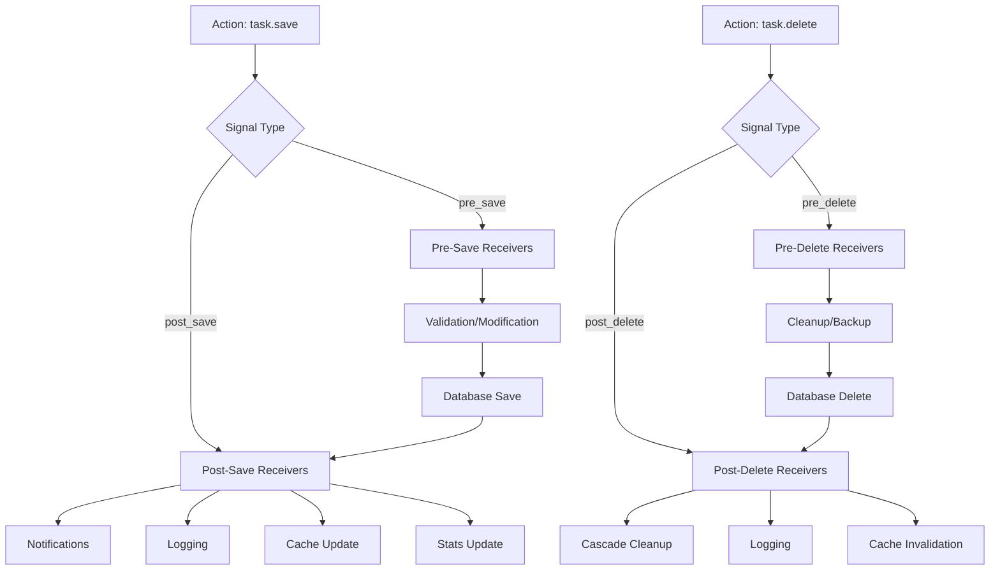

# 📡 13-DARS: SIGNALS VA DRF

## 🎯 Dars Maqsadi

Bu darsda Django **Signals** va Django REST Framework integratsiyasini o'rganasiz. Signals - event-driven programming pattern bo'lib, ma'lumotlar bazasidagi o'zgarishlarga avtomatik javob berish imkonini beradi.

**Dars oxirida siz:**
- ✅ Django Signals nima va qanday ishlaydi
- ✅ Built-in signals (pre_save, post_save, pre_delete, post_delete)
- ✅ Custom signals yaratish
- ✅ Signal receivers
- ✅ DRF bilan signals integratsiyasi
- ✅ Real-world use cases (notifications, logging, caching)
- ✅ Best practices va pitfalls

---

## 📚 Oldingi Darsdan Kerakli Bilimlar

Bu darsni boshlashdan oldin quyidagilar tayyor bo'lishi kerak:

- [x] Django models va ORM
- [x] DRF ViewSets va Serializers
- [x] Python decorators
- [x] Event-driven programming tushunchasi (ixtiyoriy)

> **Eslatma:** Signals - qo'shimcha logikani models'dan ajratib turish uchun ajoyib vosita!

---

## 🔍 1. SIGNALS NIMA?

### 1.1 Asosiy Tushuncha

**Signals** - Django'da event notification system:

```python
# Event kelib chiqadi (model save qilinadi)
task.save()
  ↓
# Signal yuboriladi
post_save signal
  ↓
# Receiver(lar) ishga tushadi
send_notification()
update_cache()
log_activity()
```

### 1.2 Signal Types

| Signal | Qachon Ishlaydi | Use Case |
|--------|----------------|----------|
| **pre_save** | Save'dan oldin | Validation, ma'lumot o'zgartirish |
| **post_save** | Save'dan keyin | Notification, logging, cache update |
| **pre_delete** | Delete'dan oldin | Cleanup, permission check |
| **post_delete** | Delete'dan keyin | Cascade cleanup, logging |
| **m2m_changed** | Many-to-Many o'zgarganda | Relationship tracking |

### 1.3 Signals vs Overriding Methods

```python
# ❌ Method override (tight coupling)
class Task(models.Model):
    def save(self, *args, **kwargs):
        super().save(*args, **kwargs)
        send_notification()      # Task model'ga bog'liq
        update_cache()           # Task model'ga bog'liq
        log_activity()           # Task model'ga bog'liq

# ✅ Signals (loose coupling)
class Task(models.Model):
    pass  # Clean model

@receiver(post_save, sender=Task)
def handle_task_save(sender, instance, **kwargs):
    send_notification()  # Alohida modul
    update_cache()       # Alohida modul
    log_activity()       # Alohida modul
```

---

## 🛠️ 2. BUILT-IN SIGNALS

### 2.1 pre_save Signal

**Save'dan oldin ishga tushadi:**

`tasks/signals.py`:

```python
from django.db.models.signals import pre_save
from django.dispatch import receiver
from .models import Task
from slugify import slugify

@receiver(pre_save, sender=Task)
def generate_slug(sender, instance, **kwargs):
    """
    Task save'dan oldin slug yaratish
    
    Params:
        sender: Task model class
        instance: Task object (save qilinayotgan)
        kwargs: qo'shimcha ma'lumotlar
    """
    # Agar yangi object bo'lsa (ID yo'q)
    if not instance.id:
        # Title'dan slug yaratish
        instance.slug = slugify(instance.title)
        print(f"[PRE_SAVE] Slug generated: {instance.slug}")


@receiver(pre_save, sender=Task)
def normalize_title(sender, instance, **kwargs):
    """
    Title'ni normalize qilish
    """
    # Title'ni capitalize qilish
    instance.title = instance.title.strip().title()
    
    # Qisqa title'lar uchun warning
    if len(instance.title) < 5:
        print(f"[PRE_SAVE] Warning: Short title '{instance.title}'")


@receiver(pre_save, sender=Task)
def prevent_completed_edit(sender, instance, **kwargs):
    """
    Completed task'ni edit qilishni oldini olish
    """
    # Agar yangi object emas bo'lsa (update)
    if instance.id:
        # Old instance'ni olish
        try:
            old_instance = Task.objects.get(id=instance.id)
            
            # Agar old instance completed bo'lsa
            if old_instance.completed and not instance.completed:
                # Completed'dan uncompleted ga o'zgartirishni rad etish
                raise ValueError("Cannot uncomplete a completed task!")
                
        except Task.DoesNotExist:
            pass  # Yangi object
```

### 2.2 post_save Signal

**Save'dan keyin ishga tushadi:**

```python
from django.db.models.signals import post_save
from django.dispatch import receiver
from .models import Task
import logging

logger = logging.getLogger(__name__)

@receiver(post_save, sender=Task)
def log_task_activity(sender, instance, created, **kwargs):
    """
    Task yaratilishi/yangilanishini log qilish
    
    Params:
        created: True = yangi yaratilgan, False = yangilangan
    """
    if created:
        # Yangi task yaratilgan
        logger.info(
            f"[POST_SAVE] New task created: "
            f"'{instance.title}' by {instance.owner.username}"
        )
    else:
        # Mavjud task yangilangan
        logger.info(
            f"[POST_SAVE] Task updated: "
            f"'{instance.title}' (ID: {instance.id})"
        )


@receiver(post_save, sender=Task)
def send_notification(sender, instance, created, **kwargs):
    """
    Task yaratilganda notification yuborish
    """
    if created:
        # Email notification (example)
        from django.core.mail import send_mail
        
        subject = f"New Task: {instance.title}"
        message = f"You have a new task: {instance.title}\nDue: {instance.due_date}"
        
        # Async task orqali yuborish yaxshiroq (Celery)
        # send_task_notification.delay(instance.id)
        
        print(f"[NOTIFICATION] Email sent to {instance.owner.email}")


@receiver(post_save, sender=Task)
def update_statistics(sender, instance, created, **kwargs):
    """
    User statistikasini yangilash
    """
    if created:
        # User profile'da task count'ni oshirish
        if hasattr(instance.owner, 'profile'):
            profile = instance.owner.profile
            profile.total_tasks += 1
            profile.save(update_fields=['total_tasks'])
            
            print(f"[STATS] User {instance.owner.username} total tasks: {profile.total_tasks}")


@receiver(post_save, sender=Task)
def invalidate_cache(sender, instance, **kwargs):
    """
    Cache'ni invalidate qilish
    """
    from django.core.cache import cache
    
    # Task list cache'ni tozalash
    cache_key = f'task_list_{instance.owner.id}'
    cache.delete(cache_key)
    
    # Task detail cache'ni tozalash
    cache_key = f'task_detail_{instance.id}'
    cache.delete(cache_key)
    
    print(f"[CACHE] Cache invalidated for task {instance.id}")
```

### 2.3 pre_delete va post_delete Signals

```python
from django.db.models.signals import pre_delete, post_delete
from django.dispatch import receiver
from .models import Task

@receiver(pre_delete, sender=Task)
def check_delete_permission(sender, instance, **kwargs):
    """
    Delete'dan oldin permission check
    """
    # Completed task'ni delete qilishni oldini olish
    if instance.completed:
        print(f"[PRE_DELETE] Warning: Deleting completed task '{instance.title}'")
        
        # Optional: exception raise qilish
        # raise PermissionDenied("Cannot delete completed tasks!")


@receiver(pre_delete, sender=Task)
def backup_before_delete(sender, instance, **kwargs):
    """
    Delete qilishdan oldin backup
    """
    # Archive table'ga saqlash
    # TaskArchive.objects.create(
    #     original_id=instance.id,
    #     title=instance.title,
    #     data=json.dumps(model_to_dict(instance))
    # )
    
    print(f"[BACKUP] Task '{instance.title}' backed up before deletion")


@receiver(post_delete, sender=Task)
def log_deletion(sender, instance, **kwargs):
    """
    Delete'ni log qilish
    """
    logger.warning(
        f"[POST_DELETE] Task deleted: "
        f"'{instance.title}' (ID: {instance.id}) by {instance.owner.username}"
    )


@receiver(post_delete, sender=Task)
def cleanup_related_data(sender, instance, **kwargs):
    """
    Related ma'lumotlarni tozalash
    """
    # File'larni o'chirish (agar task'da file bo'lsa)
    # if instance.attachment:
    #     instance.attachment.delete(save=False)
    
    # Notification'larni o'chirish
    # Notification.objects.filter(task=instance).delete()
    
    print(f"[CLEANUP] Related data cleaned up for task {instance.id}")


@receiver(post_delete, sender=Task)
def update_stats_after_delete(sender, instance, **kwargs):
    """
    Delete'dan keyin statistikani yangilash
    """
    if hasattr(instance.owner, 'profile'):
        profile = instance.owner.profile
        profile.total_tasks -= 1
        profile.save(update_fields=['total_tasks'])
        
        print(f"[STATS] User {instance.owner.username} total tasks: {profile.total_tasks}")
```

### 2.4 m2m_changed Signal

```python
from django.db.models.signals import m2m_changed
from django.dispatch import receiver
from .models import Task

# Agar Task'da ManyToMany field bo'lsa (tags, assignees)
@receiver(m2m_changed, sender=Task.tags.through)
def tags_changed(sender, instance, action, **kwargs):
    """
    Tags o'zgarganda ishga tushadi
    
    Actions:
    - pre_add: qo'shilishdan oldin
    - post_add: qo'shilganidan keyin
    - pre_remove: o'chirishdan oldin
    - post_remove: o'chirilganidan keyin
    - pre_clear: tozalashdan oldin
    - post_clear: tozalanganidan keyin
    """
    if action == 'post_add':
        print(f"[M2M] Tags added to task '{instance.title}'")
    
    elif action == 'post_remove':
        print(f"[M2M] Tags removed from task '{instance.title}'")
    
    elif action == 'post_clear':
        print(f"[M2M] All tags cleared from task '{instance.title}'")
```

---

## 🎨 3. CUSTOM SIGNALS

### 3.1 Signal Yaratish

`tasks/signals.py`:

```python
from django.dispatch import Signal

# Custom signal'lar yaratish
task_completed = Signal()  # Task completed bo'lganda
task_assigned = Signal()   # Task assign qilinganda
task_overdue = Signal()    # Task overdue bo'lganda

# Providing_args deprecated, signal'ga har qanday kwargs yuborish mumkin
```

### 3.2 Custom Signal Yuborish

`tasks/models.py`:

```python
from django.db import models
from .signals import task_completed, task_assigned

class Task(models.Model):
    # ... fields ...
    
    def mark_as_completed(self):
        """
        Task'ni completed qilish va signal yuborish
        """
        if not self.completed:
            self.completed = True
            self.save()
            
            # Custom signal yuborish
            task_completed.send(
                sender=self.__class__,
                instance=self,
                user=self.owner
            )
    
    def assign_to(self, user):
        """
        Task'ni boshqa userga assign qilish
        """
        old_assignee = self.assigned_to
        self.assigned_to = user
        self.save()
        
        # Custom signal yuborish
        task_assigned.send(
            sender=self.__class__,
            instance=self,
            old_assignee=old_assignee,
            new_assignee=user
        )
```

### 3.3 Custom Signal Receiver

```python
from django.dispatch import receiver
from .signals import task_completed, task_assigned, task_overdue

@receiver(task_completed)
def handle_task_completion(sender, instance, user, **kwargs):
    """
    Task completed bo'lganda celebration
    """
    print(f"🎉 Congratulations! Task '{instance.title}' completed by {user.username}")
    
    # Award points
    if hasattr(user, 'profile'):
        user.profile.points += 10
        user.profile.save()
    
    # Send congratulations email
    # send_congratulation_email(user, instance)


@receiver(task_assigned)
def handle_task_assignment(sender, instance, old_assignee, new_assignee, **kwargs):
    """
    Task assign qilinganda notification
    """
    if old_assignee:
        print(f"[REASSIGN] Task '{instance.title}' reassigned from {old_assignee.username} to {new_assignee.username}")
    else:
        print(f"[ASSIGN] Task '{instance.title}' assigned to {new_assignee.username}")
    
    # Notification yuborish
    # send_assignment_notification(new_assignee, instance)


@receiver(task_overdue)
def handle_overdue_task(sender, instance, **kwargs):
    """
    Task overdue bo'lganda reminder
    """
    print(f"⚠️ Task '{instance.title}' is overdue! Due date was {instance.due_date}")
    
    # Urgent email yuborish
    # send_overdue_reminder(instance.owner, instance)
    
    # Priority'ni avtomatik oshirish
    if instance.priority != 'urgent':
        instance.priority = 'urgent'
        instance.save()
```

---

## 💼 4. DRF INTEGRATION

### 4.1 Serializer Signals

`tasks/serializers.py`:

```python
from rest_framework import serializers
from django.dispatch import Signal
from .models import Task

# Custom serializer signals
serializer_validated = Signal()  # Validation'dan keyin
serializer_saved = Signal()      # Save'dan keyin

class TaskSerializer(serializers.ModelSerializer):
    """
    Task serializer with signals
    """
    class Meta:
        model = Task
        fields = '__all__'
    
    def validate(self, attrs):
        """
        Validation'dan keyin signal yuborish
        """
        # Parent validation
        attrs = super().validate(attrs)
        
        # Signal yuborish
        serializer_validated.send(
            sender=self.__class__,
            serializer=self,
            validated_data=attrs
        )
        
        return attrs
    
    def create(self, validated_data):
        """
        Create'dan keyin signal yuborish
        """
        instance = super().create(validated_data)
        
        # Signal yuborish
        serializer_saved.send(
            sender=self.__class__,
            serializer=self,
            instance=instance,
            created=True
        )
        
        return instance
    
    def update(self, instance, validated_data):
        """
        Update'dan keyin signal yuborish
        """
        old_data = {
            'title': instance.title,
            'completed': instance.completed,
            'priority': instance.priority,
        }
        
        instance = super().update(instance, validated_data)
        
        # Signal yuborish
        serializer_saved.send(
            sender=self.__class__,
            serializer=self,
            instance=instance,
            created=False,
            old_data=old_data
        )
        
        return instance


# Signal receivers
@receiver(serializer_validated)
def log_validation(sender, serializer, validated_data, **kwargs):
    """
    Validation log qilish
    """
    print(f"[SERIALIZER] {sender.__name__} validated: {validated_data.get('title')}")


@receiver(serializer_saved)
def track_changes(sender, serializer, instance, created, **kwargs):
    """
    O'zgarishlarni track qilish
    """
    if created:
        print(f"[SERIALIZER] New object created via API: {instance.title}")
    else:
        old_data = kwargs.get('old_data', {})
        print(f"[SERIALIZER] Object updated via API: {instance.title}")
        print(f"  Old data: {old_data}")
```

### 4.2 ViewSet Signals

```python
from django.dispatch import Signal
from rest_framework import viewsets
from .models import Task
from .serializers import TaskSerializer

# ViewSet signals
viewset_action_performed = Signal()  # Action performed

class TaskViewSet(viewsets.ModelViewSet):
    """
    Task ViewSet with signals
    """
    queryset = Task.objects.all()
    serializer_class = TaskSerializer
    
    def perform_create(self, serializer):
        """
        Create with signal
        """
        instance = serializer.save(owner=self.request.user)
        
        # Signal yuborish
        viewset_action_performed.send(
            sender=self.__class__,
            action='create',
            instance=instance,
            user=self.request.user
        )
    
    def perform_update(self, serializer):
        """
        Update with signal
        """
        instance = serializer.save()
        
        # Signal yuborish
        viewset_action_performed.send(
            sender=self.__class__,
            action='update',
            instance=instance,
            user=self.request.user
        )
    
    def perform_destroy(self, instance):
        """
        Delete with signal
        """
        # Signal yuborish (delete'dan oldin)
        viewset_action_performed.send(
            sender=self.__class__,
            action='delete',
            instance=instance,
            user=self.request.user
        )
        
        instance.delete()


# Receiver
@receiver(viewset_action_performed)
def log_api_action(sender, action, instance, user, **kwargs):
    """
    API action'larni log qilish
    """
    print(f"[API] {user.username} performed {action} on task '{instance.title}'")
```

---

## 📊 5. REAL-WORLD USE CASES

### 5.1 Notification System

`tasks/signals.py`:

```python
from django.db.models.signals import post_save
from django.dispatch import receiver
from .models import Task, Notification

@receiver(post_save, sender=Task)
def create_notification(sender, instance, created, **kwargs):
    """
    Task yaratilganda yoki assigned qilinganda notification
    """
    if created:
        # Owner'ga notification
        Notification.objects.create(
            user=instance.owner,
            message=f"You created a new task: {instance.title}",
            task=instance
        )
    
    # Agar assigned_to o'zgargan bo'lsa
    if instance.assigned_to and instance.assigned_to != instance.owner:
        Notification.objects.create(
            user=instance.assigned_to,
            message=f"You have been assigned to task: {instance.title}",
            task=instance
        )
```

### 5.2 Activity Logging

```python
from django.db.models.signals import post_save, post_delete
from django.dispatch import receiver
from .models import Task, ActivityLog

@receiver(post_save, sender=Task)
def log_task_activity(sender, instance, created, **kwargs):
    """
    Barcha task activity'larni log qilish
    """
    action = 'created' if created else 'updated'
    
    ActivityLog.objects.create(
        user=instance.owner,
        action=action,
        model_name='Task',
        object_id=instance.id,
        details=f"Task '{instance.title}' was {action}"
    )


@receiver(post_delete, sender=Task)
def log_task_deletion(sender, instance, **kwargs):
    """
    Task delete'ni log qilish
    """
    ActivityLog.objects.create(
        user=instance.owner,
        action='deleted',
        model_name='Task',
        object_id=instance.id,
        details=f"Task '{instance.title}' was deleted"
    )
```

### 5.3 Cache Management

```python
from django.db.models.signals import post_save, post_delete
from django.dispatch import receiver
from django.core.cache import cache
from .models import Task

@receiver(post_save, sender=Task)
@receiver(post_delete, sender=Task)
def invalidate_task_cache(sender, instance, **kwargs):
    """
    Task o'zgarganda cache'ni invalidate qilish
    """
    # User task list cache
    cache.delete(f'user_tasks_{instance.owner.id}')
    
    # Task detail cache
    cache.delete(f'task_{instance.id}')
    
    # All tasks cache (agar bo'lsa)
    cache.delete('all_tasks')
    
    # Stats cache
    cache.delete(f'user_stats_{instance.owner.id}')
```

### 5.4 Search Index Update

```python
from django.db.models.signals import post_save, post_delete
from django.dispatch import receiver
from .models import Task

@receiver(post_save, sender=Task)
def update_search_index(sender, instance, **kwargs):
    """
    Search index'ni yangilash (Elasticsearch, Algolia)
    """
    # Elasticsearch example
    # es_client.index(
    #     index='tasks',
    #     id=instance.id,
    #     body={
    #         'title': instance.title,
    #         'description': instance.description,
    #         'owner': instance.owner.username,
    #     }
    # )
    
    print(f"[SEARCH] Index updated for task {instance.id}")


@receiver(post_delete, sender=Task)
def remove_from_search_index(sender, instance, **kwargs):
    """
    Search index'dan o'chirish
    """
    # es_client.delete(index='tasks', id=instance.id)
    
    print(f"[SEARCH] Removed from index: task {instance.id}")
```

---

## ⚡ 6. BEST PRACTICES

### 6.1 Signal Organization

```python
# ✅ Good - signals.py file
# tasks/signals.py
from django.db.models.signals import post_save
from django.dispatch import receiver
from .models import Task

@receiver(post_save, sender=Task)
def handle_task_save(sender, instance, **kwargs):
    pass

# ❌ Bad - models.py file
# Signals'ni models.py'da yozish
```

### 6.2 Conditional Signal Execution

```python
@receiver(post_save, sender=Task)
def conditional_action(sender, instance, created, **kwargs):
    """
    Faqat kerakli hollarda ishga tushish
    """
    # Skip if not created
    if not created:
        return
    
    # Skip if specific flag set
    if getattr(instance, '_skip_signal', False):
        return
    
    # Skip if running in test
    import sys
    if 'test' in sys.argv:
        return
    
    # Your logic here
    send_notification(instance)


# Usage in code
task = Task(title="Test")
task._skip_signal = True  # Signal ishlamaydi
task.save()
```

### 6.3 Avoiding Infinite Loops

```python
@receiver(post_save, sender=Task)
def update_related(sender, instance, **kwargs):
    """
    Infinite loop'dan qochish
    """
    # ❌ Bad - infinite loop
    # instance.some_field = "value"
    # instance.save()  # Bu yana post_save trigger qiladi!
    
    # ✅ Good - update without triggering signal
    Task.objects.filter(id=instance.id).update(some_field="value")
    
    # ✅ Good - update_fields bilan
    instance.some_field = "value"
    instance.save(update_fields=['some_field'])
```

### 6.4 Performance Considerations

```python
from django.db.models.signals import post_save
from django.dispatch import receiver
from .models import Task

@receiver(post_save, sender=Task)
def expensive_operation(sender, instance, **kwargs):
    """
    Heavy operation'larni async qilish
    """
    # ❌ Bad - blocking operation
    # send_email(instance)  # 5 soniya
    # update_external_api(instance)  # 3 soniya
    
    # ✅ Good - async with Celery
    from .tasks import send_email_task, update_api_task
    
    send_email_task.delay(instance.id)
    update_api_task.delay(instance.id)
```

---

## 🎯 AMALIYOT TOPSHIRIQLARI

### 📝 Topshiriq 1: Basic Logging (Oson)

**Talablar:**
- ✅ post_save signal - create va update log
- ✅ post_delete signal - delete log
- ✅ Log file'ga yozish
- ✅ Console'da ko'rsatish

### 📝 Topshiriq 2: Notification System (O'rta)

**Talablar:**
- ✅ Task assigned - notification
- ✅ Task completed - notification
- ✅ Task overdue - notification (custom signal)
- ✅ Notification model yaratish
- ✅ API endpoint (unread notifications)

### 📝 Topshiriq 3: Advanced Integration (Qiyin)

**Talablar:**
- ✅ Activity tracking (barcha CRUD)
- ✅ Cache invalidation
- ✅ Search index update (mock)
- ✅ Email notification (Celery async)
- ✅ Statistics update
- ✅ Audit trail
- ✅ Custom signals (3+)
- ✅ Signal testing

---

## 📊 SIGNAL FLOW



---

## 🔗 KEYINGI DARSLAR

✅ **Dars 13 tugadi! Django Signals to'liq o'rgandingiz!**

**Keyingi darsda:**
- Background Tasks va Celery
- Async task processing
- Scheduled tasks

---

## 📚 QISQA XULOSALAR

### Signal Types

| Signal | Timing | Common Use Cases |
|--------|--------|-----------------|
| **pre_save** | Before save | Validation, slug generation, normalization |
| **post_save** | After save | Notification, logging, cache update |
| **pre_delete** | Before delete | Permission check, backup |
| **post_delete** | After delete | Cleanup, logging, cascade operations |
| **m2m_changed** | M2M change | Relationship tracking |

### Best Practices

```python
# ✅ Good practices
- Separate signals.py file
- Use receiver decorator
- Async for heavy operations
- Conditional execution
- Avoid infinite loops
- Test signals properly

# ❌ Bad practices
- Signals in models.py
- Blocking operations
- Circular signal calls
- Too many signals
- Complex logic in signals
```

### When to Use Signals

```python
# ✅ Use signals when:
- Decoupling logic
- Multiple apps need to react
- Cross-cutting concerns (logging, caching)
- Plugin architecture

# ❌ Don't use signals when:
- Simple one-time operation
- Can override model method
- Performance critical
- Testing becomes hard
```

**Esda tuting:**
- Signals = Event-driven programming
- Loose coupling = Better architecture
- Async = Better performance
- Test signals = Prevent bugs!
- Clean code = Happy developer 😊
