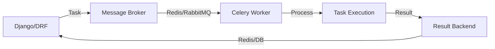
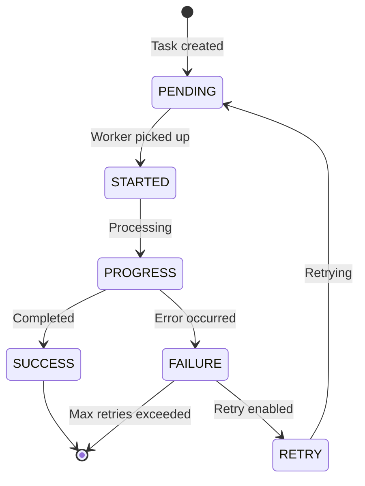

# ⚙️ 14-DARS: BACKGROUND TASKS VA CELERY

## 🎯 Dars Maqsadi

Bu darsda **Celery** - Python'da eng mashhur distributed task queue system bilan ishlashni o'rganasiz. Celery DRF API'laringizda uzoq vaqt talab qiladigan vazifalarni async ravishda bajarish imkonini beradi.

**Dars oxirida siz:**
- ✅ Celery nima va nega kerak
- ✅ Redis/RabbitMQ message broker
- ✅ Celery setup va configuration
- ✅ Task yaratish va ishga tushirish
- ✅ Periodic tasks (beat scheduler)
- ✅ Task monitoring va debugging
- ✅ DRF integratsiyasi
- ✅ Production best practices

---

## 📚 Oldingi Darsdan Kerakli Bilimlar

Bu darsni boshlashdan oldin quyidagilar tayyor bo'lishi kerak:

- [x] Django signals
- [x] Async programming tushunchasi
- [x] Redis basics (ixtiyoriy)
- [x] Docker basics (production uchun)

> **Eslatma:** Celery - production API'larda majburiy component!

---

## 🔍 1. CELERY NIMA?

### 1.1 Asosiy Tushuncha

**Celery** - distributed task queue bo'lib, vazifalarni async ravishda bajaradi:

```
Synchronous (Blocking):
Request → Heavy Task (30s) → Response
User kutadi 😴

Asynchronous (Non-blocking):
Request → Task to Queue → Response (100ms)
                ↓
        Background Worker
User davom etadi 😊
```

### 1.2 Celery Architecture



### 1.3 Nega Kerak?

| Vazifa | Sync (Yomon) | Async (Yaxshi) |
|--------|--------------|----------------|
| **Email yuborish** | 3s wait | Instant response |
| **PDF generate** | 10s wait | Background |
| **Image processing** | 20s wait | Background |
| **Report generation** | 60s wait | Background |
| **API calls** | Timeout risk | Reliable |

---

## 🛠️ 2. CELERY SETUP

### 2.1 Installation

```bash
# Celery va Redis
pip install celery[redis]

# Alternative: RabbitMQ
# pip install celery[amqp]

# Monitoring (optional)
pip install flower
```

### 2.2 Redis Setup

**Windows (WSL yoki Docker):**
```bash
# Docker bilan
docker run -d -p 6379:6379 redis:alpine

# Yoki WSL bilan
sudo apt-get install redis-server
sudo service redis-server start

# Test
redis-cli ping  # Response: PONG
```

**Ubuntu/Linux:**
```bash
sudo apt-get install redis-server
sudo systemctl start redis
redis-cli ping  # PONG
```

**macOS:**
```bash
brew install redis
brew services start redis
redis-cli ping  # PONG
```

### 2.3 Celery Configuration

`myproject/celery.py` yarating:

```python
import os
from celery import Celery

# Django settings module
os.environ.setdefault('DJANGO_SETTINGS_MODULE', 'myproject.settings')

# Celery app yaratish
app = Celery('myproject')

# Django settings'dan config olish
# namespace='CELERY' - CELERY_ prefix bilan boshlanadigan settingslar
app.config_from_object('django.conf:settings', namespace='CELERY')

# Installed apps'dan tasks.py fayllarni avtomatik topish
app.autodiscover_tasks()

@app.task(bind=True, ignore_result=True)
def debug_task(self):
    """
    Debug task - Celery ishlayotganini tekshirish uchun
    """
    print(f'Request: {self.request!r}')
```

`myproject/__init__.py` yangilash:

```python
# Bu Celery app'ni Django bilan birga yuklanishini ta'minlaydi
from .celery import app as celery_app

__all__ = ('celery_app',)
```

### 2.4 Django Settings

`myproject/settings.py`:

```python
# Celery Configuration
# ====================

# Broker URL (Redis)
CELERY_BROKER_URL = 'redis://localhost:6379/0'

# Result backend (natijalarni saqlash)
CELERY_RESULT_BACKEND = 'redis://localhost:6379/0'

# Content encoding
CELERY_ACCEPT_CONTENT = ['json']
CELERY_TASK_SERIALIZER = 'json'
CELERY_RESULT_SERIALIZER = 'json'

# Timezone
CELERY_TIMEZONE = 'Asia/Tashkent'
CELERY_ENABLE_UTC = True

# Task result expiration (24 hours)
CELERY_RESULT_EXPIRES = 60 * 60 * 24

# Task acks late (task fail bo'lsa retry qilish uchun)
CELERY_TASK_ACKS_LATE = True

# Worker settings
CELERY_WORKER_PREFETCH_MULTIPLIER = 4  # Bir vaqtda 4 ta task olish
CELERY_WORKER_MAX_TASKS_PER_CHILD = 1000  # 1000 taskdan keyin restart

# Task time limits
CELERY_TASK_TIME_LIMIT = 30 * 60  # 30 minutes hard limit
CELERY_TASK_SOFT_TIME_LIMIT = 25 * 60  # 25 minutes soft limit

# Beat scheduler (periodic tasks uchun)
CELERY_BEAT_SCHEDULER = 'django_celery_beat.schedulers:DatabaseScheduler'

# Task routes (turli queue'larga yo'naltirish)
CELERY_TASK_ROUTES = {
    'tasks.tasks.send_email': {'queue': 'emails'},
    'tasks.tasks.generate_report': {'queue': 'reports'},
}

# Monitoring
CELERY_WORKER_SEND_TASK_EVENTS = True
CELERY_TASK_SEND_SENT_EVENT = True

# Retry policy
CELERY_TASK_RETRY_POLICY = {
    'max_retries': 3,
    'interval_start': 0,
    'interval_step': 0.2,
    'interval_max': 0.2,
}
```

---

## 🎨 3. CREATING TASKS

### 3.1 Basic Tasks

`tasks/tasks.py`:

```python
from celery import shared_task
from django.core.mail import send_mail
from django.conf import settings
import time
import logging

logger = logging.getLogger(__name__)

@shared_task
def add(x, y):
    """
    Simple test task
    """
    return x + y


@shared_task(bind=True)
def debug_task(self):
    """
    Debug task - task object'ga access
    """
    print(f'Request: {self.request!r}')
    return 'Debug complete'


@shared_task
def send_welcome_email(user_email, username):
    """
    Welcome email yuborish
    
    Usage:
        send_welcome_email.delay('user@example.com', 'John')
    """
    try:
        subject = f'Welcome {username}!'
        message = f'Hello {username}, welcome to our platform!'
        
        send_mail(
            subject=subject,
            message=message,
            from_email=settings.DEFAULT_FROM_EMAIL,
            recipient_list=[user_email],
            fail_silently=False,
        )
        
        logger.info(f'[EMAIL] Welcome email sent to {user_email}')
        return f'Email sent to {user_email}'
    
    except Exception as e:
        logger.error(f'[EMAIL] Failed to send email: {str(e)}')
        raise


@shared_task(bind=True, max_retries=3)
def send_notification(self, user_id, message):
    """
    Notification yuborish (retry bilan)
    
    bind=True - task object'ga access (self)
    max_retries=3 - 3 marta retry
    """
    try:
        # Notification logic
        from django.contrib.auth.models import User
        user = User.objects.get(id=user_id)
        
        # Send push notification, SMS, etc.
        logger.info(f'[NOTIFICATION] Sent to {user.username}: {message}')
        
        return f'Notification sent to user {user_id}'
    
    except Exception as exc:
        # Retry after 60 seconds
        logger.warning(f'[NOTIFICATION] Failed, retrying... {exc}')
        raise self.retry(exc=exc, countdown=60)


@shared_task
def process_bulk_data(data_list):
    """
    Bulk data processing
    """
    results = []
    
    for item in data_list:
        # Process each item
        processed = item.upper()  # Example processing
        results.append(processed)
        
        # Simulate processing time
        time.sleep(0.1)
    
    logger.info(f'[BULK] Processed {len(results)} items')
    return results
```

### 3.2 Task Parameters

```python
from celery import shared_task
from celery.utils.log import get_task_logger

logger = get_task_logger(__name__)

@shared_task(
    bind=True,                  # Task object access (self)
    name='tasks.custom_name',   # Custom task name
    max_retries=5,              # Max retry count
    default_retry_delay=60,     # Retry delay (seconds)
    time_limit=300,             # Hard time limit (5 min)
    soft_time_limit=240,        # Soft time limit (4 min)
    ignore_result=False,        # Store result or not
    track_started=True,         # Track when started
    acks_late=True,             # Ack after completion
    reject_on_worker_lost=True, # Reject if worker dies
)
def advanced_task(self, param1, param2):
    """
    Advanced task with all parameters
    """
    try:
        logger.info(f'Task started: {param1}, {param2}')
        
        # Task logic here
        result = param1 + param2
        
        logger.info(f'Task completed: {result}')
        return result
    
    except Exception as exc:
        # Custom retry logic
        logger.error(f'Task failed: {exc}')
        raise self.retry(
            exc=exc,
            countdown=60,  # Wait 60 seconds
            max_retries=5
        )
```

### 3.3 Task States

```python
@shared_task(bind=True)
def long_running_task(self, duration):
    """
    Long-running task with progress tracking
    """
    for i in range(duration):
        # Update task state
        self.update_state(
            state='PROGRESS',
            meta={
                'current': i,
                'total': duration,
                'percent': int((i / duration) * 100)
            }
        )
        
        # Simulate work
        time.sleep(1)
    
    return {
        'status': 'Complete',
        'message': f'Processed {duration} items'
    }


# View'da task status check qilish
from celery.result import AsyncResult

def check_task_status(request, task_id):
    """
    Task status'ni tekshirish
    """
    task_result = AsyncResult(task_id)
    
    response = {
        'task_id': task_id,
        'state': task_result.state,
        'ready': task_result.ready(),
        'successful': task_result.successful() if task_result.ready() else None,
    }
    
    if task_result.state == 'PROGRESS':
        response['progress'] = task_result.info
    elif task_result.ready():
        response['result'] = task_result.result
    
    return JsonResponse(response)
```

---

## 💼 4. DRF INTEGRATION

### 4.1 Task Triggering from API

`tasks/views.py`:

```python
from rest_framework import status, viewsets
from rest_framework.decorators import action
from rest_framework.response import Response
from rest_framework.permissions import IsAuthenticated
from celery.result import AsyncResult

from .models import Task
from .serializers import TaskSerializer
from .tasks import (
    send_notification,
    generate_report,
    process_bulk_data
)

class TaskViewSet(viewsets.ModelViewSet):
    """
    Task API with async operations
    """
    queryset = Task.objects.all()
    serializer_class = TaskSerializer
    permission_classes = [IsAuthenticated]
    
    def perform_create(self, serializer):
        """
        Task yaratish va async notification
        """
        # Task save qilish
        task = serializer.save(owner=self.request.user)
        
        # Async notification yuborish
        send_notification.delay(
            user_id=self.request.user.id,
            message=f"New task created: {task.title}"
        )
    
    @action(detail=True, methods=['post'])
    def send_email(self, request, pk=None):
        """
        Task uchun email yuborish
        
        POST /tasks/1/send_email/
        """
        task = self.get_object()
        
        # Async email yuborish
        task_result = send_task_email.delay(
            task_id=task.id,
            recipient=task.owner.email
        )
        
        return Response({
            'message': 'Email is being sent',
            'task_id': task_result.id,  # Celery task ID
            'status': 'processing'
        })
    
    @action(detail=False, methods=['post'])
    def bulk_process(self, request):
        """
        Bulk data processing
        
        POST /tasks/bulk_process/
        {
            "data": ["item1", "item2", ...]
        }
        """
        data = request.data.get('data', [])
        
        if not data:
            return Response(
                {'error': 'No data provided'},
                status=status.HTTP_400_BAD_REQUEST
            )
        
        # Async processing
        task_result = process_bulk_data.delay(data)
        
        return Response({
            'message': f'Processing {len(data)} items',
            'task_id': task_result.id,
            'status_url': f'/api/tasks/status/{task_result.id}/'
        })
    
    @action(detail=False, methods=['get'], url_path='status/(?P<task_id>[^/.]+)')
    def task_status(self, request, task_id=None):
        """
        Celery task status
        
        GET /tasks/status/<task_id>/
        """
        task_result = AsyncResult(task_id)
        
        response_data = {
            'task_id': task_id,
            'state': task_result.state,
            'ready': task_result.ready(),
        }
        
        # State'ga qarab qo'shimcha ma'lumot
        if task_result.state == 'PENDING':
            response_data['message'] = 'Task is waiting...'
        
        elif task_result.state == 'PROGRESS':
            response_data['progress'] = task_result.info
        
        elif task_result.state == 'SUCCESS':
            response_data['result'] = task_result.result
            response_data['message'] = 'Task completed successfully'
        
        elif task_result.state == 'FAILURE':
            response_data['error'] = str(task_result.info)
            response_data['message'] = 'Task failed'
        
        return Response(response_data)
```

### 4.2 Chaining Tasks

```python
from celery import chain, group, chord

@shared_task
def step1(data):
    """Task chain - Step 1"""
    logger.info(f'Step 1: {data}')
    return data + ' -> Step1'

@shared_task
def step2(data):
    """Task chain - Step 2"""
    logger.info(f'Step 2: {data}')
    return data + ' -> Step2'

@shared_task
def step3(data):
    """Task chain - Step 3"""
    logger.info(f'Step 3: {data}')
    return data + ' -> Step3'


# View'da chain ishlatish
@action(detail=False, methods=['post'])
def process_pipeline(self, request):
    """
    Task chain - ketma-ket bajarish
    """
    data = request.data.get('data', 'Start')
    
    # Chain: step1 → step2 → step3
    result = chain(
        step1.s(data),
        step2.s(),
        step3.s()
    ).apply_async()
    
    return Response({
        'message': 'Pipeline started',
        'task_id': result.id
    })


# Parallel execution
@action(detail=False, methods=['post'])
def process_parallel(self, request):
    """
    Group - parallel bajarish
    """
    items = request.data.get('items', [])
    
    # Group: hammasini parallel bajarish
    job = group(process_item.s(item) for item in items)
    result = job.apply_async()
    
    return Response({
        'message': f'Processing {len(items)} items in parallel',
        'group_id': result.id
    })


# Chord: parallel + callback
@shared_task
def collect_results(results):
    """Callback - natijalarni yig'ish"""
    logger.info(f'All tasks completed. Results: {results}')
    return {'total': len(results), 'results': results}

@action(detail=False, methods=['post'])
def process_with_callback(self, request):
    """
    Chord - parallel execution + callback
    """
    items = request.data.get('items', [])
    
    # Chord: parallel bajar, so'ng collect_results chaqir
    result = chord(
        (process_item.s(item) for item in items),
        collect_results.s()
    ).apply_async()
    
    return Response({
        'message': f'Processing {len(items)} items',
        'task_id': result.id
    })
```

---

## 📅 5. PERIODIC TASKS

### 5.1 Celery Beat Setup

```bash
# django-celery-beat o'rnatish
pip install django-celery-beat
```

`settings.py`:

```python
INSTALLED_APPS = [
    # ...
    'django_celery_beat',  # Periodic tasks uchun
]

# Migrate
# python manage.py migrate django_celery_beat
```

### 5.2 Creating Periodic Tasks

`tasks/tasks.py`:

```python
from celery import shared_task
from datetime import datetime, timedelta
from .models import Task

@shared_task
def check_overdue_tasks():
    """
    Har kun overdue tasklarni tekshirish
    """
    from django.utils import timezone
    
    # Overdue tasklar
    overdue = Task.objects.filter(
        due_date__lt=timezone.now().date(),
        completed=False
    )
    
    for task in overdue:
        # Notification yuborish
        send_notification.delay(
            user_id=task.owner.id,
            message=f"Task '{task.title}' is overdue!"
        )
    
    logger.info(f'[PERIODIC] Checked overdue tasks: {overdue.count()} found')
    return f'Processed {overdue.count()} overdue tasks'


@shared_task
def daily_report():
    """
    Har kuni hisobot tayyorlash
    """
    from django.contrib.auth.models import User
    
    for user in User.objects.filter(is_active=True):
        # User statistikasi
        total_tasks = Task.objects.filter(owner=user).count()
        completed = Task.objects.filter(owner=user, completed=True).count()
        
        # Email yuborish
        send_email.delay(
            user.email,
            'Daily Report',
            f'Total: {total_tasks}, Completed: {completed}'
        )
    
    logger.info('[PERIODIC] Daily reports sent')
    return 'Daily reports sent'


@shared_task
def cleanup_old_tasks():
    """
    Har hafta eski tasklarni tozalash
    """
    from django.utils import timezone
    
    # 90 kundan eski completed tasklar
    threshold = timezone.now() - timedelta(days=90)
    old_tasks = Task.objects.filter(
        completed=True,
        updated_at__lt=threshold
    )
    
    count = old_tasks.count()
    old_tasks.delete()
    
    logger.info(f'[CLEANUP] Deleted {count} old tasks')
    return f'Deleted {count} old tasks'
```

### 5.3 Registering Periodic Tasks (Code)

`myproject/celery.py`:

```python
from celery import Celery
from celery.schedules import crontab

app = Celery('myproject')

# ...

# Periodic tasks schedule
app.conf.beat_schedule = {
    # Har 10 daqiqada
    'check-overdue-every-10-minutes': {
        'task': 'tasks.tasks.check_overdue_tasks',
        'schedule': 600.0,  # 10 minutes in seconds
    },
    
    # Har kuni soat 9:00 da
    'daily-report-9am': {
        'task': 'tasks.tasks.daily_report',
        'schedule': crontab(hour=9, minute=0),
    },
    
    # Har yakshanba kuni soat 2:00 da
    'weekly-cleanup': {
        'task': 'tasks.tasks.cleanup_old_tasks',
        'schedule': crontab(hour=2, minute=0, day_of_week=0),
    },
    
    # Har  soatda
    'hourly-stats': {
        'task': 'tasks.tasks.update_statistics',
        'schedule': crontab(minute=0),  # Har soat boshida
    },
}
```

### 5.4 Running Beat Scheduler

```bash
# Celery worker
celery -A myproject worker --loglevel=info

# Celery beat (alohida terminal)
celery -A myproject beat --loglevel=info

# Yoki ikkalasini birga (development uchun)
celery -A myproject worker --beat --loglevel=info
```

---

## 🔧 6. MONITORING & DEBUGGING

### 6.1 Flower - Web Monitoring

```bash
# Flower o'rnatish
pip install flower

# Ishga tushirish
celery -A myproject flower

# Browser: http://localhost:5555
```

**Flower features:**
- Real-time task monitoring
- Task statistics
- Worker management
- Task retry/revoke
- Graphs and charts

### 6.2 Task Events

`tasks/views.py`:

```python
from celery import current_app

@action(detail=False, methods=['get'])
def celery_stats(self, request):
    """
    Celery statistics
    """
    inspect = current_app.control.inspect()
    
    stats = {
        'active': inspect.active(),      # Active tasks
        'scheduled': inspect.scheduled(), # Scheduled tasks
        'registered': inspect.registered(), # Registered tasks
        'stats': inspect.stats(),         # Worker stats
    }
    
    return Response(stats)
```

### 6.3 Logging

`tasks/tasks.py`:

```python
import logging
from celery.utils.log import get_task_logger

# Celery logger (better for tasks)
logger = get_task_logger(__name__)

@shared_task
def task_with_logging():
    """
    Task with comprehensive logging
    """
    logger.debug('Debug message')
    logger.info('Info message')
    logger.warning('Warning message')
    logger.error('Error message')
    logger.critical('Critical message')
    
    return 'Logged'
```

---

## 🎯 AMALIYOT TOPSHIRIQLARI

### 📝 Topshiriq 1: Email Service (Oson)

**Talablar:**
- ✅ Welcome email task
- ✅ Password reset email task
- ✅ Task completion notification
- ✅ API endpoint (/api/send-email/)
- ✅ Task status check

### 📝 Topshiriq 2: Report Generation (O'rta)

**Talablar:**
- ✅ PDF report generation (async)
- ✅ Excel export (async)
- ✅ Progress tracking
- ✅ Download URL generation
- ✅ Periodic daily report
- ✅ Cleanup old reports (weekly)

### 📝 Topshiriq 3: Advanced System (Qiyin)

**Talablar:**
- ✅ Image processing pipeline (resize, compress, watermark)
- ✅ Video processing (chunked upload)
- ✅ Task chaining (multi-step process)
- ✅ Priority queues
- ✅ Retry strategies
- ✅ Flower monitoring
- ✅ Task result caching
- ✅ Error handling va logging

---

## 📊 CELERY TASK LIFECYCLE



---

## 🔗 KEYINGI DARSLAR

✅ **Dars 14 tugadi! Celery va Background Tasks o'rgandingiz!**

**Keyingi darsda:**
- API Testing va Unit Testing
- Test strategies
- Mock objects

---

## 📚 QISQA XULOSALAR

### Task Execution

```python
# Sync (blocking)
result = my_task(arg1, arg2)  # Wait for completion

# Async (non-blocking)
task = my_task.delay(arg1, arg2)  # Return immediately
# yoki
task = my_task.apply_async(args=[arg1, arg2])

# Check result later
if task.ready():
    result = task.result
```

### Crontab Examples

```python
from celery.schedules import crontab

# Har 10 daqiqada
schedule=600.0

# Har kuni 9:00 da
schedule=crontab(hour=9, minute=0)

# Har dushanba 10:30 da
schedule=crontab(hour=10, minute=30, day_of_week=1)

# Har oyning 1-kuni
schedule=crontab(hour=0, minute=0, day_of_month=1)

# Har 2 soatda
schedule=crontab(minute=0, hour='*/2')
```

### Best Practices

```python
# ✅ Good
- Small, focused tasks
- Idempotent tasks (retry-safe)
- Proper error handling
- Logging
- Task timeouts
- Retry logic
- Monitoring (Flower)

# ❌ Bad
- Large monolithic tasks
- Side effects without checks
- No error handling
- No timeouts
- Blocking operations in sync code
- No monitoring
```

**Esda tuting:**
- Celery = Async task processing
- Redis/RabbitMQ = Message broker
- Flower = Monitoring tool
- Beat = Periodic tasks scheduler
- Always use .delay() or .apply_async()!
