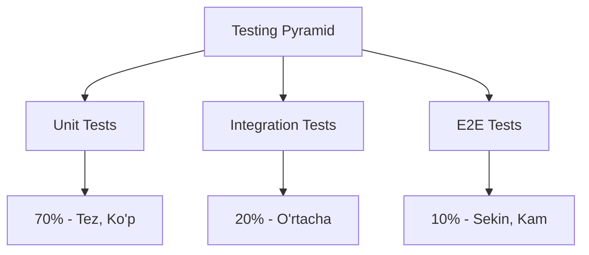
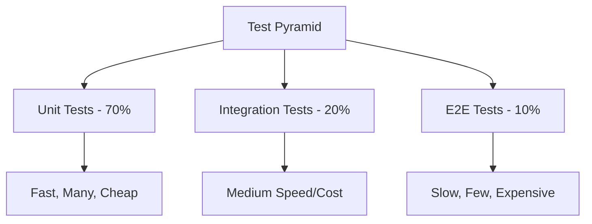

# 🧪 15-DARS: API TESTING VA UNIT TESTING

## 🎯 Dars Maqsadi

Bu darsda Django REST Framework'da **Testing** - API va kod sifatini ta'minlashning eng muhim qismi bilan ishlashni o'rganasiz. Testing - production'da xatolik yuzaga kelmasligini kafolatlaydi.

**Dars oxirida siz:**
- ✅ Testing nega kerak va turlari
- ✅ Django TestCase va DRF APITestCase
- ✅ Model, Serializer, View testing
- ✅ API endpoint testing (CRUD)
- ✅ Authentication va Permission testing
- ✅ Factory pattern va Fixtures
- ✅ Mocking va Test coverage
- ✅ CI/CD integration

---

## 📚 Oldingi Darsdan Kerakli Bilimlar

Bu darsni boshlashdan oldin quyidagilar tayyor bo'lishi kerak:

- [x] Django models va ORM
- [x] DRF Views va Serializers
- [x] Authentication va Permissions
- [x] Python unittest basics

> **Eslatma:** Testing - professional development'ning ajralmas qismi!

---

## 🔍 1. TESTING NIMA?

### 1.1 Asosiy Tushuncha

**Testing** - kodning to'g'ri ishlashini avtomatik tekshirish:

```
Manual Testing (Yomon):
- Har safar qo'lda test qilish
- Vaqt ketadi
- Xatolik yuqori
- Qayta ishlatilmaydi

Automated Testing (Yaxshi):
- Bir marta yoziladi
- Tez ishlaydi
- Ishonchli
- CI/CD'da avtomatik ✅
```

### 1.2 Test Types



| Test Turi | Nima Test Qilinadi | Misol |
|-----------|-------------------|-------|
| **Unit Tests** | Kichik kod qismlari | Model method, Serializer validation |
| **Integration Tests** | Component'lar o'rtasida | API endpoint, Database |
| **E2E Tests** | To'liq user flow | Login → Create → Logout |

### 1.3 Nega Kerak?

```python
# Without tests 😱
- Bug production'da topiladi
- Refactoring qo'rqinchli
- Code confidence past
- Regression xatolar

# With tests 😊
- Bug development'da topiladi
- Refactoring safe
- Code confidence yuqori
- Regression prevention
```

---

## 🛠️ 2. DJANGO TEST SETUP

### 2.1 Test Database

Django test paytida alohida database yaratadi:

```python
# settings.py
DATABASES = {
    'default': {
        'ENGINE': 'django.db.backends.sqlite3',
        'NAME': BASE_DIR / 'db.sqlite3',
    }
}

# Test paytida avtomatik:
# test_db.sqlite3 yaratiladi va test'dan keyin o'chiriladi
```

### 2.2 Test Settings

`myproject/settings.py`:

```python
# Test-specific settings
if 'test' in sys.argv:
    # Use in-memory database (faster)
    DATABASES['default'] = {
        'ENGINE': 'django.db.backends.sqlite3',
        'NAME': ':memory:',
    }
    
    # Disable migrations (faster)
    class DisableMigrations:
        def __contains__(self, item):
            return True
        def __getitem__(self, item):
            return None
    
    MIGRATION_MODULES = DisableMigrations()
    
    # Simple password hasher (faster)
    PASSWORD_HASHERS = [
        'django.contrib.auth.hashers.MD5PasswordHasher',
    ]
    
    # Celery eager mode
    CELERY_TASK_ALWAYS_EAGER = True
    CELERY_TASK_EAGER_PROPAGATES = True
    
    # Disable debug toolbar
    DEBUG_TOOLBAR_CONFIG = {
        'SHOW_TOOLBAR_CALLBACK': lambda request: False,
    }
```

---

## 🎨 3. MODEL TESTING

### 3.1 Basic Model Tests

`tasks/tests/test_models.py`:

```python
from django.test import TestCase
from django.contrib.auth.models import User
from tasks.models import Task
from datetime import date, timedelta

class TaskModelTest(TestCase):
    """
    Task model unit tests
    """
    
    def setUp(self):
        """
        Test setup - har bir test uchun ishga tushadi
        """
        # User yaratish
        self.user = User.objects.create_user(
            username='testuser',
            email='test@example.com',
            password='testpass123'
        )
        
        # Task yaratish
        self.task = Task.objects.create(
            title='Test Task',
            description='Test Description',
            priority='high',
            status='todo',
            owner=self.user,
            due_date=date.today() + timedelta(days=7)
        )
    
    def test_task_creation(self):
        """
        Task to'g'ri yaratilganini test qilish
        """
        self.assertEqual(self.task.title, 'Test Task')
        self.assertEqual(self.task.priority, 'high')
        self.assertEqual(self.task.status, 'todo')
        self.assertEqual(self.task.owner, self.user)
        self.assertFalse(self.task.completed)
    
    def test_task_str(self):
        """
        __str__ method test
        """
        expected = f"Test Task [Yuqori]"
        self.assertEqual(str(self.task), expected)
    
    def test_task_verbose_name(self):
        """
        Model meta options test
        """
        self.assertEqual(Task._meta.verbose_name, 'Vazifa')
        self.assertEqual(Task._meta.verbose_name_plural, 'Vazifalar')
    
    def test_task_fields(self):
        """
        Field types va attributes test
        """
        # Title field
        title_field = Task._meta.get_field('title')
        self.assertEqual(title_field.max_length, 200)
        self.assertFalse(title_field.blank)
        
        # Description field
        desc_field = Task._meta.get_field('description')
        self.assertTrue(desc_field.blank)
        self.assertTrue(desc_field.null)
        
        # Completed field
        completed_field = Task._meta.get_field('completed')
        self.assertFalse(completed_field.default)
    
    def test_task_ordering(self):
        """
        Default ordering test
        """
        # Create multiple tasks
        task2 = Task.objects.create(
            title='Task 2',
            owner=self.user
        )
        task3 = Task.objects.create(
            title='Task 3',
            owner=self.user
        )
        
        # Check ordering (newest first)
        tasks = Task.objects.all()
        self.assertEqual(tasks[0], task3)  # Eng yangi
        self.assertEqual(tasks[1], task2)
        self.assertEqual(tasks[2], self.task)  # Eng eski
    
    def test_task_default_values(self):
        """
        Default values test
        """
        task = Task.objects.create(
            title='Minimal Task',
            owner=self.user
        )
        
        self.assertEqual(task.priority, 'medium')  # Default priority
        self.assertEqual(task.status, 'todo')      # Default status
        self.assertFalse(task.completed)           # Default completed
        self.assertFalse(task.is_public)           # Default public
    
    def test_task_custom_methods(self):
        """
        Custom model methods test
        """
        # mark_as_completed method
        self.assertFalse(self.task.completed)
        self.task.mark_as_completed()
        self.assertTrue(self.task.completed)
        
        # is_overdue method
        past_task = Task.objects.create(
            title='Past Task',
            owner=self.user,
            due_date=date.today() - timedelta(days=1)
        )
        self.assertTrue(past_task.is_overdue())
        self.assertFalse(self.task.is_overdue())
```

### 3.2 Model Relationship Tests

```python
class TaskRelationshipTest(TestCase):
    """
    Model relationships test
    """
    
    def setUp(self):
        self.user = User.objects.create_user(
            username='testuser',
            password='testpass123'
        )
    
    def test_user_task_relationship(self):
        """
        User-Task ForeignKey relationship
        """
        # Create tasks
        task1 = Task.objects.create(title='Task 1', owner=self.user)
        task2 = Task.objects.create(title='Task 2', owner=self.user)
        
        # Check reverse relationship
        self.assertEqual(self.user.owned_tasks.count(), 2)
        self.assertIn(task1, self.user.owned_tasks.all())
        self.assertIn(task2, self.user.owned_tasks.all())
    
    def test_task_cascade_delete(self):
        """
        Cascade delete test (user o'chirilganda task ham o'chiriladi)
        """
        task = Task.objects.create(title='Task', owner=self.user)
        task_id = task.id
        
        # User o'chirish
        self.user.delete()
        
        # Task ham o'chirilganini tekshirish
        self.assertFalse(Task.objects.filter(id=task_id).exists())
```

---

## 🔧 4. SERIALIZER TESTING

### 4.1 Basic Serializer Tests

`tasks/tests/test_serializers.py`:

```python
from django.test import TestCase
from django.contrib.auth.models import User
from tasks.models import Task
from tasks.serializers import TaskSerializer
from datetime import date, timedelta

class TaskSerializerTest(TestCase):
    """
    TaskSerializer unit tests
    """
    
    def setUp(self):
        self.user = User.objects.create_user(
            username='testuser',
            password='testpass123'
        )
        
        self.task_data = {
            'title': 'Test Task',
            'description': 'Test Description',
            'priority': 'high',
            'due_date': date.today() + timedelta(days=7)
        }
        
        self.task = Task.objects.create(
            owner=self.user,
            **self.task_data
        )
    
    def test_serializer_with_valid_data(self):
        """
        Valid data bilan serializer test
        """
        serializer = TaskSerializer(data=self.task_data)
        self.assertTrue(serializer.is_valid())
    
    def test_serializer_contains_expected_fields(self):
        """
        Serializer expected fieldlarga ega ekanini test
        """
        serializer = TaskSerializer(instance=self.task)
        data = serializer.data
        
        expected_fields = {
            'id', 'title', 'description', 'priority',
            'status', 'completed', 'due_date', 'owner',
            'created_at', 'updated_at'
        }
        self.assertEqual(set(data.keys()), expected_fields)
    
    def test_serializer_field_values(self):
        """
        Serializer field values test
        """
        serializer = TaskSerializer(instance=self.task)
        data = serializer.data
        
        self.assertEqual(data['title'], 'Test Task')
        self.assertEqual(data['priority'], 'high')
        self.assertEqual(data['owner'], 'testuser')  # ReadOnlyField
        self.assertFalse(data['completed'])
    
    def test_serializer_read_only_fields(self):
        """
        Read-only fields test
        """
        # Try to update read-only field
        update_data = {
            'title': 'Updated',
            'owner': 'hacker',  # Read-only field
            'created_at': '2020-01-01'  # Read-only field
        }
        
        serializer = TaskSerializer(
            instance=self.task,
            data=update_data,
            partial=True
        )
        
        self.assertTrue(serializer.is_valid())
        updated_task = serializer.save()
        
        # Read-only fields o'zgarmasligi kerak
        self.assertEqual(updated_task.title, 'Updated')
        self.assertEqual(updated_task.owner, self.user)  # Unchanged
    
    def test_serializer_validation_title_min_length(self):
        """
        Title minimum length validation
        """
        invalid_data = self.task_data.copy()
        invalid_data['title'] = 'ab'  # Too short (min 3)
        
        serializer = TaskSerializer(data=invalid_data)
        self.assertFalse(serializer.is_valid())
        self.assertIn('title', serializer.errors)
    
    def test_serializer_validation_due_date_past(self):
        """
        Due date past validation
        """
        invalid_data = self.task_data.copy()
        invalid_data['due_date'] = date.today() - timedelta(days=1)
        
        serializer = TaskSerializer(data=invalid_data)
        self.assertFalse(serializer.is_valid())
        self.assertIn('due_date', serializer.errors)
    
    def test_serializer_method_field(self):
        """
        SerializerMethodField test
        """
        serializer = TaskSerializer(instance=self.task)
        data = serializer.data
        
        # days_until_due method field
        expected_days = (self.task.due_date - date.today()).days
        self.assertEqual(data['days_until_due'], expected_days)
    
    def test_serializer_create(self):
        """
        Create method test
        """
        new_data = {
            'title': 'New Task',
            'description': 'New Description',
            'priority': 'low',
        }
        
        serializer = TaskSerializer(data=new_data)
        self.assertTrue(serializer.is_valid())
        
        # Note: owner manually set qilinadi (perform_create'da)
        # Bu test faqat serializer.save() ni test qiladi
    
    def test_serializer_update(self):
        """
        Update method test
        """
        update_data = {
            'title': 'Updated Title',
            'completed': True
        }
        
        serializer = TaskSerializer(
            instance=self.task,
            data=update_data,
            partial=True
        )
        
        self.assertTrue(serializer.is_valid())
        updated_task = serializer.save()
        
        self.assertEqual(updated_task.title, 'Updated Title')
        self.assertTrue(updated_task.completed)
```

---

## 💼 5. API ENDPOINT TESTING

### 5.1 Basic CRUD Tests

`tasks/tests/test_api.py`:

```python
from rest_framework.test import APITestCase, APIClient
from rest_framework import status
from django.contrib.auth.models import User
from django.urls import reverse
from tasks.models import Task
from rest_framework_simplejwt.tokens import RefreshToken

class TaskAPITest(APITestCase):
    """
    Task API endpoint tests
    """
    
    def setUp(self):
        """
        Test setup
        """
        # Create test users
        self.user = User.objects.create_user(
            username='testuser',
            email='test@example.com',
            password='testpass123'
        )
        
        self.other_user = User.objects.create_user(
            username='otheruser',
            password='otherpass123'
        )
        
        # Get JWT token
        refresh = RefreshToken.for_user(self.user)
        self.token = str(refresh.access_token)
        
        # Set credentials
        self.client.credentials(
            HTTP_AUTHORIZATION=f'Bearer {self.token}'
        )
        
        # Create test task
        self.task = Task.objects.create(
            title='Test Task',
            description='Test Description',
            owner=self.user
        )
        
        # URLs
        self.list_url = reverse('task-list')
        self.detail_url = reverse('task-detail', kwargs={'pk': self.task.pk})
    
    def test_get_task_list(self):
        """
        GET /api/tasks/ - List tasks
        """
        response = self.client.get(self.list_url)
        
        self.assertEqual(response.status_code, status.HTTP_200_OK)
        self.assertIn('results', response.data)  # Pagination
        self.assertEqual(len(response.data['results']), 1)
        self.assertEqual(response.data['results'][0]['title'], 'Test Task')
    
    def test_get_task_list_unauthenticated(self):
        """
        Unauthenticated user 401 olishi kerak
        """
        # Remove credentials
        self.client.credentials()
        
        response = self.client.get(self.list_url)
        self.assertEqual(response.status_code, status.HTTP_401_UNAUTHORIZED)
    
    def test_get_task_detail(self):
        """
        GET /api/tasks/{id}/ - Get task detail
        """
        response = self.client.get(self.detail_url)
        
        self.assertEqual(response.status_code, status.HTTP_200_OK)
        self.assertEqual(response.data['id'], self.task.id)
        self.assertEqual(response.data['title'], 'Test Task')
        self.assertEqual(response.data['owner'], 'testuser')
    
    def test_create_task(self):
        """
        POST /api/tasks/ - Create new task
        """
        data = {
            'title': 'New Task',
            'description': 'New Description',
            'priority': 'high'
        }
        
        response = self.client.post(
            self.list_url,
            data=data,
            format='json'
        )
        
        self.assertEqual(response.status_code, status.HTTP_201_CREATED)
        self.assertEqual(Task.objects.count(), 2)
        
        # Check created task
        new_task = Task.objects.get(title='New Task')
        self.assertEqual(new_task.owner, self.user)
        self.assertEqual(new_task.priority, 'high')
    
    def test_create_task_invalid_data(self):
        """
        Invalid data bilan 400 olishi kerak
        """
        invalid_data = {
            'title': 'ab',  # Too short
            'description': 'Test'
        }
        
        response = self.client.post(
            self.list_url,
            data=invalid_data,
            format='json'
        )
        
        self.assertEqual(response.status_code, status.HTTP_400_BAD_REQUEST)
        self.assertIn('title', response.data)
    
    def test_update_task_owner(self):
        """
        PUT /api/tasks/{id}/ - Owner update qila oladi
        """
        data = {
            'title': 'Updated Title',
            'description': 'Updated Description',
            'completed': True
        }
        
        response = self.client.put(
            self.detail_url,
            data=data,
            format='json'
        )
        
        self.assertEqual(response.status_code, status.HTTP_200_OK)
        
        # Check updated values
        self.task.refresh_from_db()
        self.assertEqual(self.task.title, 'Updated Title')
        self.assertTrue(self.task.completed)
    
    def test_partial_update_task(self):
        """
        PATCH /api/tasks/{id}/ - Partial update
        """
        data = {'completed': True}
        
        response = self.client.patch(
            self.detail_url,
            data=data,
            format='json'
        )
        
        self.assertEqual(response.status_code, status.HTTP_200_OK)
        
        self.task.refresh_from_db()
        self.assertTrue(self.task.completed)
        self.assertEqual(self.task.title, 'Test Task')  # Unchanged
    
    def test_update_task_non_owner(self):
        """
        Non-owner update qila olmaydi (403)
        """
        # Switch to other user
        other_refresh = RefreshToken.for_user(self.other_user)
        other_token = str(other_refresh.access_token)
        self.client.credentials(
            HTTP_AUTHORIZATION=f'Bearer {other_token}'
        )
        
        data = {'completed': True}
        response = self.client.patch(
            self.detail_url,
            data=data,
            format='json'
        )
        
        self.assertEqual(response.status_code, status.HTTP_403_FORBIDDEN)
    
    def test_delete_task_owner(self):
        """
        DELETE /api/tasks/{id}/ - Owner delete qila oladi
        """
        response = self.client.delete(self.detail_url)
        
        self.assertEqual(response.status_code, status.HTTP_204_NO_CONTENT)
        self.assertEqual(Task.objects.count(), 0)
    
    def test_delete_task_non_owner(self):
        """
        Non-owner delete qila olmaydi (403)
        """
        # Switch to other user
        other_refresh = RefreshToken.for_user(self.other_user)
        other_token = str(other_refresh.access_token)
        self.client.credentials(
            HTTP_AUTHORIZATION=f'Bearer {other_token}'
        )
        
        response = self.client.delete(self.detail_url)
        self.assertEqual(response.status_code, status.HTTP_403_FORBIDDEN)
```

### 5.2 Advanced API Tests

```python
class TaskAPIAdvancedTest(APITestCase):
    """
    Advanced API tests - filtering, pagination, etc.
    """
    
    def setUp(self):
        self.user = User.objects.create_user(
            username='testuser',
            password='testpass123'
        )
        
        refresh = RefreshToken.for_user(self.user)
        self.token = str(refresh.access_token)
        self.client.credentials(HTTP_AUTHORIZATION=f'Bearer {self.token}')
        
        # Create multiple tasks
        for i in range(15):
            Task.objects.create(
                title=f'Task {i}',
                priority='high' if i % 2 == 0 else 'low',
                completed=True if i % 3 == 0 else False,
                owner=self.user
            )
        
        self.list_url = reverse('task-list')
    
    def test_pagination(self):
        """
        Pagination test
        """
        response = self.client.get(self.list_url)
        
        self.assertEqual(response.status_code, status.HTTP_200_OK)
        self.assertIn('results', response.data)
        self.assertIn('next', response.data)
        self.assertIn('previous', response.data)
        self.assertIn('count', response.data)
        
        # Page size check
        self.assertLessEqual(len(response.data['results']), 10)
    
    def test_filtering_by_completed(self):
        """
        Filtering by completed field
        """
        url = f'{self.list_url}?completed=true'
        response = self.client.get(url)
        
        self.assertEqual(response.status_code, status.HTTP_200_OK)
        
        # Check all results are completed
        for task in response.data['results']:
            self.assertTrue(task['completed'])
    
    def test_filtering_by_priority(self):
        """
        Filtering by priority field
        """
        url = f'{self.list_url}?priority=high'
        response = self.client.get(url)
        
        self.assertEqual(response.status_code, status.HTTP_200_OK)
        
        # Check all results have high priority
        for task in response.data['results']:
            self.assertEqual(task['priority'], 'high')
    
    def test_search(self):
        """
        Search test
        """
        # Create task with unique title
        Task.objects.create(
            title='Unique Search Term',
            owner=self.user
        )
        
        url = f'{self.list_url}?search=Unique'
        response = self.client.get(url)
        
        self.assertEqual(response.status_code, status.HTTP_200_OK)
        self.assertGreaterEqual(len(response.data['results']), 1)
        
        # Check search worked
        titles = [task['title'] for task in response.data['results']]
        self.assertIn('Unique Search Term', titles)
    
    def test_ordering(self):
        """
        Ordering test
        """
        url = f'{self.list_url}?ordering=-created_at'
        response = self.client.get(url)
        
        self.assertEqual(response.status_code, status.HTTP_200_OK)
        
        # Check ordering (newest first)
        results = response.data['results']
        for i in range(len(results) - 1):
            self.assertGreaterEqual(
                results[i]['created_at'],
                results[i+1]['created_at']
            )
```

---

## 🎯 AMALIYOT TOPSHIRIQLARI

### 📝 Topshiriq 1: Basic Testing (Oson)

**Talablar:**
- ✅ Model tests (5+ tests)
- ✅ Serializer tests (5+ tests)
- ✅ API CRUD tests (GET, POST, PUT/PATCH, DELETE)
- ✅ 80%+ test coverage

### 📝 Topshiriq 2: Advanced Testing (O'rta)

**Talablar:**
- ✅ Permission tests
- ✅ Authentication tests (JWT)
- ✅ Filtering va search tests
- ✅ Pagination tests
- ✅ Custom action tests
- ✅ Signal tests

### 📝 Topshiriq 3: Complete Test Suite (Qiyin)

**Talablar:**
- ✅ Factory pattern
- ✅ Fixtures
- ✅ Mocking external services
- ✅ Performance tests
- ✅ 95%+ coverage
- ✅ CI/CD integration
- ✅ Load testing

---

## 📊 TEST PYRAMID



---

## 🔗 KEYINGI DARSLAR

✅ **Dars 15 tugadi! Testing to'liq o'rgandingiz!**

**Keyingi darsda:**
- Caching va Performance Optimization
- Redis cache
- Query optimization

---

## 📚 QISQA XULOSALAR

### Test Commands

```bash
# Barcha testlar
python manage.py test

# Specific app
python manage.py test tasks

# Specific test class
python manage.py test tasks.tests.test_models.TaskModelTest

# Specific test method
python manage.py test tasks.tests.test_models.TaskModelTest.test_task_creation

# With coverage
coverage run --source='.' manage.py test
coverage report
coverage html  # HTML report

# Verbose output
python manage.py test --verbosity=2

# Keep test database
python manage.py test --keepdb

# Parallel testing
python manage.py test --parallel
```

### Assertions

```python
# Equality
self.assertEqual(a, b)
self.assertNotEqual(a, b)

# Truth
self.assertTrue(x)
self.assertFalse(x)

# Membership
self.assertIn(item, container)
self.assertNotIn(item, container)

# Null
self.assertIsNone(obj)
self.assertIsNotNone(obj)

# Exceptions
self.assertRaises(Exception, func)
with self.assertRaises(Exception):
    func()

# Greater/Less
self.assertGreater(a, b)
self.assertLess(a, b)
```

### Best Practices

```python
# ✅ Good
- Test one thing per test
- Descriptive test names
- Use setUp for common data
- Fast tests (no sleep)
- Independent tests
- Clean test data

# ❌ Bad
- Multiple assertions for different things
- Vague test names
- Duplicate setup code
- Slow tests
- Dependent tests (order matters)
- Shared mutable state
```

**Esda tuting:**
- Testing = Code sifati
- 80%+ coverage = Professional
- Fast tests = Happy developer
- CI/CD = Automated testing
- Green tests = Deploy with confidence! 🚀
