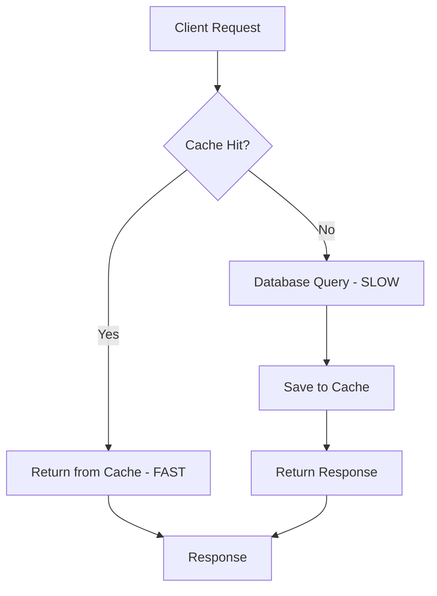
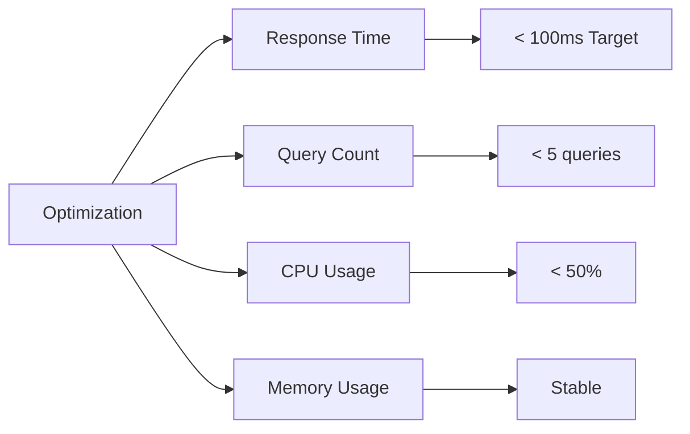

# ⚡ 16-DARS: CACHING VA PERFORMANCE OPTIMIZATION

## 🎯 Dars Maqsadi

Bu darsda Django REST Framework'da **Caching (Keshlash)** va **Performance Optimization** - API'ni tezlashtirish va serverga yuk tushiris humanlarini kamaytirish texnikalarini o'rganasiz.

**Dars oxirida siz:**
- ✅ Caching nima va nega kerak
- ✅ Cache backends (Redis, Memcached)
- ✅ View-level va Low-level caching
- ✅ Query optimization (select_related, prefetch_related)
- ✅ Database indexes
- ✅ Response compression
- ✅ Performance monitoring
- ✅ Best practices

---

## 📚 Oldingi Darsdan Kerakli Bilimlar

Bu darsni boshlashdan oldin quyidagilar tayyor bo'lishi kerak:

- [x] Django ORM va queries
- [x] Redis basics
- [x] DRF Views va Serializers
- [x] Database concepts

> **Eslatma:** Performance - production API'da eng muhim metrikalardan biri!

---

## 🔍 1. CACHING NIMA?

### 1.1 Asosiy Tushuncha

**Caching** - tez-tez ishlatiladigan ma'lumotlarni vaqtincha tezkor xotirada saqlash:

```
Without Cache 😴:
Request → Database Query → Response (500ms)
Request → Database Query → Response (500ms)
Request → Database Query → Response (500ms)

With Cache 😊:
Request → Database Query → Cache → Response (500ms)
Request → Cache → Response (5ms) ⚡
Request → Cache → Response (5ms) ⚡
```

### 1.2 Cache Layers



### 1.3 Nega Kerak?

| Metric | Without Cache | With Cache |
|--------|--------------|------------|
| **Response Time** | 500ms | 5ms (100x faster!) |
| **DB Queries** | 1000/s | 100/s (10x less!) |
| **Server Cost** | 💰💰💰 | 💰 |
| **User Experience** | Slow 😴 | Fast ⚡ |
| **Scalability** | Limited | High |

---

## 🛠️ 2. REDIS CACHE SETUP

### 2.1 Installation

```bash
# Django Redis
pip install django-redis

# Redis server (if not installed)
# Ubuntu/Debian
sudo apt-get install redis-server

# macOS
brew install redis

# Windows (WSL or Docker)
docker run -d -p 6379:6379 redis:alpine
```

### 2.2 Start Redis

```bash
# Start Redis server
redis-server

# Test connection
redis-cli ping  # Should return: PONG

# Monitor cache
redis-cli monitor
```

### 2.3 Django Settings

`myproject/settings.py`:

```python
# Cache Configuration
CACHES = {
    # Default cache (Redis)
    'default': {
        'BACKEND': 'django_redis.cache.RedisCache',
        'LOCATION': 'redis://127.0.0.1:6379/1',
        'OPTIONS': {
            'CLIENT_CLASS': 'django_redis.client.DefaultClient',
            'PASSWORD': '',  # If Redis has password
            'SOCKET_CONNECT_TIMEOUT': 5,
            'SOCKET_TIMEOUT': 5,
            'CONNECTION_POOL_KWARGS': {
                'max_connections': 50,
                'retry_on_timeout': True
            },
            # Serializer
            'SERIALIZER': 'django_redis.serializers.json.JSONSerializer',
            # Compression
            'COMPRESSOR': 'django_redis.compressors.zlib.ZlibCompressor',
        },
        'KEY_PREFIX': 'myapp',  # Prefix for all cache keys
        'TIMEOUT': 300,  # Default timeout (5 minutes)
    },
    
    # Session cache (separate database)
    'sessions': {
        'BACKEND': 'django_redis.cache.RedisCache',
        'LOCATION': 'redis://127.0.0.1:6379/2',
        'OPTIONS': {
            'CLIENT_CLASS': 'django_redis.client.DefaultClient',
        },
        'KEY_PREFIX': 'session',
        'TIMEOUT': 60 * 60 * 24,  # 24 hours
    },
}

# Session backend (use Redis)
SESSION_ENGINE = 'django.contrib.sessions.backends.cache'
SESSION_CACHE_ALIAS = 'sessions'

# Cache middleware (site-wide caching)
# MIDDLEWARE = [
#     'django.middleware.cache.UpdateCacheMiddleware',  # First
#     # ... other middleware ...
#     'django.middleware.cache.FetchFromCacheMiddleware',  # Last
# ]
```

---

## 🎨 3. VIEW-LEVEL CACHING

### 3.1 Cache Decorator

`tasks/views.py`:

```python
from django.views.decorators.cache import cache_page
from django.utils.decorators import method_decorator
from rest_framework import viewsets
from rest_framework.decorators import action
from rest_framework.response import Response
from .models import Task
from .serializers import TaskSerializer

class TaskViewSet(viewsets.ModelViewSet):
    """
    Task ViewSet with caching
    """
    queryset = Task.objects.all()
    serializer_class = TaskSerializer
    
    @method_decorator(cache_page(60 * 5))  # 5 minutes
    def list(self, request, *args, **kwargs):
        """
        Cached list view - 5 daqiqa
        
        Cache key includes:
        - URL path
        - Query parameters
        - HTTP headers
        """
        return super().list(request, *args, **kwargs)
    
    @method_decorator(cache_page(60 * 10))  # 10 minutes
    def retrieve(self, request, *args, **kwargs):
        """
        Cached detail view - 10 daqiqa
        """
        return super().retrieve(request, *args, **kwargs)
    
    # Create, Update, Delete - NO CACHE (mutation operations)
    
    @action(detail=False, methods=['get'])
    @method_decorator(cache_page(60 * 15))  # 15 minutes
    def stats(self, request):
        """
        Custom action with caching
        
        GET /tasks/stats/
        """
        from django.db.models import Count, Q
        
        stats = {
            'total': Task.objects.count(),
            'completed': Task.objects.filter(completed=True).count(),
            'pending': Task.objects.filter(completed=False).count(),
            'by_priority': Task.objects.values('priority').annotate(
                count=Count('id')
            ),
        }
        
        return Response(stats)
```

### 3.2 Custom Cache Keys

```python
from django.core.cache import cache
from django.utils.cache import get_cache_key

class TaskViewSet(viewsets.ModelViewSet):
    """
    ViewSet with custom cache keys
    """
    
    def list(self, request, *args, **kwargs):
        """
        Custom cache key per user
        """
        # Generate cache key
        cache_key = f'task_list_user_{request.user.id}'
        
        # Try to get from cache
        cached_data = cache.get(cache_key)
        if cached_data is not None:
            return Response(cached_data)
        
        # Get from database
        response = super().list(request, *args, **kwargs)
        
        # Save to cache (5 minutes)
        cache.set(cache_key, response.data, 60 * 5)
        
        return response
    
    def perform_create(self, serializer):
        """
        Invalidate cache on create
        """
        # Create task
        task = serializer.save(owner=self.request.user)
        
        # Invalidate user's cache
        cache_key = f'task_list_user_{self.request.user.id}'
        cache.delete(cache_key)
        
        return task
    
    def perform_update(self, serializer):
        """
        Invalidate cache on update
        """
        task = serializer.save()
        
        # Invalidate multiple cache keys
        cache.delete_many([
            f'task_list_user_{task.owner.id}',
            f'task_detail_{task.id}',
            'task_stats',
        ])
        
        return task
```

---

## 💼 4. LOW-LEVEL CACHING

### 4.1 Manual Cache Operations

`tasks/utils.py`:

```python
from django.core.cache import cache
from .models import Task

def get_task_stats():
    """
    Get task statistics with caching
    """
    cache_key = 'task_stats'
    
    # Try cache first
    stats = cache.get(cache_key)
    
    if stats is None:
        # Calculate from database
        from django.db.models import Count, Q
        
        stats = {
            'total': Task.objects.count(),
            'completed': Task.objects.filter(completed=True).count(),
            'pending': Task.objects.filter(completed=False).count(),
            'high_priority': Task.objects.filter(priority='high').count(),
        }
        
        # Cache for 10 minutes
        cache.set(cache_key, stats, 60 * 10)
        print('[CACHE] Stats calculated and cached')
    else:
        print('[CACHE] Stats retrieved from cache')
    
    return stats


def get_user_tasks(user_id, filters=None):
    """
    Get user tasks with cache
    """
    # Build cache key
    filter_str = '_'.join(f'{k}={v}' for k, v in (filters or {}).items())
    cache_key = f'user_{user_id}_tasks_{filter_str}'
    
    # Try cache
    tasks = cache.get(cache_key)
    
    if tasks is None:
        # Query database
        queryset = Task.objects.filter(owner_id=user_id)
        
        # Apply filters
        if filters:
            queryset = queryset.filter(**filters)
        
        tasks = list(queryset.values())
        
        # Cache for 5 minutes
        cache.set(cache_key, tasks, 60 * 5)
    
    return tasks


def invalidate_user_cache(user_id):
    """
    Invalidate all user-related caches
    """
    # Pattern matching (Redis specific)
    from django_redis import get_redis_connection
    
    redis_conn = get_redis_connection('default')
    
    # Get all keys matching pattern
    pattern = f'*user_{user_id}_*'
    keys = redis_conn.keys(pattern)
    
    # Delete all matching keys
    if keys:
        redis_conn.delete(*keys)
        print(f'[CACHE] Invalidated {len(keys)} cache keys for user {user_id}')
```

### 4.2 Cache Decorators

```python
from functools import wraps
from django.core.cache import cache

def cache_result(timeout=60 * 5, key_prefix=''):
    """
    Custom cache decorator for functions
    
    Usage:
        @cache_result(timeout=300, key_prefix='expensive_calc')
        def expensive_calculation(x, y):
            return x ** y
    """
    def decorator(func):
        @wraps(func)
        def wrapper(*args, **kwargs):
            # Generate cache key
            cache_key = f'{key_prefix}_{func.__name__}_{args}_{kwargs}'
            
            # Try cache
            result = cache.get(cache_key)
            
            if result is None:
                # Call function
                result = func(*args, **kwargs)
                
                # Cache result
                cache.set(cache_key, result, timeout)
            
            return result
        
        return wrapper
    return decorator


# Usage
@cache_result(timeout=60 * 10, key_prefix='task')
def calculate_task_metrics(user_id):
    """
    Expensive calculation with caching
    """
    import time
    time.sleep(2)  # Simulate slow operation
    
    return {
        'user_id': user_id,
        'total_tasks': Task.objects.filter(owner_id=user_id).count(),
        'completion_rate': 0.85
    }
```

---

## 🚀 5. QUERY OPTIMIZATION

### 5.1 select_related (ForeignKey)

```python
class TaskViewSet(viewsets.ModelViewSet):
    """
    Optimized queryset with select_related
    """
    
    def get_queryset(self):
        """
        Optimize ForeignKey queries
        """
        # ❌ Bad - N+1 queries
        # queryset = Task.objects.all()
        # for task in queryset:
        #     print(task.owner.username)  # Extra query!
        
        # ✅ Good - Single JOIN query
        queryset = Task.objects.select_related('owner', 'assigned_to')
        # for task in queryset:
        #     print(task.owner.username)  # No extra query!
        
        return queryset


# Example of N+1 problem
# Without select_related:
tasks = Task.objects.all()  # 1 query
for task in tasks:
    print(task.owner.username)  # N queries (one per task!)
# Total: 1 + N queries

# With select_related:
tasks = Task.objects.select_related('owner').all()  # 1 query (with JOIN)
for task in tasks:
    print(task.owner.username)  # No extra query!
# Total: 1 query
```

### 5.2 prefetch_related (ManyToMany)

```python
class TaskViewSet(viewsets.ModelViewSet):
    """
    Optimize ManyToMany queries
    """
    
    def get_queryset(self):
        """
        Optimize queryset with prefetch_related
        """
        queryset = Task.objects.all()
        
        # ForeignKey optimization
        queryset = queryset.select_related('owner', 'assigned_to')
        
        # ManyToMany optimization (if Task has tags, comments, etc.)
        queryset = queryset.prefetch_related('tags', 'comments')
        
        return queryset


# Example with ManyToMany
# Assume Task has tags = ManyToManyField(Tag)

# ❌ Bad - N+1 queries
tasks = Task.objects.all()
for task in tasks:
    print(task.tags.all())  # N queries!

# ✅ Good - 2 queries total
tasks = Task.objects.prefetch_related('tags').all()
for task in tasks:
    print(task.tags.all())  # No extra query!
```

### 5.3 only() va defer()

```python
class TaskViewSet(viewsets.ModelViewSet):
    """
    Load only needed fields
    """
    
    def list(self, request, *args, **kwargs):
        """
        List view - minimal fields
        """
        # ❌ Bad - Load all fields
        # queryset = Task.objects.all()
        
        # ✅ Good - Load only needed fields
        queryset = Task.objects.only(
            'id', 'title', 'status', 'priority', 'due_date'
        )
        
        serializer = TaskListSerializer(queryset, many=True)
        return Response(serializer.data)
    
    def retrieve(self, request, *args, **kwargs):
        """
        Detail view - all fields
        """
        # Load all fields for detail view
        task = self.get_object()
        serializer = TaskDetailSerializer(task)
        return Response(serializer.data)


# defer() - opposite of only()
# Load all fields EXCEPT specified ones
queryset = Task.objects.defer('description', 'notes')
# Useful when you have large text fields you don't need
```

### 5.4 Query Count Monitoring

```python
from django.db import connection
from django.test.utils import override_settings

class TaskViewSet(viewsets.ModelViewSet):
    """
    Monitor query count (development)
    """
    
    def list(self, request, *args, **kwargs):
        """
        List with query count logging
        """
        from django.db import reset_queries
        reset_queries()
        
        response = super().list(request, *args, **kwargs)
        
        # Log query count (development only)
        if settings.DEBUG:
            query_count = len(connection.queries)
            print(f'[QUERIES] Total queries: {query_count}')
            
            # Log slow queries
            for query in connection.queries:
                if float(query['time']) > 0.01:  # > 10ms
                    print(f'[SLOW QUERY] {query["time"]}s: {query["sql"][:100]}')
        
        return response
```

---

## 📊 6. DATABASE INDEXES

### 6.1 Model Indexes

`tasks/models.py`:

```python
from django.db import models

class Task(models.Model):
    """
    Task model with optimized indexes
    """
    title = models.CharField(max_length=200)
    description = models.TextField(blank=True)
    status = models.CharField(max_length=20)
    priority = models.CharField(max_length=20)
    completed = models.BooleanField(default=False)
    due_date = models.DateField(null=True, blank=True)
    
    owner = models.ForeignKey(
        'auth.User',
        on_delete=models.CASCADE,
        related_name='owned_tasks'
    )
    
    created_at = models.DateTimeField(auto_now_add=True)
    updated_at = models.DateTimeField(auto_now=True)
    
    class Meta:
        # Simple indexes
        indexes = [
            # Single field indexes
            models.Index(fields=['status']),
            models.Index(fields=['priority']),
            models.Index(fields=['completed']),
            models.Index(fields=['due_date']),
            models.Index(fields=['created_at']),
            
            # Composite indexes (multiple fields)
            models.Index(fields=['owner', 'completed']),
            models.Index(fields=['owner', 'status']),
            models.Index(fields=['status', 'priority']),
            
            # Descending order index
            models.Index(fields=['-created_at']),
            
            # Named index
            models.Index(
                fields=['owner', '-created_at'],
                name='owner_created_idx'
            ),
        ]
        
        # Ordering (uses index)
        ordering = ['-created_at']
    
    # ForeignKey already creates index automatically
    # owner field has index: task_owner_id_idx


# Migration to create indexes
# python manage.py makemigrations
# python manage.py migrate
```

### 6.2 When to Use Indexes

```python
# ✅ Create index when:
- Frequent WHERE clauses
- Frequent ORDER BY
- Foreign Keys (automatic)
- Frequent JOIN conditions
- Unique constraints

# ❌ Don't create index when:
- Small tables (< 1000 rows)
- Rarely queried fields
- High write frequency
- Large text fields
```

---

## 🎯 AMALIYOT TOPSHIRIQLARI

### 📝 Topshiriq 1: Basic Caching (Oson)

**Talablar:**
- ✅ Redis cache setup
- ✅ View-level caching (5 min)
- ✅ Stats endpoint with cache
- ✅ Cache invalidation on create/update
- ✅ Test cache hit/miss

### 📝 Topshiriq 2: Query Optimization (O'rta)

**Talablar:**
- ✅ select_related for all ForeignKey
- ✅ prefetch_related for ManyToMany
- ✅ only() for list views
- ✅ Database indexes (5+)
- ✅ Query count < 5 per request
- ✅ Debug toolbar integration

### 📝 Topshiriq 3: Advanced Performance (Qiyin)

**Talablar:**
- ✅ Multi-level caching (local + Redis)
- ✅ Cache warming
- ✅ Automatic cache invalidation
- ✅ Response compression
- ✅ Database query analysis
- ✅ Load testing (100+ RPS)
- ✅ Performance monitoring

---

## 📊 PERFORMANCE METRICS



---

## 🔗 KEYINGI DARSLAR

✅ **Dars 16 tugadi! Caching va Performance Optimization o'rgandingiz!**

**Keyingi darsda:**
- API Documentation (Swagger/OpenAPI)
- Auto-generated docs
- Interactive API explorer

---

## 📚 QISQA XULOSALAR

### Cache Commands

```python
from django.core.cache import cache

# Set
cache.set('key', 'value', timeout=300)

# Get
value = cache.get('key')
value = cache.get('key', default='default_value')

# Delete
cache.delete('key')
cache.delete_many(['key1', 'key2'])

# Clear all
cache.clear()

# Atomic operations
cache.add('key', 'value')  # Only if not exists
cache.get_or_set('key', default='value', timeout=300)

# Increment/Decrement
cache.incr('counter')
cache.decr('counter')
```

### Optimization Checklist

```python
# ✅ Database Optimization
- select_related() for ForeignKey
- prefetch_related() for ManyToMany
- only() / defer() for fields
- Database indexes
- Avoid N+1 queries

# ✅ Caching Strategy
- Cache read-heavy endpoints
- Use appropriate timeouts
- Invalidate on writes
- Monitor cache hit ratio

# ✅ Performance Monitoring
- Django Debug Toolbar
- Query count < 5
- Response time < 100ms
- Load testing
```

### Best Practices

```python
# ✅ Good
- Cache GET endpoints only
- Short cache timeout (5-15 min)
- Invalidate on mutations
- Use composite indexes
- Monitor performance

# ❌ Bad
- Cache POST/PUT/DELETE
- Very long timeout (hours)
- No cache invalidation
- Index every field
- No monitoring
```

**Esda tuting:**
- Caching = Speed boost
- select_related = JOIN queries
- Indexes = Fast lookups
- Monitor = Know your performance!
- Cache wisely, not everything! 🚀
