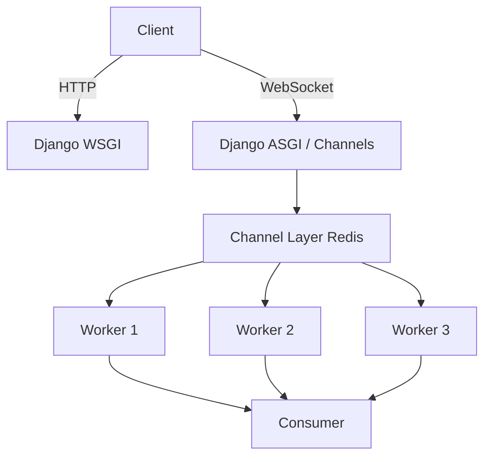

# 🔌 17-DARS: WEBSOCKETS VA DJANGO CHANNELS

## 🎯 Dars Maqsadi

Bu darsda Django REST Framework bilan **WebSockets** va **Django Channels** - real-time, ikki tomonlama aloqani ta'minlovchi texnologiyalarni o'rganasiz.

**Dars oxirida siz:**
- ✅ WebSocket nima va HTTP'dan farqi
- ✅ Django Channels architecture
- ✅ ASGI vs WSGI
- ✅ WebSocket consumers
- ✅ Channel layers va groups
- ✅ Real-time notifications
- ✅ Chat application
- ✅ Testing WebSockets

---

## 📚 Oldingi Darsdan Kerakli Bilimlar

Bu darsni boshlashdan oldin quyidagilar tayyor bo'lishi kerak:

- [x] Django basics
- [x] Redis
- [x] Async/await concepts (Python)
- [x] JavaScript basics

> **Eslatma:** WebSockets - modern real-time applications'ning asosi!

---

## 🔍 1. WEBSOCKET NIMA?

### 1.1 HTTP vs WebSocket

```
HTTP (Request-Response):
Client → Request → Server
Client ← Response ← Server
(Connection closes)

WebSocket (Persistent Connection):
Client ↔ Server (always connected)
↑           ↓
Bidirectional, Real-time
```

### 1.2 Use Cases

| Use Case | HTTP | WebSocket |
|----------|------|-----------|
| **Chat** | Polling (slow) | Real-time ⚡ |
| **Notifications** | Long polling | Push instantly |
| **Live updates** | Refresh page | Auto-update |
| **Gaming** | ❌ Not suitable | ✅ Perfect |
| **Collaboration** | ❌ Laggy | ✅ Smooth |

### 1.3 Django Channels Architecture



---

## 🛠️ 2. DJANGO CHANNELS SETUP

### 2.1 Installation

```bash
# Django Channels
pip install channels[daphne]

# Redis channel layer
pip install channels-redis

# Redis server (if not installed)
# Ubuntu/Debian
sudo apt-get install redis-server

# macOS
brew install redis

# Windows (WSL or Docker)
docker run -d -p 6379:6379 redis:alpine
```

### 2.2 Django Settings

`myproject/settings.py`:

```python
INSTALLED_APPS = [
    'django.contrib.admin',
    'django.contrib.auth',
    'django.contrib.contenttypes',
    'django.contrib.sessions',
    'django.contrib.messages',
    'django.contrib.staticfiles',
    
    # Third-party
    'rest_framework',
    'channels',  # Django Channels
    
    # Local
    'tasks',
]

# ASGI Application
ASGI_APPLICATION = 'myproject.asgi.application'

# Channel layers (Redis)
CHANNEL_LAYERS = {
    'default': {
        'BACKEND': 'channels_redis.core.RedisChannelLayer',
        'CONFIG': {
            'hosts': [('127.0.0.1', 6379)],
            # Optional settings
            'capacity': 1500,  # Max messages in channel
            'expiry': 10,      # Message expiry (seconds)
        },
    },
}

# For testing: In-memory channel layer (no Redis needed)
# CHANNEL_LAYERS = {
#     'default': {
#         'BACKEND': 'channels.layers.InMemoryChannelLayer'
#     }
# }
```

### 2.3 ASGI Configuration

`myproject/asgi.py`:

```python
"""
ASGI config for myproject.

Supports both HTTP (Django) and WebSocket (Channels)
"""

import os
from django.core.asgi import get_asgi_application
from channels.routing import ProtocolTypeRouter, URLRouter
from channels.auth import AuthMiddlewareStack
from channels.security.websocket import AllowedHostsOriginValidator

os.environ.setdefault('DJANGO_SETTINGS_MODULE', 'myproject.settings')

# Initialize Django ASGI application early
django_asgi_app = get_asgi_application()

# Import routing after django_asgi_app
from tasks import routing

application = ProtocolTypeRouter({
    # HTTP requests → Django
    'http': django_asgi_app,
    
    # WebSocket requests → Channels
    'websocket': AllowedHostsOriginValidator(
        AuthMiddlewareStack(
            URLRouter(
                routing.websocket_urlpatterns
            )
        )
    ),
})
```

---

## 🎨 3. WEBSOCKET CONSUMERS

### 3.1 Basic Consumer

`tasks/consumers.py`:

```python
from channels.generic.websocket import AsyncWebsocketConsumer
import json

class NotificationConsumer(AsyncWebsocketConsumer):
    """
    Basic WebSocket consumer for notifications
    """
    
    async def connect(self):
        """
        WebSocket connection established
        """
        # Get user from scope (if authenticated)
        self.user = self.scope['user']
        
        # Join group (all users)
        self.group_name = 'notifications'
        
        await self.channel_layer.group_add(
            self.group_name,
            self.channel_name
        )
        
        # Accept connection
        await self.accept()
        
        # Send welcome message
        await self.send(text_data=json.dumps({
            'type': 'connection_established',
            'message': f'Welcome {self.user.username if self.user.is_authenticated else "Guest"}!'
        }))
    
    async def disconnect(self, close_code):
        """
        WebSocket closed
        """
        # Leave group
        await self.channel_layer.group_discard(
            self.group_name,
            self.channel_name
        )
    
    async def receive(self, text_data):
        """
        Receive message from WebSocket (client → server)
        """
        data = json.loads(text_data)
        message = data.get('message', '')
        
        # Echo message back
        await self.send(text_data=json.dumps({
            'type': 'echo',
            'message': f'You said: {message}'
        }))
    
    # Handler for group messages
    async def notification_message(self, event):
        """
        Receive message from group (server → client)
        
        Called when channel_layer.group_send() is used
        """
        await self.send(text_data=json.dumps({
            'type': event['type'],
            'message': event['message'],
            'data': event.get('data', {})
        }))
```

### 3.2 Advanced Consumer (User-specific)

```python
class UserNotificationConsumer(AsyncWebsocketConsumer):
    """
    User-specific WebSocket consumer
    """
    
    async def connect(self):
        """
        Connect to user-specific channel
        """
        self.user = self.scope['user']
        
        # Reject if not authenticated
        if not self.user.is_authenticated:
            await self.close()
            return
        
        # User-specific group
        self.group_name = f'user_{self.user.id}'
        
        await self.channel_layer.group_add(
            self.group_name,
            self.channel_name
        )
        
        await self.accept()
        
        # Send unread notifications count
        from tasks.models import Notification
        unread_count = Notification.objects.filter(
            user=self.user,
            read=False
        ).count()
        
        await self.send(text_data=json.dumps({
            'type': 'unread_count',
            'count': unread_count
        }))
    
    async def disconnect(self, close_code):
        """
        Disconnect from user-specific channel
        """
        if hasattr(self, 'group_name'):
            await self.channel_layer.group_discard(
                self.group_name,
                self.channel_name
            )
    
    async def receive(self, text_data):
        """
        Handle client messages
        """
        data = json.loads(text_data)
        action = data.get('action')
        
        if action == 'mark_read':
            # Mark notification as read
            notif_id = data.get('notification_id')
            await self.mark_notification_read(notif_id)
        
        elif action == 'get_notifications':
            # Send all notifications
            await self.send_notifications()
    
    async def mark_notification_read(self, notif_id):
        """
        Mark notification as read (database operation)
        """
        from channels.db import database_sync_to_async
        from tasks.models import Notification
        
        @database_sync_to_async
        def mark_read(notif_id):
            try:
                notif = Notification.objects.get(
                    id=notif_id,
                    user=self.user
                )
                notif.read = True
                notif.save()
                return True
            except Notification.DoesNotExist:
                return False
        
        success = await mark_read(notif_id)
        
        if success:
            await self.send(text_data=json.dumps({
                'type': 'notification_read',
                'notification_id': notif_id
            }))
    
    async def send_notifications(self):
        """
        Send all user notifications
        """
        from channels.db import database_sync_to_async
        from tasks.models import Notification
        
        @database_sync_to_async
        def get_notifications():
            return list(Notification.objects.filter(
                user=self.user
            ).values('id', 'message', 'created_at', 'read')[:20])
        
        notifications = await get_notifications()
        
        await self.send(text_data=json.dumps({
            'type': 'notifications_list',
            'notifications': notifications
        }))
    
    # Group message handler
    async def new_notification(self, event):
        """
        New notification for this user
        """
        await self.send(text_data=json.dumps({
            'type': 'new_notification',
            'notification': event['notification']
        }))
```

### 3.3 Routing

`tasks/routing.py`:

```python
from django.urls import re_path, path
from . import consumers

websocket_urlpatterns = [
    # Global notifications
    path('ws/notifications/', consumers.NotificationConsumer.as_asgi()),
    
    # User-specific notifications
    path('ws/notifications/user/', consumers.UserNotificationConsumer.as_asgi()),
    
    # Chat room
    re_path(r'ws/chat/(?P<room_name>\w+)/$', consumers.ChatConsumer.as_asgi()),
    
    # Task updates
    path('ws/tasks/', consumers.TaskUpdateConsumer.as_asgi()),
]
```

---

## 💼 4. SENDING MESSAGES FROM DJANGO

### 4.1 From Views

`tasks/views.py`:

```python
from channels.layers import get_channel_layer
from asgiref.sync import async_to_sync
from rest_framework import viewsets
from rest_framework.decorators import action
from rest_framework.response import Response

class TaskViewSet(viewsets.ModelViewSet):
    """
    Task ViewSet with WebSocket notifications
    """
    
    def perform_create(self, serializer):
        """
        Create task and send WebSocket notification
        """
        task = serializer.save(owner=self.request.user)
        
        # Send WebSocket notification to all users
        channel_layer = get_channel_layer()
        async_to_sync(channel_layer.group_send)(
            'notifications',  # Group name
            {
                'type': 'notification_message',  # Consumer method
                'message': f'New task created: {task.title}',
                'data': {
                    'task_id': task.id,
                    'title': task.title,
                    'owner': task.owner.username
                }
            }
        )
        
        # Send to task owner only
        async_to_sync(channel_layer.group_send)(
            f'user_{task.owner.id}',
            {
                'type': 'new_notification',
                'notification': {
                    'message': f'You created task: {task.title}',
                    'task_id': task.id
                }
            }
        )
    
    @action(detail=True, methods=['post'])
    def complete(self, request, pk=None):
        """
        Complete task with notification
        """
        task = self.get_object()
        task.completed = True
        task.save()
        
        # Notify task owner
        channel_layer = get_channel_layer()
        async_to_sync(channel_layer.group_send)(
            f'user_{task.owner.id}',
            {
                'type': 'new_notification',
                'notification': {
                    'message': f'Task completed: {task.title}',
                    'task_id': task.id
                }
            }
        )
        
        return Response({'status': 'task completed'})
```

### 4.2 From Signals

`tasks/signals.py`:

```python
from django.db.models.signals import post_save, post_delete
from django.dispatch import receiver
from channels.layers import get_channel_layer
from asgiref.sync import async_to_sync
from .models import Task

@receiver(post_save, sender=Task)
def task_saved(sender, instance, created, **kwargs):
    """
    Send WebSocket notification on task save
    """
    channel_layer = get_channel_layer()
    
    if created:
        # New task
        async_to_sync(channel_layer.group_send)(
            'notifications',
            {
                'type': 'notification_message',
                'message': f'New task: {instance.title}',
                'data': {
                    'task_id': instance.id,
                    'action': 'created'
                }
            }
        )
    else:
        # Task updated
        async_to_sync(channel_layer.group_send)(
            f'user_{instance.owner.id}',
            {
                'type': 'new_notification',
                'notification': {
                    'message': f'Task updated: {instance.title}',
                    'task_id': instance.id,
                    'action': 'updated'
                }
            }
        )


@receiver(post_delete, sender=Task)
def task_deleted(sender, instance, **kwargs):
    """
    Send notification on task delete
    """
    channel_layer = get_channel_layer()
    async_to_sync(channel_layer.group_send)(
        'notifications',
        {
            'type': 'notification_message',
            'message': f'Task deleted: {instance.title}',
            'data': {
                'task_id': instance.id,
                'action': 'deleted'
            }
        }
    )
```

### 4.3 From Celery Tasks

`tasks/tasks.py`:

```python
from celery import shared_task
from channels.layers import get_channel_layer
from asgiref.sync import async_to_sync

@shared_task
def send_daily_reminder():
    """
    Send daily reminder via WebSocket
    """
    from tasks.models import Task
    from django.utils import timezone
    
    # Get today's tasks
    today_tasks = Task.objects.filter(
        due_date=timezone.now().date(),
        completed=False
    )
    
    # Group by user
    user_tasks = {}
    for task in today_tasks:
        user_id = task.owner.id
        if user_id not in user_tasks:
            user_tasks[user_id] = []
        user_tasks[user_id].append(task)
    
    # Send to each user
    channel_layer = get_channel_layer()
    for user_id, tasks in user_tasks.items():
        async_to_sync(channel_layer.group_send)(
            f'user_{user_id}',
            {
                'type': 'new_notification',
                'notification': {
                    'message': f'You have {len(tasks)} tasks due today!',
                    'task_count': len(tasks)
                }
            }
        )
```

---

## 🚀 5. FRONTEND INTEGRATION

### 5.1 JavaScript Client

```html
<!DOCTYPE html>
<html>
<head>
    <title>Real-time Notifications</title>
    <style>
        #notifications {
            border: 1px solid #ccc;
            padding: 10px;
            height: 300px;
            overflow-y: scroll;
        }
        .notification {
            padding: 5px;
            margin: 5px 0;
            background: #f0f0f0;
            border-left: 3px solid #007bff;
        }
    </style>
</head>
<body>
    <h1>Real-time Notifications</h1>
    
    <div id="status">Connecting...</div>
    
    <div id="notifications"></div>
    
    <script>
        // WebSocket connection
        const protocol = window.location.protocol === 'https:' ? 'wss:' : 'ws:';
        const wsUrl = `${protocol}//${window.location.host}/ws/notifications/`;
        
        const socket = new WebSocket(wsUrl);
        
        // Connection opened
        socket.onopen = function(e) {
            console.log('[WebSocket] Connected');
            document.getElementById('status').textContent = 'Connected ✅';
            document.getElementById('status').style.color = 'green';
        };
        
        // Receive message
        socket.onmessage = function(event) {
            const data = JSON.parse(event.data);
            console.log('[WebSocket] Message:', data);
            
            // Add to notifications
            const notificationsDiv = document.getElementById('notifications');
            const notificationEl = document.createElement('div');
            notificationEl.className = 'notification';
            
            const timestamp = new Date().toLocaleTimeString();
            notificationEl.innerHTML = `
                <strong>[${timestamp}]</strong> ${data.message}
                ${data.data ? `<pre>${JSON.stringify(data.data, null, 2)}</pre>` : ''}
            `;
            
            notificationsDiv.insertBefore(notificationEl, notificationsDiv.firstChild);
        };
        
        // Connection closed
        socket.onclose = function(event) {
            console.log('[WebSocket] Disconnected');
            document.getElementById('status').textContent = 'Disconnected ❌';
            document.getElementById('status').style.color = 'red';
            
            // Reconnect after 3 seconds
            setTimeout(() => {
                console.log('[WebSocket] Reconnecting...');
                window.location.reload();
            }, 3000);
        };
        
        // Error
        socket.onerror = function(error) {
            console.error('[WebSocket] Error:', error);
            document.getElementById('status').textContent = 'Error ⚠️';
            document.getElementById('status').style.color = 'orange';
        };
        
        // Send message example
        function sendMessage(message) {
            if (socket.readyState === WebSocket.OPEN) {
                socket.send(JSON.stringify({
                    message: message
                }));
            }
        }
    </script>
</body>
</html>
```

### 5.2 React Integration

```javascript
// useWebSocket.js - Custom hook
import { useEffect, useState, useRef } from 'react';

export function useWebSocket(url) {
    const [isConnected, setIsConnected] = useState(false);
    const [messages, setMessages] = useState([]);
    const ws = useRef(null);
    
    useEffect(() => {
        // Create WebSocket connection
        ws.current = new WebSocket(url);
        
        ws.current.onopen = () => {
            console.log('[WebSocket] Connected');
            setIsConnected(true);
        };
        
        ws.current.onmessage = (event) => {
            const data = JSON.parse(event.data);
            setMessages(prev => [...prev, data]);
        };
        
        ws.current.onclose = () => {
            console.log('[WebSocket] Disconnected');
            setIsConnected(false);
        };
        
        ws.current.onerror = (error) => {
            console.error('[WebSocket] Error:', error);
        };
        
        // Cleanup
        return () => {
            if (ws.current) {
                ws.current.close();
            }
        };
    }, [url]);
    
    const sendMessage = (message) => {
        if (ws.current && ws.current.readyState === WebSocket.OPEN) {
            ws.current.send(JSON.stringify(message));
        }
    };
    
    return { isConnected, messages, sendMessage };
}

// NotificationComponent.jsx
import React from 'react';
import { useWebSocket } from './useWebSocket';

export function NotificationComponent() {
    const wsUrl = `ws://${window.location.host}/ws/notifications/`;
    const { isConnected, messages, sendMessage } = useWebSocket(wsUrl);
    
    return (
        <div>
            <h2>Notifications</h2>
            <p>Status: {isConnected ? '🟢 Connected' : '🔴 Disconnected'}</p>
            
            <div>
                {messages.map((msg, index) => (
                    <div key={index} className="notification">
                        <strong>{msg.type}:</strong> {msg.message}
                    </div>
                ))}
            </div>
        </div>
    );
}
```

---

## 🎯 AMALIYOT TOPSHIRIQLARI

### 📝 Topshiriq 1: Basic WebSocket (Oson)

**Talablar:**
- ✅ Django Channels setup
- ✅ Basic consumer (connect, disconnect, receive)
- ✅ Frontend HTML page
- ✅ Real-time notification on task create

### 📝 Topshiriq 2: Chat Application (O'rta)

**Talablar:**
- ✅ Chat room consumer
- ✅ User authentication
- ✅ Message history (database)
- ✅ Online users list
- ✅ Typing indicators
- ✅ Frontend chat UI

### 📝 Topshiriq 3: Advanced Real-time System (Qiyin)

**Talablar:**
- ✅ User-specific channels
- ✅ Presence system (online/offline)
- ✅ Read receipts
- ✅ File sharing via WebSocket
- ✅ Reconnection logic
- ✅ Message queue (offline messages)
- ✅ Load testing (1000+ concurrent connections)

---

## 🔗 KEYINGI DARSLAR

✅ **Dars 17 tugadi! WebSockets va Django Channels o'rgandingiz!**

**Keyingi darsda:**
- API Documentation (Swagger)
- Auto-generated docs
- Interactive API explorer

---

## 📚 QISQA XULOSALAR

### Running Channels

```bash
# Development (Daphne)
daphne -b 0.0.0.0 -p 8000 myproject.asgi:application

# Production (with workers)
daphne -b 0.0.0.0 -p 8000 -w 4 myproject.asgi:application

# With Gunicorn + Uvicorn (alternative)
gunicorn myproject.asgi:application -w 4 -k uvicorn.workers.UvicornWorker
```

### Consumer Patterns

```python
# ✅ Async consumer (recommended)
class MyConsumer(AsyncWebsocketConsumer):
    async def connect(self):
        await self.accept()

# ✅ Sync consumer (for blocking code)
class MyConsumer(WebsocketConsumer):
    def connect(self):
        self.accept()
```

### Best Practices

```python
# ✅ Good
- Use groups for broadcasting
- Authenticate WebSocket connections
- Handle reconnection gracefully
- Limit message size
- Rate limit messages
- Clean up on disconnect

# ❌ Bad
- No authentication
- No reconnection logic
- Large messages (> 100KB)
- No rate limiting
- Memory leaks (not cleaning up)
```

**Esda tuting:**
- WebSocket = Real-time bidirectional
- Channels = Django + WebSocket
- async/await = Modern Python
- Groups = Broadcast messages
- Test WebSockets = Special tools needed! 🚀
