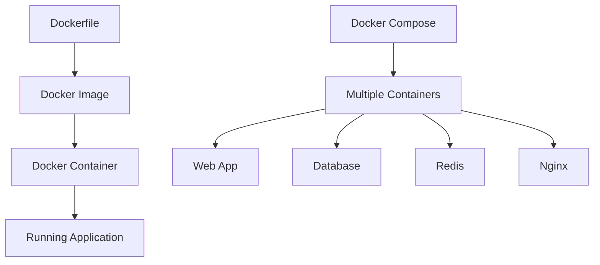

# 🚀 18-DARS: DEPLOYMENT VA DOCKER

## 🎯 Dars Maqsadi

Bu darsda Django REST Framework loyihasini **Production**'ga chiqarish - **Docker**, **Docker Compose**, **Nginx**, va **CI/CD** bilan to'liq deployment qilishni o'rganasiz.

**Dars oxirida siz:**
- ✅ Docker basics va containerization
- ✅ Multi-stage Docker builds
- ✅ Docker Compose orchestration
- ✅ PostgreSQL va Redis setup
- ✅ Nginx reverse proxy
- ✅ Environment variables va secrets
- ✅ Static files va media handling
- ✅ CI/CD pipeline (GitHub Actions)
- ✅ Production best practices

---

## 📚 Oldingi Darsdan Kerakli Bilimlar

Bu darsni boshlashdan oldin quyidagilar tayyor bo'lishi kerak:

- [x] Django production settings
- [x] Linux commands basics
- [x] Docker concepts (ixtiyoriy)
- [x] Git va GitHub

> **Eslatma:** Deployment - development'dan production'ga o'tish!

---

## 🔍 1. DOCKER NIMA?

### 1.1 Containerization

```
Traditional Deployment:
Server → OS → Dependencies → App
(Different environments = Different bugs)

Docker Deployment:
Server → Docker → Container (OS + Dependencies + App)
(Same environment everywhere) ✅
```

### 1.2 Docker vs Virtual Machine

| Feature | Virtual Machine | Docker Container |
|---------|----------------|------------------|
| **Size** | GBs | MBs |
| **Startup** | Minutes | Seconds |
| **Performance** | Slower | Near native |
| **Isolation** | Complete OS | Process-level |
| **Use case** | Heavy isolation | Microservices |

### 1.3 Docker Components



---

## 🛠️ 2. PRE-DEPLOYMENT CHECKLIST

### 2.1 Production Settings

`myproject/settings_prod.py`:

```python
from .settings import *
import os

# SECURITY
DEBUG = False
SECRET_KEY = os.environ.get('SECRET_KEY')
ALLOWED_HOSTS = os.environ.get('ALLOWED_HOSTS', '').split(',')

# Database
DATABASES = {
    'default': {
        'ENGINE': 'django.db.backends.postgresql',
        'NAME': os.environ.get('DB_NAME'),
        'USER': os.environ.get('DB_USER'),
        'PASSWORD': os.environ.get('DB_PASSWORD'),
        'HOST': os.environ.get('DB_HOST', 'db'),
        'PORT': os.environ.get('DB_PORT', '5432'),
        'CONN_MAX_AGE': 600,  # Connection pooling
        'OPTIONS': {
            'connect_timeout': 10,
        }
    }
}

# Redis
REDIS_URL = os.environ.get('REDIS_URL', 'redis://redis:6379')

# Celery
CELERY_BROKER_URL = f'{REDIS_URL}/0'
CELERY_RESULT_BACKEND = f'{REDIS_URL}/0'

# Cache
CACHES = {
    'default': {
        'BACKEND': 'django_redis.cache.RedisCache',
        'LOCATION': f'{REDIS_URL}/1',
        'OPTIONS': {
            'CLIENT_CLASS': 'django_redis.client.DefaultClient',
            'SOCKET_CONNECT_TIMEOUT': 5,
            'SOCKET_TIMEOUT': 5,
        }
    }
}

# Channels
CHANNEL_LAYERS = {
    'default': {
        'BACKEND': 'channels_redis.core.RedisChannelLayer',
        'CONFIG': {
            'hosts': [(os.environ.get('REDIS_HOST', 'redis'), 6379)],
        },
    },
}

# Static files
STATIC_URL = '/static/'
STATIC_ROOT = os.path.join(BASE_DIR, 'staticfiles')

# Media files
MEDIA_URL = '/media/'
MEDIA_ROOT = os.path.join(BASE_DIR, 'media')

# Security settings
SECURE_SSL_REDIRECT = True
SESSION_COOKIE_SECURE = True
CSRF_COOKIE_SECURE = True
SECURE_BROWSER_XSS_FILTER = True
SECURE_CONTENT_TYPE_NOSNIFF = True
X_FRAME_OPTIONS = 'DENY'

# HSTS
SECURE_HSTS_SECONDS = 31536000  # 1 year
SECURE_HSTS_INCLUDE_SUBDOMAINS = True
SECURE_HSTS_PRELOAD = True

# Logging
LOGGING = {
    'version': 1,
    'disable_existing_loggers': False,
    'formatters': {
        'verbose': {
            'format': '{levelname} {asctime} {module} {message}',
            'style': '{',
        },
    },
    'handlers': {
        'file': {
            'level': 'INFO',
            'class': 'logging.FileHandler',
            'filename': '/app/logs/django.log',
            'formatter': 'verbose',
        },
        'console': {
            'level': 'INFO',
            'class': 'logging.StreamHandler',
            'formatter': 'verbose',
        },
    },
    'root': {
        'handlers': ['console', 'file'],
        'level': 'INFO',
    },
}
```

### 2.2 Requirements Files

`requirements/base.txt`:

```txt
Django==4.2.7
djangorestframework==3.14.0
django-filter==23.3
djangorestframework-simplejwt==5.3.0
psycopg2-binary==2.9.9
redis==5.0.1
celery==5.3.4
django-redis==5.4.0
channels==4.0.0
channels-redis==4.1.0
daphne==4.0.0
gunicorn==21.2.0
python-dotenv==1.0.0
```

`requirements/prod.txt`:

```txt
-r base.txt
gevent==23.9.1
whitenoise==6.6.0  # Static files
sentry-sdk==1.38.0  # Error tracking
```

---

## 🐳 3. DOCKERFILE

### 3.1 Multi-Stage Build

`Dockerfile`:

```dockerfile
# Build stage
FROM python:3.11-slim as builder

WORKDIR /app

# Install system dependencies
RUN apt-get update && apt-get install -y \
    gcc \
    postgresql-client \
    && rm -rf /var/lib/apt/lists/*

# Copy requirements
COPY requirements/prod.txt requirements.txt

# Install Python dependencies
RUN pip install --no-cache-dir --user -r requirements.txt


# Runtime stage
FROM python:3.11-slim

# Set environment variables
ENV PYTHONDONTWRITEBYTECODE=1 \
    PYTHONUNBUFFERED=1 \
    PATH=/root/.local/bin:$PATH

WORKDIR /app

# Install runtime dependencies
RUN apt-get update && apt-get install -y \
    postgresql-client \
    && rm -rf /var/lib/apt/lists/*

# Copy Python dependencies from builder
COPY --from=builder /root/.local /root/.local

# Copy project
COPY . .

# Create directories
RUN mkdir -p /app/staticfiles /app/media /app/logs

# Collect static files (will run in entrypoint)
# RUN python manage.py collectstatic --noinput

# Create non-root user
RUN useradd -m -u 1000 appuser && \
    chown -R appuser:appuser /app
USER appuser

# Expose port
EXPOSE 8000

# Entrypoint script
COPY entrypoint.sh /entrypoint.sh
RUN chmod +x /entrypoint.sh

ENTRYPOINT ["/entrypoint.sh"]
CMD ["gunicorn", "--bind", "0.0.0.0:8000", "--workers", "4", "myproject.wsgi:application"]
```

### 3.2 Entrypoint Script

`entrypoint.sh`:

```bash
#!/bin/bash

set -e

echo "Waiting for postgres..."
while ! nc -z $DB_HOST $DB_PORT; do
  sleep 0.1
done
echo "PostgreSQL started"

echo "Waiting for redis..."
while ! nc -z $REDIS_HOST 6379; do
  sleep 0.1
done
echo "Redis started"

# Run migrations
echo "Running migrations..."
python manage.py migrate --noinput

# Collect static files
echo "Collecting static files..."
python manage.py collectstatic --noinput

# Create superuser if needed
echo "from django.contrib.auth import get_user_model; User = get_user_model(); User.objects.filter(username='admin').exists() or User.objects.create_superuser('admin', 'admin@example.com', 'admin')" | python manage.py shell

exec "$@"
```

---

## 📦 4. DOCKER COMPOSE

### 4.1 Complete Setup

`docker-compose.yml`:

```yaml
version: '3.9'

services:
  # PostgreSQL Database
  db:
    image: postgres:15-alpine
    volumes:
      - postgres_data:/var/lib/postgresql/data
    environment:
      POSTGRES_DB: ${DB_NAME}
      POSTGRES_USER: ${DB_USER}
      POSTGRES_PASSWORD: ${DB_PASSWORD}
    healthcheck:
      test: ["CMD-SHELL", "pg_isready -U ${DB_USER}"]
      interval: 10s
      timeout: 5s
      retries: 5
    networks:
      - backend

  # Redis
  redis:
    image: redis:7-alpine
    volumes:
      - redis_data:/data
    command: redis-server --appendonly yes
    healthcheck:
      test: ["CMD", "redis-cli", "ping"]
      interval: 10s
      timeout: 5s
      retries: 5
    networks:
      - backend

  # Django Web Application
  web:
    build:
      context: .
      dockerfile: Dockerfile
    volumes:
      - ./staticfiles:/app/staticfiles
      - ./media:/app/media
      - ./logs:/app/logs
    ports:
      - "8000:8000"
    environment:
      - DJANGO_SETTINGS_MODULE=myproject.settings_prod
      - SECRET_KEY=${SECRET_KEY}
      - DB_NAME=${DB_NAME}
      - DB_USER=${DB_USER}
      - DB_PASSWORD=${DB_PASSWORD}
      - DB_HOST=db
      - DB_PORT=5432
      - REDIS_HOST=redis
      - REDIS_URL=redis://redis:6379
      - ALLOWED_HOSTS=${ALLOWED_HOSTS}
    depends_on:
      db:
        condition: service_healthy
      redis:
        condition: service_healthy
    networks:
      - backend
      - frontend
    restart: unless-stopped

  # Celery Worker
  celery:
    build:
      context: .
      dockerfile: Dockerfile
    command: celery -A myproject worker --loglevel=info --concurrency=4
    volumes:
      - ./logs:/app/logs
    environment:
      - DJANGO_SETTINGS_MODULE=myproject.settings_prod
      - SECRET_KEY=${SECRET_KEY}
      - DB_NAME=${DB_NAME}
      - DB_USER=${DB_USER}
      - DB_PASSWORD=${DB_PASSWORD}
      - DB_HOST=db
      - REDIS_URL=redis://redis:6379
    depends_on:
      - db
      - redis
    networks:
      - backend
    restart: unless-stopped

  # Celery Beat (Scheduler)
  celery-beat:
    build:
      context: .
      dockerfile: Dockerfile
    command: celery -A myproject beat --loglevel=info
    volumes:
      - ./logs:/app/logs
    environment:
      - DJANGO_SETTINGS_MODULE=myproject.settings_prod
      - SECRET_KEY=${SECRET_KEY}
      - DB_NAME=${DB_NAME}
      - DB_USER=${DB_USER}
      - DB_PASSWORD=${DB_PASSWORD}
      - DB_HOST=db
      - REDIS_URL=redis://redis:6379
    depends_on:
      - redis
      - db
    networks:
      - backend
    restart: unless-stopped

  # Nginx Reverse Proxy
  nginx:
    image: nginx:alpine
    ports:
      - "80:80"
      - "443:443"
    volumes:
      - ./nginx/nginx.conf:/etc/nginx/nginx.conf:ro
      - ./staticfiles:/app/staticfiles:ro
      - ./media:/app/media:ro
      - ./nginx/ssl:/etc/nginx/ssl:ro
    depends_on:
      - web
    networks:
      - frontend
    restart: unless-stopped

volumes:
  postgres_data:
  redis_data:

networks:
  backend:
  frontend:
```

### 4.2 Environment File

`.env`:

```bash
# Django
SECRET_KEY=your-super-secret-key-change-this-in-production
DEBUG=False
ALLOWED_HOSTS=localhost,127.0.0.1,yourdomain.com

# Database
DB_NAME=myproject_db
DB_USER=myproject_user
DB_PASSWORD=strong_password_here
DB_HOST=db
DB_PORT=5432

# Redis
REDIS_HOST=redis
REDIS_URL=redis://redis:6379
```

**Add to `.gitignore`:**

```
.env
*.pyc
__pycache__/
db.sqlite3
staticfiles/
media/
logs/
```

---

## 🌐 5. NGINX CONFIGURATION

### 5.1 Production Config

`nginx/nginx.conf`:

```nginx
events {
    worker_connections 1024;
}

http {
    include /etc/nginx/mime.types;
    default_type application/octet-stream;

    # Logging
    access_log /var/log/nginx/access.log;
    error_log /var/log/nginx/error.log;

    # Performance
    sendfile on;
    tcp_nopush on;
    tcp_nodelay on;
    keepalive_timeout 65;
    types_hash_max_size 2048;

    # Gzip compression
    gzip on;
    gzip_vary on;
    gzip_proxied any;
    gzip_comp_level 6;
    gzip_types text/plain text/css text/xml text/javascript
               application/json application/javascript application/xml+rss;

    # Rate limiting
    limit_req_zone $binary_remote_addr zone=api_limit:10m rate=10r/s;

    upstream django_app {
        server web:8000;
    }

    server {
        listen 80;
        server_name localhost;

        client_max_body_size 10M;

        # Static files
        location /static/ {
            alias /app/staticfiles/;
            expires 30d;
            add_header Cache-Control "public, immutable";
        }

        # Media files
        location /media/ {
            alias /app/media/;
            expires 7d;
            add_header Cache-Control "public";
        }

        # API endpoints
        location /api/ {
            limit_req zone=api_limit burst=20 nodelay;
            
            proxy_pass http://django_app;
            proxy_set_header Host $host;
            proxy_set_header X-Real-IP $remote_addr;
            proxy_set_header X-Forwarded-For $proxy_add_x_forwarded_for;
            proxy_set_header X-Forwarded-Proto $scheme;
            
            # Timeouts
            proxy_connect_timeout 60s;
            proxy_send_timeout 60s;
            proxy_read_timeout 60s;
        }

        # WebSocket
        location /ws/ {
            proxy_pass http://django_app;
            proxy_http_version 1.1;
            proxy_set_header Upgrade $http_upgrade;
            proxy_set_header Connection "upgrade";
            proxy_set_header Host $host;
            proxy_set_header X-Real-IP $remote_addr;
            proxy_set_header X-Forwarded-For $proxy_add_x_forwarded_for;
            
            # WebSocket timeouts
            proxy_read_timeout 86400;
        }

        # Default location
        location / {
            proxy_pass http://django_app;
            proxy_set_header Host $host;
            proxy_set_header X-Real-IP $remote_addr;
            proxy_set_header X-Forwarded-For $proxy_add_x_forwarded_for;
            proxy_set_header X-Forwarded-Proto $scheme;
        }
    }

    # HTTPS server (uncomment when you have SSL certificates)
    # server {
    #     listen 443 ssl http2;
    #     server_name yourdomain.com;
    #
    #     ssl_certificate /etc/nginx/ssl/cert.pem;
    #     ssl_certificate_key /etc/nginx/ssl/key.pem;
    #
    #     # SSL configuration
    #     ssl_protocols TLSv1.2 TLSv1.3;
    #     ssl_ciphers HIGH:!aNULL:!MD5;
    #     ssl_prefer_server_ciphers on;
    #
    #     # Same locations as above...
    # }
}
```

---

## 🎯 6. DEPLOYMENT COMMANDS

### 6.1 Build and Run

```bash
# Build images
docker-compose build

# Start services
docker-compose up -d

# View logs
docker-compose logs -f web

# Stop services
docker-compose down

# Stop and remove volumes
docker-compose down -v
```

### 6.2 Management Commands

```bash
# Run migrations
docker-compose exec web python manage.py migrate

# Create superuser
docker-compose exec web python manage.py createsuperuser

# Collect static files
docker-compose exec web python manage.py collectstatic --noinput

# Django shell
docker-compose exec web python manage.py shell

# Database shell
docker-compose exec db psql -U $DB_USER -d $DB_NAME
```

---

## 🎯 AMALIYOT TOPSHIRIQLARI

### 📝 Topshiriq 1: Basic Docker Setup (Oson)

**Talablar:**
- ✅ Dockerfile yaratish
- ✅ docker-compose.yml (web, db, redis)
- ✅ Environment variables
- ✅ Localhost'da ishlatish

### 📝 Topshiriq 2: Complete Production Setup (O'rta)

**Talablar:**
- ✅ Multi-stage Dockerfile
- ✅ Nginx reverse proxy
- ✅ Static files handling
- ✅ SSL certificates (self-signed)
- ✅ Celery worker
- ✅ Health checks

### 📝 Topshiriq 3: Full CI/CD Pipeline (Qiyin)

**Talablar:**
- ✅ GitHub Actions workflow
- ✅ Automated testing
- ✅ Docker image build
- ✅ Push to Docker Hub/Registry
- ✅ Deploy to cloud (AWS/DigitalOcean)
- ✅ Database backups
- ✅ Monitoring (Sentry)

---

## 🔗 KEYINGI DARSLAR

✅ **Dars 18 tugadi! Deployment va Docker o'rgandingiz**!

**Keyingi darsda:**
- Advanced Concepts
- API Versioning
- Best Practices

---

## 📚 QISQA XULOSALAR

### Docker Commands

```bash
# Build
docker build -t myapp .
docker-compose build

# Run
docker run -p 8000:8000 myapp
docker-compose up -d

# Logs
docker logs container_name
docker-compose logs -f service_name

# Execute
docker exec -it container_name bash
docker-compose exec service_name bash

# Clean up
docker system prune -a
docker volume prune
```

### Production Checklist

```python
# ✅ Must Have
- DEBUG = False
- Strong SECRET_KEY
- Environment variables
- Database backups
- SSL/HTTPS
- Static files served properly
- Logging configured
- Error monitoring (Sentry)

# ✅ Performance
- Gunicorn workers (2-4 x CPU cores)
- Connection pooling
- Redis caching
- CDN for static files
- Database indexes

# ✅ Security
- ALLOWED_HOSTS configured
- CSRF protection
- CORS configured
- Rate limiting
- Regular updates
```

**Esda tuting:**
- Docker = Consistency everywhere
- docker-compose = Multi-container orchestration
- Nginx = Reverse proxy + static files
- Environment variables = Secrets management
- CI/CD = Automated deployment! 🚀
