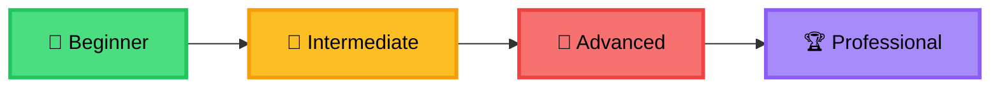

<div align="center">

# 🚀 Django REST Framework
### Professional API Development Masterclass


### 🎓 Deepcode Academy tomonidan taqdim etilgan professional kurs

[](https://deepcode.academy)
[](https://t.me/deepcode_academy)
[](https://www.youtube.com/@deepcode-academy)

---

### 💼 **Noldan professional API dasturchisiga aylanish yo'lingiz**

</div>

<br/>

## 📖 Kurs Haqida

Bu nafaqat oddiy tutorial - bu sizning **professional backend dasturchisiga aylanish yo'lingiz**! 

Django REST Framework (DRF) yordamida zamonaviy, xavfsiz va masshtablanadigan RESTful API yaratishni o'rganasiz. Kurs amaliy loyihalar, real-world misollar va industry best practices bilan to'ldirilgan.

### 🎯 Kurs Oxirida Siz:

```python
✅ Production-ready API'lar yarata olasiz
✅ JWT va Token autentifikatsiyani qo'lla olasiz
✅ Redis cache va optimization texnikalarini bilasiz
✅ Docker yordamida deploy qila olasiz
✅ Real-time WebSocket ilovalar yaratishni o'rganasiz
✅ Professional development workflow'ni egallaysiz
```

---

## 👨‍💻 Bu Kurs Kimlar Uchun?

<table>
<tr>
<td width="50%">

### ✨ Boshlang'ich Dasturchilar
- Django asoslarini bilasiz
- API dunyosiga kirishni istaysiz
- Backend yo'nalishini tanlagan bo'lsangiz

</td>
<td width="50%">

### 🚀 Tajribali Dasturchilar
- Backend malakangizni oshirmoqchimisiz
- Modern API arxitekturasini o'rganasiz
- Full-stack dasturchiga aylanmoqchisiz

</td>
</tr>
<tr>
<td width="50%">

### 📱 Mobil Dasturchilar
- iOS/Android uchun backend kerak
- RESTful API bilan ishlashni xohlaysiz
- O'z backend'ingizni yaratishni o'ylayapsiz

</td>
<td width="50%">

### 🎨 Frontend Dasturchilar
- React/Vue/Angular bilan ishlaysiz
- Backend qanday ishlashini bilmoqchisiz
- Full-stack bo'lish orzu qilasiz

</td>
</tr>
</table>

---

## 🗺️ O'rganish Yo'li



---

## 📚 Kurs Rejasi

### 🌱 **Beginner Level - Poydevor Quramiz**
> *5 ta dars • Taxminan 2 hafta • Beginner friendly*

<table>
<thead>
<tr>
<th width="5%">📌</th>
<th width="40%">Mavzu</th>
<th width="55%">Nima O'rganasiz</th>
</tr>
</thead>
<tbody>
<tr>
<td align="center"><strong>00</strong></td>
<td><a href="./00-Introduction%20to%20Django%20REST%20Framework"><strong>Django REST Framework bilan Tanishish</strong></a></td>
<td>DRF nima? REST API konsepsiyalari, HTTP metodlari, Status kodlari</td>
</tr>
<tr>
<td align="center"><strong>01</strong></td>
<td><a href="./01-Setting%20Up%20a%20Django%20Project%20and%20DRF"><strong>Django va DRF O'rnatish</strong></a></td>
<td>Virtual environment, Poetry, Django setup, DRF konfiguratsiyasi</td>
</tr>
<tr>
<td align="center"><strong>02</strong></td>
<td><a href="./02-Creating%20the%20First%20API"><strong>Birinchi API Yaratish</strong></a></td>
<td>Serializers, API endpoints, GET/POST so'rovlari</td>
</tr>
<tr>
<td align="center"><strong>03</strong></td>
<td><a href="./03-Implementing%20CRUD%20Operations"><strong>CRUD Operatsiyalari</strong></a></td>
<td>Create, Read, Update, Delete - to'liq funksional API</td>
</tr>
<tr>
<td align="center"><strong>04</strong></td>
<td><a href="./04-Working%20with%20ModelSerializer"><strong>ModelSerializer bilan Ishlash</strong></a></td>
<td>Validatsiya, custom fields, read_only/write_only maydonlar</td>
</tr>
</tbody>
</table>

<div align="center">
<strong>🎯 Oraliq Natija:</strong> Oddiy CRUD API yaratishni bilasiz
</div>

<br/>

### 🌿 **Intermediate Level - Professionallik Sari**
> *7 ta dars • Taxminan 3-4 hafta • Real-world uchun tayyor*

<table>
<thead>
<tr>
<th width="5%">📌</th>
<th width="40%">Mavzu</th>
<th width="55%">Nima O'rganasiz</th>
</tr>
</thead>
<tbody>
<tr>
<td align="center"><strong>05</strong></td>
<td><a href="./05-Using%20Generic%20API%20Views"><strong>Generic API Views</strong></a></td>
<td>ListAPIView, CreateAPIView, UpdateAPIView - kod yozishni kamaytirish</td>
</tr>
<tr>
<td align="center"><strong>06</strong></td>
<td><a href="./06-ViewSets%20and%20Routers"><strong>ViewSets va Routers</strong></a></td>
<td>ModelViewSet, DefaultRouter - professional API tuzilishi</td>
</tr>
<tr>
<td align="center"><strong>07</strong></td>
<td><a href="./07-Authentication%20(Token-Based%20Authentication)"><strong>Token-Based Authentication</strong></a></td>
<td>Foydalanuvchi autentifikatsiyasi, token yaratish va tekshirish</td>
</tr>
<tr>
<td align="center"><strong>08</strong></td>
<td><a href="./08-Working%20with%20Permissions"><strong>Permissions bilan Ishlash</strong></a></td>
<td>IsAuthenticated, IsAdminUser, custom permission classlar</td>
</tr>
<tr>
<td align="center"><strong>09</strong></td>
<td><a href="./09-Throttling%20and%20Rate%20Limiting"><strong>Throttling va Rate Limiting</strong></a></td>
<td>API xavfsizligi, so'rovlarni cheklash, DDoS himoyasi</td>
</tr>
<tr>
<td align="center"><strong>10</strong></td>
<td><a href="./10-Filtering,%20Searching,%20and%20Ordering"><strong>Filtering, Searching, Ordering</strong></a></td>
<td>DjangoFilterBackend, SearchFilter, OrderingFilter - qidiruv tizimi</td>
</tr>
<tr>
<td align="center"><strong>11</strong></td>
<td><a href="./11-Working%20with%20Pagination"><strong>Pagination</strong></a></td>
<td>PageNumberPagination, LimitOffsetPagination - katta ma'lumotlarni boshqarish</td>
</tr>
</tbody>
</table>

<div align="center">
<strong>🎯 Oraliq Natija:</strong> Xavfsiz, optimallashtirilgan API yaratishni bilasiz
</div>

<br/>

### 🌳 **Advanced Level - Expert Bo'ling**
> *8 ta dars • Taxminan 4-5 hafta • Production-ready malakalar*

<table>
<thead>
<tr>
<th width="5%">📌</th>
<th width="40%">Mavzu</th>
<th width="55%">Nima O'rganasiz</th>
</tr>
</thead>
<tbody>
<tr>
<td align="center"><strong>12</strong></td>
<td><a href="./12-JWT%20Authentication"><strong>JWT Authentication</strong></a></td>
<td>JSON Web Tokens, refresh tokens, secure authentication</td>
</tr>
<tr>
<td align="center"><strong>13</strong></td>
<td><a href="./13-Signals%20and%20DRF"><strong>Signals va DRF</strong></a></td>
<td>Django signals, post_save, pre_save, disconnecting signals</td>
</tr>
<tr>
<td align="center"><strong>14</strong></td>
<td><a href="./14-Background%20Tasks%20and%20Celery"><strong>Celery va Background Tasks</strong></a></td>
<td>Asinxron vazifalar, email yuborish, scheduled tasks, Celery Beat</td>
</tr>
<tr>
<td align="center"><strong>15</strong></td>
<td><a href="./15-API%20Testing%20and%20Unit%20Testing"><strong>API Testing</strong></a></td>
<td>APITestCase, test fixtures, TDD approach, coverage reports</td>
</tr>
<tr>
<td align="center"><strong>16</strong></td>
<td><a href="./16-Caching%20and%20Performance%20Optimization"><strong>Caching va Performance</strong></a></td>
<td>Redis cache, database optimization, N+1 problem yechimi, query optimization</td>
</tr>
<tr>
<td align="center"><strong>17</strong></td>
<td><a href="./17-WebSockets%20and%20Django%20Channels"><strong>WebSockets va Django Channels</strong></a></td>
<td>Real-time applications, chat systems, live notifications, ASGI</td>
</tr>
<tr>
<td align="center"><strong>18</strong></td>
<td><a href="./18-Deployment%20and%20Docker"><strong>Deployment va Docker</strong></a></td>
<td>Production settings, Docker, docker-compose, Nginx, Gunicorn, CI/CD</td>
</tr>
<tr>
<td align="center"><strong>19</strong></td>
<td><a href="./19-Advanced%20Concepts%20and%20Best%20Practices"><strong>Advanced Concepts</strong></a></td>
<td>API versioning, CORS, Security best practices, Documentation with Swagger</td>
</tr>
</tbody>
</table>

<div align="center">
<strong>🏆 Yakuniy Natija:</strong> Production-ready, professional API dasturchisisiz!
</div>

---

## 🛠️ Texnologiyalar Stack

<div align="center">

### Core Technologies

<table>
<tr>
<td align="center" width="25%">
<br/>
<strong>Python 3.8+</strong><br/>
<sub>Asosiy dasturlash tili</sub>
</td>
<td align="center" width="25%">
<br/>
<strong>Django 4.0+</strong><br/>
<sub>Web framework</sub>
</td>
<td align="center" width="25%">
<br/>
<strong>DRF 3.14+</strong><br/>
<sub>REST API toolkit</sub>
</td>
<td align="center" width="25%">
<br/>
<strong>PostgreSQL</strong><br/>
<sub>Production database</sub>
</td>
</tr>
</table>

### Advanced Tools

<table>
<tr>
<td align="center" width="25%">
<br/>
<strong>Redis</strong><br/>
<sub>Caching & sessions</sub>
</td>
<td align="center" width="25%">
<br/>
<strong>Celery</strong><br/>
<sub>Background tasks</sub>
</td>
<td align="center" width="25%">
<br/>
<strong>Docker</strong><br/>
<sub>Containerization</sub>
</td>
<td align="center" width="25%">
<br/>
<strong>JWT</strong><br/>
<sub>Authentication</sub>
</td>
</tr>
</table>

</div>

---

## 📖 Qanday O'rganish Kerak?

<table>
<tr>
<td width="50%">

### 📅 O'rganish Grafigi

```
Week 1-2:  🌱 Beginner (00-04)
Week 3-6:  🌿 Intermediate (05-11)
Week 7-11: 🌳 Advanced (12-19)
Week 12+:  🏆 Portfolio Projects
```

### ⏱️ Kunlik Rejalashtirish

- **1-2 soat/kun**: Dars materiallari
- **1 soat/kun**: Amaliy mashqlar
- **Dam olish kunlari**: Loyiha ustida ish

</td>
<td width="50%">

### ✅ O'rganish Qoidalari

1. **📝 Tartib bilan**: Darslarni o'tkazib yubormang
2. **💻 Amaliyot**: Har bir kodni o'zingiz yozing
3. **🔄 Takrorlash**: Tushunmagan joylarni qaytaring
4. **🤝 Jamiyat**: Telegram guruhida faol bo'ling
5. **🚀 Loyihalar**: O'z portfolio'ingizni yarating
6. **📚 Dokumentatsiya**: Rasmiy docs'ni o'qing

</td>
</tr>
</table>

---

## 🎯 Amaliy Loyiha G'oyalari

Kurs davomida quyidagi loyihalarni yaratishga tayyor bo'lasiz:

<table>
<tr>
<td width="50%">

### 🔰 Beginner Loyihalari

- **📝 Blog API** - CRUD operations
- **📋 Todo API** - Task management
- **📚 Book Library API** - Kutubxona tizimi
- **👤 User Profile API** - Profil boshqaruvi

</td>
<td width="50%">

### 🚀 Advanced Loyihalari

- **🛒 E-commerce API** - To'liq onlayn do'kon
- **💬 Real-time Chat** - WebSocket chat
- **📱 Social Network API** - Ijtimoiy tarmoq
- **🎓 Online Learning Platform** - Ta'lim platformasi

</td>
</tr>
</table>

---

## 💡 Qo'shimcha Resurslar

<table>
<tr>
<td width="50%">

### 📚 Rasmiy Dokumentatsiya

- 📘 [Django Documentation](https://docs.djangoproject.com/)
- 📗 [DRF Documentation](https://www.django-rest-framework.org/)
- 📙 [Python Documentation](https://docs.python.org/3/)
- 📕 [PostgreSQL Documentation](https://www.postgresql.org/docs/)

</td>
<td width="50%">

### 🎓 Deepcode Academy

- 🎥 [YouTube Channel](https://www.youtube.com/@deepcode-academy)
- 💬 [Telegram Guruhi](https://t.me/deepcode_academy)
- 🌐 [Website](https://deepcode.academy)
- 📧 [Email](mailto:info@deepcode.academy)

</td>
</tr>
</table>

---

## 🏆 Sertifikat

Kursni muvaffaqiyatli tugatsangiz va barcha amaliy topshiriqlarni bajarsangiz, **Deepcode Academy** tomonidan **Professional API Developer** sertifikatini olasiz!

<div align="center">

### 📜 Sertifikat Olish Shartlari

✅ Barcha 20 ta darsni tugatish  
✅ Har bir darsning amaliy topshiriqlarini bajarish  
✅ Kamida 3 ta portfolio loyiha yaratish  
✅ Final loyihani himoya qilish  

</div>

---

## 🤝 Jamiyatga Qo'shiling

<div align="center">

### 💬 Savol-javoblar, yordam va networking uchun:

[](https://t.me/deepcode_academy)
[](#)
[](#)

</div>

---

## 🤝 Hissa Qo'shish (Contributing)

Bu kurs ochiq manbali! Sizning hissangiz juda qimmatli:

### Qanday hissa qo'shish mumkin?

1. 🍴 **Fork** qiling
2. 🌿 **Branch** yarating (`git checkout -b feature/AmazingFeature`)
3. ✍️ **O'zgarishlar** kiriting
4. 💾 **Commit** qiling (`git commit -m 'Add some AmazingFeature'`)
5. 📤 **Push** qiling (`git push origin feature/AmazingFeature`)
6. 🔄 **Pull Request** yuboring

### 🐛 Xatolik Topsangiz

Issue ochib, quyidagilarni ko'rsating:
- Xatolik tavsifi
- Takrorlash yo'li
- Kutilgan natija
- Screenshot (agar kerak bo'lsa)

---

## 📝 Litsenziya

```
MIT License

Copyright (c) 2024 Deepcode Academy

Permission is hereby granted, free of charge, to any person obtaining a copy
of this software and associated documentation files (the "Software"), to deal
in the Software without restriction...
```

Bu kurs **ochiq manbali** va **bepul**. Siz uni o'rganish, tarqatish va o'zgartirish uchun erkin foydalanishingiz mumkin.

---

## 📊 Statistika

<div align="center">


**20** Dars • **100+** Soat Material • **50+** Amaliy Mashqlar • **∞** Imkoniyatlar

</div>

---

## ✍️ Muallif & Jamoat

<div align="center">

### 👨‍💻 Deepcode Academy Team

<table>
<tr>
<td align="center">
<br/>
<sub><b>Lead Instructor</b></sub><br/>
<sub>Senior Backend Developer</sub>
</td>
<td align="center">
<br/>
<sub><b>Co-Instructor</b></sub><br/>
<sub>Full-Stack Developer</sub>
</td>
<td align="center">
<br/>
<sub><b>Content Creator</b></sub><br/>
<sub>Technical Writer</sub>
</td>
</tr>
</table>

### 📞 Bog'lanish

🌐 **Website:** [deepcode.academy](https://deepcode.academy)  
📱 **Telegram:** [@deepcode_academy](https://t.me/deepcode_academy)  
📧 **Email:** info@deepcode.academy  
🎥 **YouTube:** [Deepcode Academy](https://www.youtube.com/@deepcode-academy)

</div>

---

## ⭐ Star History

<div align="center">

Bu kurs sizga foydali bo'lsa, **⭐ star** berishni unutmang!

Har bir star bizni yanada ko'proq quality content yaratishga ilhomlantiradi! 💪

</div>

---

<div align="center">

## 🚀 Tayyor? Keling, Boshlaymiz!

### 👇 Birinchi Darsga O'ting

[](./00-Introduction%20to%20Django%20REST%20Framework)

---

### 🎯 "Eng yaxshi investitsiya - bu o'zingizga investitsiya"

**Bugun boshlansin, ertasi professional bo'ling!** 🌟

---

<sub>Made with ❤️ by Deepcode Academy • Last Updated: January 2024</sub>

**© 2024 Deepcode Academy. Barcha huquqlar himoyalangan.**

</div>
